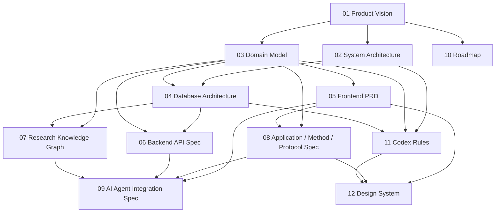

# Chapter 00 Master Index and Navigation Guide

## 文档定位

这是一份 12 章文档集的总索引与执行导航总纲。

它的作用不是新增业务规则，而是：

- 固定整套文档的阅读顺序
- 固定整套文档的执行顺序
- 固定各章节之间的依赖关系
- 为 Codex、Claude Code、Cursor 提供统一的入口
- 避免后续实现时出现“先做局部、后补全局”的顺序错误

如果后续章节与本总纲存在冲突，优先以具体章节的约束为准；如果多个章节都涉及同一问题，则按更接近实现层的章节优先。

## 使用方式

### 1. 首次阅读顺序

建议按以下顺序完整阅读：

1. 01 Product Vision
2. 02 System Architecture
3. 03 Domain Model
4. 04 Database Architecture
5. 05 Frontend PRD
6. 06 Backend API Spec
7. 07 Research Knowledge Graph
8. 08 Application / Method / Protocol Spec
9. 09 AI Agent Integration Spec
10. 10 Roadmap
11. 11 Codex Rules
12. 12 Design System

### 2. 实现顺序

如果是按工程实施推进，建议按以下顺序：

1. 01 产品愿景定边界
2. 02 系统架构定层次
3. 03 领域模型定对象和关系
4. 04 数据库架构定持久化基线
5. 06 后端 API 定服务契约
6. 07 知识图谱定语义链路
7. 08 Application / Method / Protocol 定内容结构
8. 09 AI Agent Integration 定智能体边界
9. 05 Frontend PRD 定页面和交互
10. 12 Design System 定视觉和组件语言
11. 11 Codex Rules 定变更约束
12. 10 Roadmap 定阶段推进和交付节奏

说明：

- 01 至 04 解决“系统是什么、数据是什么、关系是什么”
- 05 至 09 解决“怎么展示、怎么服务、怎么被智能体使用”
- 10 至 12 解决“怎么推进、怎么约束、怎么统一外观和执行纪律”

### 3. 任务驱动顺序

如果当前任务只涉及某一类工作，按下面的最短路径读文档：

- 产品策略和范围定义：01 -> 10 -> 11
- 系统分层和边界：02 -> 03 -> 04 -> 11
- 数据库和实体建模：03 -> 04 -> 07 -> 11
- API 和服务契约：03 -> 04 -> 06 -> 11
- 前端页面和组件：05 -> 12 -> 11
- 知识图谱和语义关系：03 -> 07 -> 08 -> 09
- 智能体集成：06 -> 07 -> 09 -> 11
- 全量交付推进：01 -> 02 -> 03 -> 04 -> 05 -> 06 -> 07 -> 08 -> 09 -> 10 -> 11 -> 12

## 总体依赖图

## 12 章总览

| 章号 | 文件 | 角色定位 | 主要产出 | 依赖章节 | 下游影响 | 状态 |
|---|---|---|---|---|---|---|
| 01 | [01_PRODUCT_VISION.md](/Users/yuan/Documents/试剂网站进化文档讨论/01_PRODUCT_VISION.md) | 产品总纲 | 目标、定位、用户、演进路径、范围边界 | 无 | 02-12 全部 | 已完成 |
| 02 | [02_SYSTEM_ARCHITECTURE.md](/Users/yuan/Documents/试剂网站进化文档讨论/02_SYSTEM_ARCHITECTURE.md) | 系统总架构 | 分层、边界、运行时拓扑、数据流 | 01 | 04-09、11-12 | 已完成 |
| 03 | [03_DOMAIN_MODEL.md](/Users/yuan/Documents/试剂网站进化文档讨论/03_DOMAIN_MODEL.md) | 领域模型 | 核心实体、关系、生命周期、约束 | 01 | 04-09、11-12 | 已完成 |
| 04 | [04_DATABASE_ARCHITECTURE_ENTERPRISE.md](/Users/yuan/Documents/试剂网站进化文档讨论/04_DATABASE_ARCHITECTURE_ENTERPRISE.md) | 企业级数据库基线 | ER 架构、模型映射、索引、迁移、约束 | 02-03 | 06-09、11-12 | 已完成 |
| 05 | [05_FRONTEND_PRD.md](/Users/yuan/Documents/试剂网站进化文档讨论/05_FRONTEND_PRD.md) | 前端 PRD | 页面清单、组件、交互、SEO、信息架构 | 01-04 | 08、12 | 已完成 |
| 06 | [06_BACKEND_API_SPEC.md](/Users/yuan/Documents/试剂网站进化文档讨论/06_BACKEND_API_SPEC.md) | 后端 API 规范 | REST 契约、资源模型、错误、权限 | 03-04 | 09、11 | 已完成 |
| 07 | [07_RESEARCH_KNOWLEDGE_GRAPH.md](/Users/yuan/Documents/试剂网站进化文档讨论/07_RESEARCH_KNOWLEDGE_GRAPH.md) | 知识图谱规范 | 节点、边、证据链、推理路径 | 03-04 | 08-09 | 已完成 |
| 08 | [08_APPLICATION_METHOD_PROTOCOL_SPEC.md](/Users/yuan/Documents/试剂网站进化文档讨论/08_APPLICATION_METHOD_PROTOCOL_SPEC.md) | 领域内容中台 | Application / Method / Protocol 页面与内容模型 | 03、05、07 | 05、09、12 | 已完成 |
| 09 | [09_AI_AGENT_INTEGRATION_SPEC.md](/Users/yuan/Documents/试剂网站进化文档讨论/09_AI_AGENT_INTEGRATION_SPEC.md) | AI / Agent 集成 | 智能体能力边界、MCP、JSON-LD、检索规则 | 06-08 | 11 | 已完成 |
| 10 | [10_ROADMAP.md](/Users/yuan/Documents/试剂网站进化文档讨论/10_ROADMAP.md) | 路线图 | 阶段规划、里程碑、风险、推进顺序 | 01-04 | 11-12 | 已完成 |
| 11 | [11_CODEX_RULES.md](/Users/yuan/Documents/试剂网站进化文档讨论/11_CODEX_RULES.md) | 变更约束 | Codex 可改、不可改、审批规则、迁移规则 | 02-06 | 全部 | 已完成 |
| 12 | [12_DESIGN_SYSTEM.md](/Users/yuan/Documents/试剂网站进化文档讨论/12_DESIGN_SYSTEM.md) | 设计系统 | 视觉、组件、状态、响应式、可访问性 | 01、02、03、05、08、11 | 前端实现全局 | 已完成 |

## 章节职责边界

### 01 Product Vision

定义“为什么做”和“做成什么样”，是所有后续章节的上位约束。

### 02 System Architecture

定义系统分层、边界和运行方式，不直接定义具体页面或字段。

### 03 Domain Model

定义业务实体、关系和语义，不负责 UI 细节和 API 协议细节。

### 04 Database Architecture

定义数据库基线、模型映射、索引、迁移和持久化约束，不做前端决定。

### 05 Frontend PRD

定义页面与交互需求，不替代设计系统和代码规范。

### 06 Backend API Spec

定义服务契约与资源边界，不直接决定前端视觉或数据库物理实现。

### 07 Research Knowledge Graph

定义知识节点、证据链和推理路径，是语义层基线。

### 08 Application / Method / Protocol Spec

定义内容中心的组织方式和页面结构，是科学内容组织层基线。

### 09 AI Agent Integration Spec

定义 Agent 能做什么、不能做什么，以及如何读取系统数据。

### 10 Roadmap

定义阶段拆解、优先级和交付节奏，不替代工程实现细则。

### 11 Codex Rules

定义后续自动化开发的变更纪律，是执行层约束文件。

### 12 Design System

定义视觉和组件语言，是前端落地的一致性基线。

## 推荐的 Codex 工作流

### A. 需要新增功能时

1. 先确认该功能属于哪个章节职责范围
2. 读取对应章节和其上游依赖章节
3. 检查 11 章的变更约束
4. 再决定是否需要修改多个章节

### B. 需要做实现前审查时

1. 检查 01 是否定义了目标范围
2. 检查 02 是否定义了系统边界
3. 检查 03 是否定义了实体和关系
4. 检查 04 和 06 是否定义了数据与接口契约
5. 检查 11 是否允许这类变更

### C. 需要做 UI 或页面实现时

1. 先看 05 页面需求
2. 再看 12 设计系统
3. 再看 03、08、11 中的内容和约束

### D. 需要做 AI / Agent 功能时

1. 先看 06 API
2. 再看 07 知识图谱
3. 再看 09 Agent 集成
4. 最后检查 11 是否有禁止项

## 交付验收标准

这份总索引完成的标准是：

- 12 章的角色边界清楚
- 12 章的阅读顺序清楚
- 12 章的执行顺序清楚
- 每个主要任务都能找到最短阅读路径
- 任意一个后续实现任务都能先定位到正确章节
- Codex、Claude Code、Cursor 都可以把它当作入口文档使用

## 备注

- 本文件不替代任何业务章节
- 本文件不引入新的业务约束
- 本文件只负责组织和导航
