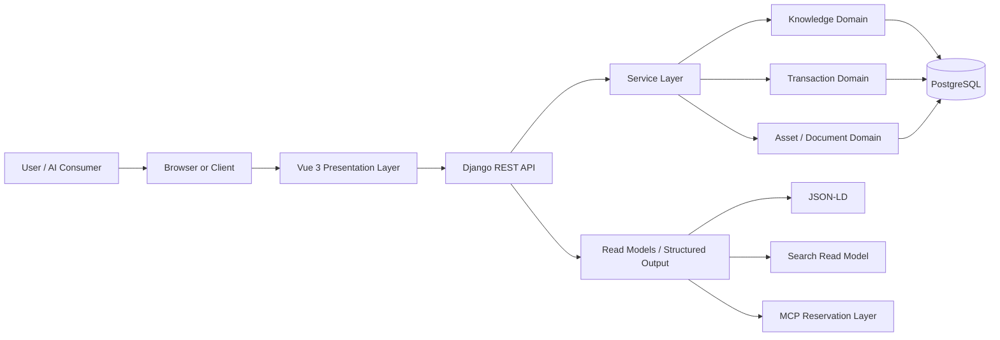

# Chapter 2 System Architecture

## Document Authority

This chapter defines the system architecture for LabPro Global.
It translates the product intent from Chapter 1 into an implementation boundary that downstream chapters and engineering work must follow.

If a later implementation chapter conflicts with this chapter on layering, service ownership, request flow, or integration boundaries, this chapter wins on system structure and the later chapter must be adjusted.

This chapter is intentionally concrete:

- It defines the runtime layers.
- It defines the request and data flow.
- It defines where business logic lives.
- It defines how search, knowledge, transaction, and AI surfaces relate.
- It defines which interfaces are read-only and which are transactional.
- It defines the operational assumptions that the rest of the platform must respect.

## 1. Architecture Objective

The system must support a knowledge-backed reagent platform that can serve both human users and AI consumers.

The architecture must optimize for four outcomes:

1. Product discovery and conversion for ecommerce and quotation.
2. Scientific navigation across applications, methods, protocols, and products.
3. Stable, machine-readable access for AI systems.
4. Safe evolution without breaking the existing Django + PostgreSQL baseline.

## 2. Architecture Principles

### 2.1 Canonical Source of Truth

- PostgreSQL is the canonical source of truth for business data.
- The backend service layer is the canonical orchestration layer for domain behavior.
- The frontend is a presentation layer only.
- Read models for search, JSON-LD, and future agent access must derive from canonical data.

### 2.2 Layered Responsibility

- Presentation renders data and captures user intent.
- Business logic lives in services, not in views.
- Knowledge objects carry scientific meaning and relationships.
- Transaction objects carry commerce state and money-related behavior.
- AI-facing surfaces are read-only and structured.

### 2.3 Explicit Boundaries

- Views must not contain domain orchestration.
- Anonymous coupling between unrelated domains is prohibited.
- Duplicate APIs for the same resource are prohibited.
- New layers must be introduced through explicit interfaces, not side effects.

### 2.4 Versioned Evolution

- Public APIs must be versioned.
- Scientific content that is cited or published must be version-aware.
- Schema evolution must preserve backward compatibility during migration windows.

### 2.5 Reuse Before Replacement

- Reuse existing models, component patterns, and resource contracts whenever possible.
- Extend the current system rather than rebuilding it without reason.

## 3. High-Level System View

The platform is organized around five logical layers:

1. Presentation
2. Business
3. Knowledge
4. Transaction
5. AI

These layers do not map one-to-one to deployment boxes.
They define ownership and coupling rules.

### 3.1 System Context Diagram

### 3.2 What the Diagram Means

- The browser or client is the entry point for both human users and front-end consumers.
- The Vue application owns navigation, page composition, and interaction state.
- Django REST owns request validation, authentication, orchestration, and response shaping.
- The service layer owns business rules, transactions, and cross-model writes.
- PostgreSQL stores canonical knowledge and commerce facts.
- Structured outputs such as JSON-LD and future MCP payloads must be derived from canonical records.

## 4. Logical Layers

### 4.1 Presentation Layer

The presentation layer is responsible for:

- Routing and page composition
- Component reuse
- Layout and responsive behavior
- Client-side interaction state
- Triggering requests to the backend API
- Rendering search results, catalog cards, content pages, and commerce workflows

The presentation layer must not:

- Contain business rules
- Perform direct database access
- Reimplement canonical relationship logic
- Become a second data source

### 4.2 Business Layer

The business layer is responsible for:

- Transaction orchestration
- Validation that depends on multiple models
- Publication rules for scientific content
- Compatibility evaluation
- Cross-domain writes
- API response assembly when it depends on domain rules

The business layer must be implemented in services or equivalent domain orchestration classes.
It must not be hidden in views.

### 4.3 Knowledge Layer

The knowledge layer contains the scientific model graph:

- Research goals
- Applications
- Methods
- Protocols
- Protocol steps
- References
- Compatibility rules

This layer must preserve semantic relationships and citation stability.

Its job is to answer questions such as:

- What application does this method belong to?
- Which protocols belong to this method?
- Which products are linked to this protocol?
- What references support this product or protocol?

### 4.4 Transaction Layer

The transaction layer contains commerce and operational state:

- Products
- SKUs
- Quotes
- Quote items
- Orders
- Order items
- Basket
- Wishlist

This layer must support commercial workflows without corrupting the scientific graph.

### 4.5 AI Layer

The AI layer is the structured consumption layer for machine clients.

It must support:

- JSON-LD for public structured data
- Read-only resource access for future MCP capabilities
- Retrieval-oriented data contracts
- Stable identifiers and citation-friendly representations

The AI layer must not become a write surface for transaction or knowledge mutations.

## 5. Core Runtime Topology

### 5.1 Frontend Runtime

- Vue 3 is the frontend runtime.
- Composition API is the required authoring pattern for reusable components and page logic.
- The frontend should be organized into reusable page components such as ApplicationCard, MethodCard, ProtocolCard, and ProductCard.

### 5.2 Backend Runtime

- Django 5.1 is the application runtime.
- Django REST is the public API layer.
- Service-layer orchestration is mandatory.
- Views should remain thin and delegate behavior to services.

### 5.3 Data Runtime

- PostgreSQL is the persistent store.
- All canonical content, relations, and transactions must be stored or derived from PostgreSQL-backed data.
- Search and structured output must be derived from canonical data rather than manually duplicated records.

### 5.4 Logical Support Runtime

The system may maintain derived read views or projections for:

- Search
- JSON-LD
- Future MCP payloads

Those projections must remain rebuildable from canonical data.

## 6. Primary Data Flow

### 6.1 Browsing Flow

Canonical browsing path:

`Home -> Application -> Method -> Protocol -> Product -> SKU -> Quote / Cart / Order`

Flow responsibilities:

- The frontend renders the navigation and content structure.
- The backend serves canonical resource data.
- The service layer resolves cross-links and derived presentation fields.
- The database preserves the underlying relationships.

### 6.2 Search Flow

Search must support the following access patterns from the PRD:

- Product search
- CAS search
- SMILES search
- Application search
- Method search
- Natural language search

Search flow responsibilities:

- Search requests land on a read-only search interface.
- Search results must return canonical resource identifiers.
- Search results may be ranked or projected, but they must point back to canonical records.
- Search must never become the authoritative source of record for entity state.

### 6.3 Quote and Order Flow

The commerce flow must support:

- Product discovery
- SKU selection
- Quote creation
- Cart management
- Order creation

Flow rules:

- Commerce actions are transaction layer responsibilities.
- Commerce actions may read from the knowledge layer, but the knowledge layer must not be mutated by commerce behavior.
- Quote and order states must be explicit and auditable.

### 6.4 Structured Data Flow

Structured data must be derived from the canonical resource layer and exposed through:

- JSON-LD on public resource pages
- REST responses for application consumption
- Future MCP read payloads

Structured data flow rules:

- Public structured output must use stable IDs.
- Structured output must preserve canonical relationships.
- Structured output must not invent data that cannot be traced back to canonical records.

### 6.5 Agent Retrieval Flow

AI systems must consume read-only structured outputs.

The retrieval path is:

1. Agent requests a resource or capability.
2. The system resolves the request against canonical read data.
3. The system returns a structured, citation-friendly payload.
4. Any agent recommendation or explanation must remain traceable to source data.

## 7. Service Boundaries

### 7.1 View Boundary

Views are responsible for:

- Accepting HTTP requests
- Calling the right service
- Returning a serialized response

Views are not responsible for:

- Relationship orchestration
- Multi-model transactions
- Publication rules
- Compatibility logic

### 7.2 Service Boundary

Services are responsible for:

- Validation across related entities
- Business rules that span models
- Transaction management
- Publication and versioning decisions
- Building canonical domain outcomes

### 7.3 Serializer Boundary

Serializers are responsible for:

- Shape validation
- Response serialization
- Input normalization where appropriate

Serializers are not responsible for:

- Domain orchestration
- Side effects
- Multi-step persistence logic

### 7.4 Repository / Query Boundary

Query logic should remain explicit and reusable.

- Simple reads may be handled directly through ORM queries in a service or query layer.
- Complex data access should be isolated in query helpers or repositories if needed.
- Query helpers must still respect the service boundary and cannot replace domain orchestration.

### 7.5 Asset Boundary

Document and asset handling must remain separated from core transaction logic.

Assets such as PDFs are supporting references, not the authority for canonical product or protocol records.

## 8. Knowledge and Transaction Interaction

The platform intentionally blends knowledge and commerce, but the two domains must remain distinct.

### 8.1 Knowledge to Commerce

Knowledge objects may point to products.

Examples:

- A method can surface recommended products.
- A protocol can link to required reagents.
- A reference can support product claims.
- A compatibility rule can validate a product pair.

### 8.2 Commerce to Knowledge

Commerce objects may expose knowledge context.

Examples:

- A product page can show applications, methods, and protocols.
- A SKU page can show the underlying product’s evidence and compatibility.
- A quote flow can preserve the scientific rationale for the requested items.

### 8.3 Boundary Rule

Knowledge content and transaction state must never be conflated.

- A product may be referenced by knowledge objects.
- A protocol may recommend products.
- But a protocol cannot directly own transaction state.
- And an order cannot rewrite the knowledge graph.

## 9. Search and Knowledge Layer

Search is a first-class architecture concern.
It is not an implementation detail to defer until the end.

### 9.1 Search Goals

Search must help users and agents find:

- Products by name, CAS, or SMILES
- Applications by research intent
- Methods by workflow family
- Protocols by procedure content
- References by citation metadata

### 9.2 Search Inputs

The search system must support the PRD’s required modes:

- Product text search
- CAS search
- SMILES search
- Application search
- Method search
- Natural language search

### 9.3 Search Output Contract

Search output must:

- Return canonical resource IDs
- Preserve resource type
- Preserve ranking metadata where appropriate
- Be explainable through the underlying canonical record

### 9.4 Search Architecture Rules

- Search may be backed by derived read models.
- Search must not duplicate canonical truth as a separate editable record set.
- Search relevance should be tuned for scientific intent, not only keyword frequency.
- Search results should reinforce the Goal -> Method -> Protocol -> Product journey.

### 9.5 Search and Structured Data

Search results and structured data must agree on canonical identity.

- The same product should resolve to the same canonical ID in search, REST, and JSON-LD.
- The same method or protocol should not have conflicting public identifiers across surfaces.

## 10. AI and Agent Integration Boundary

The architecture must support AI consumption without turning the platform into an uncontrolled write surface.

### 10.1 Phase Model

The PRD describes the AI evolution in phases:

1. REST API
2. JSON-LD
3. MCP
4. Agent Capability API

### 10.2 Phase Responsibilities

- REST API is the primary general-purpose integration surface.
- JSON-LD is the structured public representation of selected knowledge pages.
- MCP is a reserved future read layer for agent-oriented retrieval.
- Agent Capability API is reserved for future higher-level capabilities built on canonical data.

### 10.3 AI Boundary Rules

- AI layers must be read-first.
- AI layers must not write canonical transaction data directly.
- AI outputs must be traceable to source records.
- AI layers must respect the same canonical resource identities as the REST layer.

### 10.4 Capability Examples

The PRD’s AI capability set includes:

- Product recommendation
- Protocol retrieval
- Compatibility validation
- Inventory validation

These capabilities should be treated as outputs of structured canonical data, not as separate data silos.

## 11. Deployment and Operational Assumptions

### 11.1 Baseline Stack

- Frontend: Vue 3
- Backend: Django 5.1 REST
- Database: PostgreSQL

### 11.2 Service Discipline

- Versioned APIs are mandatory.
- No business logic in views.
- Service-layer orchestration is mandatory.
- Direct database access from presentation code is prohibited.

### 11.3 Reuse Constraints

- Reuse existing models when they satisfy the domain.
- Reuse components when they satisfy the UX.
- Follow the domain hierarchy.
- Do not create duplicated APIs for the same business concept.

### 11.4 Performance and Scale Assumptions

The architecture should be able to support:

- Growing product and SKU catalogs
- Growing scientific content graphs
- Increasing read traffic from search and structured data consumers
- Increasing AI read traffic without exposing write paths

The architecture does not need to solve global distributed scale in the first baseline, but it must avoid design decisions that make later scaling impossible.

## 12. Cross-Chapter Dependencies

This chapter defines the structural contract for the rest of the documentation set.

| Chapter | Dependency on This Chapter |
|---|---|
| Chapter 1 Product Vision | Defines the intent and evolution this architecture must support |
| Chapter 3 Domain Model | Formalizes the entities and relationships used here |
| Chapter 4 Database Architecture | Implements the canonical persistence model behind this architecture |
| Chapter 5 Frontend PRD | Must reflect the presentation and navigation layer defined here |
| Chapter 6 Backend API Spec | Must implement the API boundaries and service contracts defined here |
| Chapter 7 Knowledge Graph | Must represent the scientific graph and search relationships defined here |
| Chapter 8 Application / Method / Protocol Spec | Must operationalize the knowledge and browsing flows defined here |
| Chapter 9 AI Agent Integration | Must respect the read-only AI boundary defined here |
| Chapter 10 Roadmap | Must sequence work according to these layers and constraints |
| Chapter 11 Codex Rules | Must protect the service and schema boundaries defined here |
| Chapter 12 Design System | Must support the presentation responsibilities defined here |

## 13. Non-Goals

This chapter does not define:

- Exact database field lists
- Full API request/response schemas
- UI component implementation details
- Search ranking algorithms
- Future MCP wire formats
- Design tokens or visual styling

Those belong in later chapters.

This chapter only defines the structural boundaries that those later chapters must obey.

## 14. Acceptance Criteria

This chapter is complete when all of the following are true:

- The runtime layers are explicit and non-overlapping.
- The canonical source of truth is clear.
- The presentation, business, knowledge, transaction, and AI responsibilities are separated.
- The browsing, search, commerce, structured data, and agent flows are defined.
- Service boundaries are explicit.
- Search is treated as a read model, not an authority.
- AI integration is explicitly read-only.
- The architecture is consistent with the PRD’s stack and product evolution.
- Downstream chapters can implement against this chapter without needing a redefinition of system structure.

