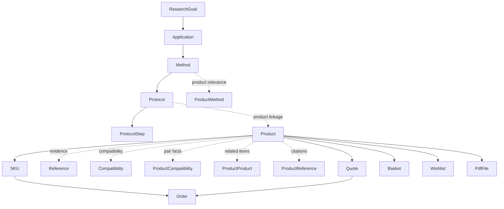

# Chapter 3 Domain Model

## Document Authority

This chapter defines the canonical domain model for LabPro Global.
It sits between product intent and implementation detail:

- Chapter 1 defines why the platform exists.
- Chapter 2 defines how the system is layered.
- This chapter defines what the business objects are and how they relate.
- Chapter 4 defines how these objects are persisted.

If a later chapter conflicts with this chapter on entity meaning, ownership, lifecycle, or allowed relations, this chapter wins on domain semantics.

## 1. Domain Purpose

The LabPro Global domain model exists to represent a scientific-to-commercial pathway.

The platform must let users and AI systems move through the chain:

`Research Goal -> Application -> Method -> Protocol -> Product -> SKU -> Order`

The domain model must support two goals at once:

1. Scientific reasoning and evidence linking.
2. Commercial discovery and purchase flow.

The domain model is not a database schema.
It is the business language that the schema, APIs, search, and UI must all obey.

## 2. Domain Boundaries

The platform has four major domain zones:

### 2.1 Knowledge Domain

Contains the scientific graph and supporting evidence:

- ResearchGoal
- Application
- Method
- Protocol
- ProtocolStep
- Reference
- Compatibility

### 2.2 Product Domain

Contains commercial products and product-facing relations:

- Product
- SKU
- ProductClass
- ProductCatalog
- ProductCompatibility
- ProductMethod
- MethodProtocol
- ProductProduct
- ProductReference

### 2.3 Transaction Domain

Contains commerce state and buying workflow:

- Order
- OrderItem
- Quote
- QuoteItem
- Basket
- Wishlist

### 2.4 Asset Domain

Contains supporting files and documents:

- PdfFile

## 3. Canonical Domain Chain

The canonical business chain is:

`ResearchGoal -> Application -> Method -> Protocol -> Product -> SKU -> Order`

This chain expresses the normal user journey and the main data dependency flow.

### 3.1 Meaning of the Chain

- A ResearchGoal captures the user’s scientific intent.
- An Application groups methods by use case.
- A Method represents a scientific workflow family.
- A Protocol is a versioned, stepwise procedure within a method.
- A Product is the commercial reagent or scientific item used in the workflow.
- A SKU is the purchasable variant of the product.
- An Order is the transactional result of a purchase.

### 3.2 Chain Direction Rule

The chain is directional.
Later nodes may refer back to earlier nodes for navigation and evidence, but earlier nodes do not depend on later transactional outcomes.

Examples:

- A Method may point to Products.
- A Protocol may point to Products.
- A Product may point to References and Protocols.
- An Order must not rewrite the Method or Protocol graph.

## 4. Core Entity Definitions

### 4.1 ResearchGoal

ResearchGoal is the top-level scientific intent object.

Purpose:

- Represent the reason a user begins exploring the platform.
- Anchor the highest-level navigation into research outcomes.

Typical examples:

- Label RNA
- Perform click chemistry
- Prepare an NGS library

Rules:

- A ResearchGoal can group multiple Applications.
- It is not a product record.
- It is not a transaction record.

### 4.2 Application

Application is a use-case grouping that maps scientific intent to a family of methods.

Purpose:

- Organize the platform by research need rather than by SKU alone.
- Provide the main entry point for goal-driven discovery.

Typical examples:

- RNA Labeling
- DNA Labeling
- Click Chemistry
- mRNA Synthesis
- NGS Library Prep
- ADC Conjugation
- Cell Tracking

Rules:

- An Application belongs to one ResearchGoal.
- An Application can contain multiple Methods.
- An Application should be stable enough to support navigation and SEO.

### 4.3 Method

Method is a research workflow family.

Purpose:

- Represent how a scientific outcome is achieved.
- Bridge application intent to protocols and products.

Typical examples:

- Sanger Sequencing
- Targeted NGS
- RNA-seq
- RIP-seq
- In Vitro Transcription
- Click Conjugation
- Terminal Transferase Labeling

Rules:

- A Method belongs to one Application.
- A Method can own multiple Protocols.
- A Method can be linked to multiple Products.
- A Method is not a single experiment step; it is a workflow family.

### 4.4 Protocol

Protocol is a versioned scientific procedure.

Purpose:

- Provide structured, stepwise execution guidance.
- Connect methods to concrete actions, materials, and products.

Typical sections:

- Objective
- Principle
- Materials
- Reagents
- Equipment
- Steps
- Troubleshooting
- Expected Results
- References

Rules:

- A Protocol belongs to one Method.
- A Protocol can have multiple ProtocolStep records.
- A Protocol must be version-aware.
- A Protocol must be able to link to Products.
- A Protocol is not mutable in a way that breaks citation stability.
- A Protocol may expose an ordered list of reference IDs in read models, but it must not duplicate full citation content inside the protocol record.

### 4.5 ProtocolStep

ProtocolStep is an ordered atomic unit inside a protocol.

Purpose:

- Represent one step in a procedure.
- Support step-level display, search, and troubleshooting.

Rules:

- A ProtocolStep belongs to one Protocol.
- Step order is meaningful.
- Steps are not free-floating content blocks.

### 4.6 Product

Product is the commercial and scientific item that users buy or evaluate.

Purpose:

- Serve as the commercial anchor of the scientific graph.
- Expose product identity, usage context, and commerce readiness.

Product must be able to surface:

- Applications
- Methods
- Protocols
- Compatibility
- References
- Inventory status
- SKU variants

Rules:

- Product is not a Protocol.
- Product is not a Method.
- Product may participate in multiple methods and protocols.
- Product may be linked to evidence and compatibility facts.

### 4.7 SKU

SKU is the purchasable variant of a Product.

Purpose:

- Represent pack size, inventory, and sale unit details.

Rules:

- A SKU belongs to one Product.
- SKU is transactional and operational, not conceptual.
- SKU should not duplicate scientific meaning that belongs on Product.

### 4.8 Reference

Reference is the canonical citation object.

Purpose:

- Capture scientific evidence supporting products, methods, or protocols.

Rules:

- A Reference may support multiple Products or Protocols.
- A Reference must be canonical and reusable.
- A Reference should be normalized so the same publication is not duplicated across the system.

### 4.9 Compatibility

Compatibility is the rule definition for whether two or more entities can be used together.

Purpose:

- Represent compatibility semantics at the rule level.
- Support validation, warnings, and recommendations.

Rules:

- Compatibility is not the pair result itself.
- Actual pair facts are stored through explicit compatibility relations.
- Compatibility rules may apply to product-product, product-method, or product-protocol contexts.

### 4.10 ProductCompatibility

ProductCompatibility is the product-pair compatibility fact.

Purpose:

- Record whether two products are compatible, incompatible, conditionally compatible, or require warning.

Rules:

- ProductCompatibility references the source product and target product.
- ProductCompatibility references the governing Compatibility rule.
- ProductCompatibility is a relation fact, not a business transaction.

### 4.11 ProductMethod

ProductMethod is the semantic bridge between Product and Method.

Purpose:

- Explain which products are relevant to a method.
- Capture role, evidence level, and ordering semantics.

Rules:

- It is not a plain many-to-many relation.
- It must carry metadata.
- It is the canonical link for product-to-method discovery.

### 4.12 MethodProtocol

MethodProtocol is the presentation and curation bridge between Method and Protocol.

Purpose:

- Control how protocols are surfaced under a method.

Rules:

- It is not the ownership relation itself.
- Ownership still belongs to Protocol -> Method.
- This bridge is for listing, ranking, and feature status.

### 4.13 ProductProduct

ProductProduct is the semantic relation between two products.

Purpose:

- Support substitute, complement, alternate, bundle, or related-product relationships.

Rules:

- ProductProduct must keep relation type and direction explicit.
- Self-links are only allowed when the relation type explicitly permits it.

### 4.14 ProductReference

ProductReference is the semantic bridge between Product and Reference.

Purpose:

- Attach scientific evidence to products in a reusable way.

Rules:

- It must carry citation role and ordering semantics when needed.
- It must not duplicate citation content that already belongs in Reference.

### 4.15 Order

Order is the finalized transaction object.

Purpose:

- Represent a completed commercial purchase path.

Rules:

- Order is downstream of the scientific graph.
- Order should preserve enough context for audit and customer support.
- Order must not rewrite canonical scientific meaning.

### 4.16 Quote

Quote is the commercial pre-order negotiation object.

Purpose:

- Represent negotiated or requested pricing before order completion.

Rules:

- Quote may reference products and SKUs.
- Quote must not become a knowledge source.

### 4.17 Basket

Basket is the temporary pre-checkout container.

Purpose:

- Hold in-progress selections before quote or order conversion.

Rules:

- Basket is ephemeral.
- Basket is not part of the scientific graph.

### 4.18 Wishlist

Wishlist is a saved-interest container.

Purpose:

- Allow users to store products of interest for later review or purchase.

Rules:

- Wishlist is user-oriented state, not scientific truth.

### 4.19 PdfFile

PdfFile is a file-backed asset object.

Purpose:

- Store supporting documents such as product sheets, protocol attachments, or reference documents.

Rules:

- PdfFile is supportive, not canonical scientific meaning by itself.
- PdfFile may be linked to multiple business objects if the content is reusable.

## 5. Relationship Rules

### 5.1 Ownership Rules

- One ResearchGoal owns many Applications.
- One Application owns many Methods.
- One Method owns many Protocols.
- One Protocol owns many ProtocolSteps.
- One Product owns many SKUs.
- One Reference may support many Products or Protocols through relations.

### 5.2 Cross-Link Rules

- Products may link to Methods through ProductMethod.
- Products may link to Protocols through product-facing relations and product page navigation.
- Methods may surface Protocols through MethodProtocol.
- Products may link to References through ProductReference.
- Product compatibility facts must be explicit and machine-readable.

### 5.3 Directionality Rules

- Ownership is directional and single-valued.
- Discovery relations may be many-to-many.
- Presentation relations must not be confused with ownership relations.

### 5.4 Evidence Rules

- A reference can justify a product or protocol claim.
- A compatibility record can justify a warning or recommendation.
- A product can expose multiple evidence links.
- Evidence must remain traceable to a canonical citation or rule object.

## 6. Lifecycle and State Model

The domain needs explicit lifecycle thinking even when individual states are implemented later in the database or API layer.

### 6.1 ResearchGoal Lifecycle

- Draft
- Active
- Archived

Rules:

- Research goals are usually editorial or curatorial.
- They can evolve, but should remain recognizable for navigation.

### 6.2 Application Lifecycle

- Draft
- Active
- Deprecated
- Archived

Rules:

- Active applications are visible in navigation.
- Deprecated applications may remain readable for compatibility and SEO continuity.

### 6.3 Method Lifecycle

- Draft
- Active
- Deprecated
- Archived

Rules:

- Methods must stay stable enough for users to trust them as scientific pathways.

### 6.4 Protocol Lifecycle

- Draft
- Published
- Superseded
- Archived

Rules:

- Published protocols are citation-sensitive.
- Superseded protocols remain accessible for historical traceability.
- A newer version must not silently destroy the old one.

### 6.5 Product Lifecycle

- Draft
- Active
- Hidden
- Discontinued

Rules:

- Active products are visible to the public catalog.
- Hidden products may exist but are not surfaced broadly.
- Discontinued products may remain referenced by history and support content.

### 6.6 SKU Lifecycle

- Active
- Out of stock
- Discontinued

Rules:

- SKU lifecycle is operational and inventory-driven.

### 6.7 Quote Lifecycle

- Draft
- Requested
- Quoted
- Accepted
- Rejected
- Expired

### 6.8 Order Lifecycle

- Pending
- Paid
- Processing
- Shipped
- Completed
- Cancelled
- Refunded

### 6.9 Compatibility Lifecycle

- Draft
- Active
- Retired

Rules:

- Compatibility rules should be versionable and auditable.

## 7. Allowed and Disallowed Relationships

### 7.1 Allowed

- ResearchGoal -> Applications
- Application -> Methods
- Method -> Protocols
- Protocol -> ProtocolSteps
- Product -> SKUs
- Product -> References
- Product -> Methods
- Product -> Protocols
- Product -> Other Products
- Product -> Compatibility facts

### 7.2 Disallowed

- A Product directly owning a Method
- A Product directly owning a Protocol
- A Protocol directly owning transaction state
- An Order rewriting scientific meaning
- A SKU carrying scientific claims that belong on Product
- A Basket becoming a source of truth for product identity
- A Reference being duplicated as free text in every connected record

### 7.3 Soft Allowed but Controlled

- Application names may influence navigation and SEO.
- Method summaries may be reused in lists and cards.
- Protocol excerpts may appear on product pages.
- Reference snippets may appear in product and protocol contexts.

These must still point back to canonical records.

## 8. Typical Domain Flows

### 8.1 Research-First Flow

1. A user starts with a research goal.
2. The user selects an application.
3. The user evaluates methods.
4. The user opens a protocol.
5. The user inspects linked products.
6. The user chooses a SKU.
7. The user requests a quote or places an order.

### 8.2 Product-First Flow

1. A user starts from a product.
2. The user checks applications and methods.
3. The user verifies protocols and references.
4. The user checks compatibility.
5. The user moves into commerce.

### 8.3 Agent-First Flow

1. An AI agent asks for a method, protocol, product, or compatibility answer.
2. The system resolves the request against canonical structured data.
3. The agent returns a ranked or explained answer with traceable references.

### 8.4 Procurement Flow

1. A procurement user identifies required products and SKUs.
2. The user requests a quote.
3. The quote preserves the scientific context so support and sales can resolve questions.

## 9. Domain Invariants

The following invariants must always hold:

- A Method belongs to one Application.
- A Protocol belongs to one Method.
- A ProtocolStep belongs to one Protocol.
- A SKU belongs to one Product.
- A Product may belong to multiple scientific contexts.
- A Reference can be reused across many records.
- A compatibility fact must be explicit, not inferred.
- Transaction records must not mutate scientific meaning.
- Scientific citations must remain stable over time.
- Public resource identities must be canonical and durable.

## 10. Domain Vocabulary

### 10.1 Research Goal

The scientific intent that starts the journey.

### 10.2 Application

A use-case grouping that organizes methods by scientific purpose.

### 10.3 Method

A workflow family that explains how an application is executed.

### 10.4 Protocol

A versioned, stepwise procedure.

### 10.5 Product

A commercial reagent or scientific item that participates in the knowledge graph.

### 10.6 SKU

The purchasable variant of a product.

### 10.7 Reference

A normalized scientific citation or evidence object.

### 10.8 Compatibility

A rule definition describing whether entities may be used together.

### 10.9 ProductCompatibility

A concrete compatibility fact between products governed by a compatibility rule.

### 10.10 ProductMethod

A semantic relation linking a product to a method.

### 10.11 MethodProtocol

A curation relation linking a method to a protocol for display and ranking.

### 10.12 ProductProduct

A semantic relation between two products.

### 10.13 ProductReference

A semantic relation linking a product to evidence.

## 11. Diagram of the Domain

## 12. Cross-Chapter Dependencies

This chapter depends on Chapter 1 and Chapter 2 for intent and structural boundaries, and it feeds Chapter 4 for persistence design.

| Chapter | Dependency on This Chapter |
|---|---|
| Chapter 1 Product Vision | Defines the business purpose and evolution that this model supports |
| Chapter 2 System Architecture | Defines the runtime and layer boundaries used by this model |
| Chapter 4 Database Architecture | Must persist these entities and relationships without changing their meaning |
| Chapter 5 Frontend PRD | Must render the entities in the same hierarchy and relationship order |
| Chapter 6 Backend API Spec | Must expose these concepts through stable resource contracts |
| Chapter 7 Knowledge Graph | Must represent the scientific portion of this model faithfully |
| Chapter 8 Application / Method / Protocol Spec | Must operationalize the core scientific chain |
| Chapter 9 AI Agent Integration | Must read from these canonical concepts, not replace them |
| Chapter 11 Codex Rules | Must protect the entity boundaries and migration discipline |

## 13. Acceptance Criteria

This chapter is complete when all of the following are true:

- The scientific and commerce domains are clearly separated.
- The canonical chain from goal to order is explicit.
- Every core entity has a defined purpose.
- Ownership and cross-link rules are unambiguous.
- Lifecycle expectations are explicit.
- Allowed and disallowed relations are listed.
- Typical user and agent flows are defined.
- Domain vocabulary is consistent with the PRD and the other chapters.
- Chapter 4 can be implemented from this chapter without inventing new business meanings.
