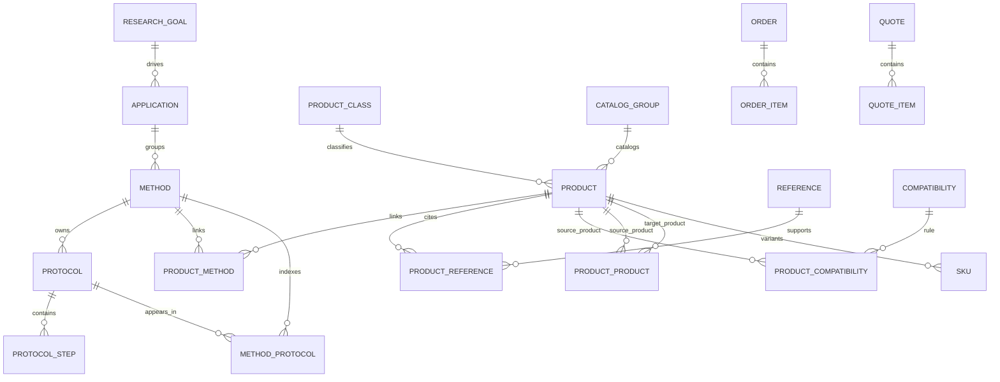

# Chapter 4 Database Architecture（Enterprise）

## Document Authority

This chapter is the database baseline for the LabPro Global reagent platform.
It is derived from the `LabPro_Global_Master_PRD_V1_Full_Specification.docx` and the documentation pack, and it is written to be consumed directly by Codex, Claude Code, Cursor, and human engineers.

The purpose of this chapter is not to describe the product at a high level.
Its purpose is to define the persistent data model, the relation boundaries, the migration policy, and the implementation constraints that downstream agents must follow.

## 0. 现有代码命名兼容说明

**重要**：现有代码库（`/Users/yuan/Documents/试剂网站/backend/DjangoWebProject1/app/models.py`）中的 `ProductCatalog` 模型对应本规范的模型 #9 `SKU`（变体/库存单位），而非模型 #11 `CatalogGroup`（目录分组）。

Phase 1 迁移步骤：
1. 将现有 `ProductCatalog` 模型重命名为 `SKU`
2. 新建 `CatalogGroup` 模型（目录分组，本规范模型 #11）
3. 更新所有引用现有 `ProductCatalog` 的外键和序列化器

本规范中的 `SKU`（模型 #9）与重命名后的现有 `SKU` 在字段语义上对齐；本规范中的 `CatalogGroup`（模型 #11）为全新模型，不影响现有数据。
**字段命名注意**：现有代码中 SKU 编号字段名为 `sku_no`，本规范中使用 `sku_code`。Phase 1 迁移时将现有 `sku_no` 重命名为 `sku_code`，或创建 `sku_code` 属性作为 `sku_no` 的别名，同步更新所有序列化器引用。


## 1. Database Role in the Product Chain

The platform chain is:

`Research Goal -> Application -> Method -> Protocol -> Product -> SKU -> Order`

The database must support two independent but connected responsibilities:

1. Knowledge graph persistence for scientific reasoning and retrieval.
2. Commerce and transaction persistence for catalog, quote, basket, wishlist, and order flows.

Operating assumptions:

- Database: PostgreSQL
- Backend: Django 5.1
- API style: Django REST with a stable `success / data / meta` envelope
- Agent-ready exposure: JSON-LD first, MCP later, no write access through agent channels

## 2. Bounded Contexts

### 2.1 Knowledge Context

Owns the scientific hierarchy and the reusable knowledge objects:

- `ResearchGoal`
- `Application`
- `Method`
- `Protocol`
- `ProtocolStep`
- `Reference`
- `Compatibility`

### 2.2 Product Context

Owns commercial reagent records and product-facing knowledge joins:

- `Product`
- `SKU`
- `ProductClass`
- `CatalogGroup`
- `ProductCompatibility`
- `ProductMethod`
- `MethodProtocol`
- `ProductProduct`
- `ProductReference`

### 2.3 Transaction Context

Owns buyer-facing commerce flows:

- `Order`
- `OrderItem`
- `Quote`
- `QuoteItem`
- `Basket`
- `Wishlist`

### 2.4 Asset Context

Owns file-backed supporting assets:

- `PdfFile`

## 3. Full ER Architecture

### 3.1 Canonical Relation Rules

- `Application` groups methods.
- `Method` owns the canonical protocol lineage.
- `Protocol` owns ordered steps.
- `Product` is the commercial anchor and can participate in method, protocol, reference, compatibility, and self-product relations.
- `Compatibility` is the rule master; `ProductCompatibility` stores actual product-pair facts.
- Mapping tables are explicit and must remain explicit; do not replace them with anonymous many-to-many relations if the relation carries semantic data.

### 3.2 ERD



### 3.3 ERD Notes

- `Method -> Protocol` is the primary scientific lineage.
- `MethodProtocol` exists to support ordered listing, curation, and cross-listing without losing canonical ownership.
- `ProductMethod` links products to methods for application-facing navigation and recommendation.
- `ProductProduct` is reserved for substitutes, complements, alternates, and bundle-like relations.
- `ProductReference` exposes evidence links at product level.
- `ProtocolStep` must remain a child table, not a JSON blob, because step-level versioning, ordering, and search are required.

### 3.4 Cardinality and Ownership Table

| Relation | Cardinality | Ownership rule | Notes |
|---|---|---|---|
| `ResearchGoal -> Application` | `1 : many` | `Application` belongs to one goal | navigation hierarchy |
| `Application -> Method` | `1 : many` | `Method` belongs to one application | product discovery anchor |
| `Method -> Protocol` | `1 : many` | `Protocol` belongs to one method | canonical scientific lineage |
| `Protocol -> ProtocolStep` | `1 : many` | `ProtocolStep` belongs to one protocol | ordered child rows |
| `Product -> SKU` | `1 : many` | `SKU` belongs to one product | commerce variant layer |
| `Product -> ProductMethod` | `1 : many` | through table owns relation metadata | semantic product-method bridge |
| `Method -> ProductMethod` | `1 : many` | through table owns relation metadata | semantic product-method bridge |
| `Method -> MethodProtocol` | `1 : many` | through table owns presentation metadata | curation and ranking |
| `Protocol -> MethodProtocol` | `1 : many` | through table owns presentation metadata | curation and ranking |
| `Product -> ProductReference` | `1 : many` | through table owns citation metadata | evidence exposure |
| `Reference -> ProductReference` | `1 : many` | through table owns citation metadata | evidence exposure |
| `Product -> ProductCompatibility` | `1 : many` | through table owns pair facts | compatibility facts |
| `Compatibility -> ProductCompatibility` | `1 : many` | compatibility rule master | rule interpretation |
| `Product -> ProductProduct` | `1 : many` | through table owns pair facts | substitutes/complements |
| `Order -> OrderItem` | `1 : many` | order owns line items | transaction detail |
| `Quote -> QuoteItem` | `1 : many` | quote owns line items | pre-order detail |

## 4. Existing 23-Model Mapping

Legend:

- `Status = retained` means keep the current model family and preserve the existing business meaning.
- `Status = new` means this chapter introduces the model as part of the target baseline.
- `Status = verify` means the model is expected from the legacy system but the exact code-level shape must be checked before implementation.

| # | Model | Context | Status | Key fields | Core relations | API exposure | JSON-LD exposure |
|---|---|---|---|---|---|---|---|
| 1 | `ResearchGoal` | Knowledge | new | `id`, `slug`, `name`, `summary`, `priority`, `status` | parent of `Application` | read-only | no |
| 2 | `Application` | Knowledge | retained | `id`, `slug`, `name`, `summary`, `sort_order`, `status`, `research_goal_id` | belongs to `ResearchGoal`; owns `Method` | yes | no |
| 3 | `Method` | Knowledge | new | `id`, `slug`, `application_id`, `name`, `purpose`, `advantages`, `limitations`, `cost_band`, `timeline`, `status` | owns `Protocol`; linked by `ProductMethod` and `MethodProtocol` | yes | yes |
| 4 | `Protocol` | Knowledge | new | `id`, `slug`, `method_id`, `version`, `objective`, `principle`, `materials`, `reagents`, `equipment`, `troubleshooting`, `expected_results`, `status` | owns `ProtocolStep`; linked by `MethodProtocol`; reference lists are exposed through canonical read projections | yes | yes |
| 5 | `ProtocolStep` | Knowledge | new | `id`, `protocol_id`, `step_no`, `title`, `body`, `duration_seconds`, `warnings` | child of `Protocol` | embedded in protocol detail | no |
| 6 | `Reference` | Knowledge | new | `id`, `title`, `authors`, `journal`, `year`, `doi`, `pmid`, `url`, `citation_text`, `source_type` | referenced by `ProductReference` and protocol citation read projections | yes | yes |
| 7 | `Compatibility` | Rules | new | `id`, `code`, `scope`, `rule_type`, `severity`, `expression_json`, `summary`, `status` | master for `ProductCompatibility` | admin/read-only | custom vocab |
| 8 | `Product` | Commerce | retained + extended | `id`, `slug`, `name`, `cas`, `smiles`, `synonyms`, `inchi`, `purity`, `storage`, `shipping`, `lead_time`, `handling_notes`, `shelf_life`, `research_use_only`, `status` | linked to `SKU`, `ProductMethod`, `ProductReference`, `ProductCompatibility`, `ProductProduct` | yes | yes |
| 9 | `SKU` | Commerce | retained | `id`, `product_id`, `sku_code`, `pack_size`, `price`, `currency`, `inventory_status` | belongs to `Product` | yes | no |
| 10 | `ProductClass` | Commerce | retained | `id`, `name`, `slug`, `parent_id`, `sort_order` | classifies `Product` | internal/admin | no |
| 11 | `CatalogGroup` | Commerce | retained | `id`, `name`, `slug`, `locale`, `active` | catalogs `Product` | internal/admin | no |
| 12 | `ProductCompatibility` | Rules | new | `id`, `source_product_id`, `target_product_id`, `compatibility_id`, `verdict`, `notes` | product-pair fact table | yes | no |
| 13 | `ProductMethod` | Bridge | new | `id`, `product_id`, `method_id`, `role`, `evidence_level`, `display_order` | product-to-method mapping | yes | no |
| 14 | `MethodProtocol` | Bridge | new | `id`, `method_id`, `protocol_id`, `display_order`, `featured`, `status` | method-to-protocol mapping | yes | no |
| 15 | `ProductProduct` | Bridge | new | `id`, `source_product_id`, `target_product_id`, `relation_type`, `direction`, `strength`, `notes` | self-referential product relation | yes | no |
| 16 | `ProductReference` | Bridge | new | `id`, `product_id`, `reference_id`, `citation_role`, `display_order` | product-to-reference mapping | yes | no |
| 17 | `Order` | Transaction | retained | `id`, `order_no`, `customer_id`, `status`, `subtotal`, `tax_total`, `grand_total`, `currency` | owns `OrderItem` | yes | no |
| 18 | `OrderItem` | Transaction | verify | `id`, `order_id`, `product_id`, `sku_id`, `quantity`, `unit_price` | order line item | yes | no |
| 19 | `Quote` | Transaction | retained | `id`, `quote_no`, `customer_id`, `status`, `valid_until`, `subtotal`, `grand_total` | owns `QuoteItem` | yes | no |
| 20 | `QuoteItem` | Transaction | verify | `id`, `quote_id`, `product_id`, `sku_id`, `quantity`, `unit_price` | quote line item | yes | no |
| 21 | `Basket` | Transaction | retained | `id`, `user_id`, `session_key`, `state`, `expires_at` | container for pre-cart state | authenticated API | no |
| 22 | `Wishlist` | Transaction | retained | `id`, `user_id`, `name`, `state`, `visibility` | saved product list | authenticated API | no |
| 23 | `PdfFile` | Asset | retained | `id`, `file`, `checksum`, `mime_type`, `page_count`, `extraction_state` | linked from product/protocol/reference assets | yes | no |

## 5. Core Model Specifications

### 5.1 Product

`Product` is the canonical commerce entity.

Required extension fields:

| Field | Type | Rule |
|---|---|---|
| `synonyms` | `text[]` | store deduplicated alternate names in original display case; normalize on write for uniqueness checks and search indexing |
| `inchi` | `text` | unique when present; normalize case and whitespace |
| `handling_notes` | `text` | freeform operational guidance for shipping and lab handling |
| `shelf_life` | `DurationField` / PostgreSQL `interval` | store a machine-readable lifetime value in canonical duration units |
| `research_use_only` | `boolean` | default `true` for reagent products unless explicitly commercialized |

Canonical identity and commerce fields:

| Field | Type | Rule |
|---|---|---|
| `cas` | `text` | chemical registry identifier; normalized and indexed when present |
| `smiles` | `text` | canonical structural string for chemical search and interoperability |
| `purity` | `CharField(max_length=100)` | public quality descriptor, retained if available |
| `storage` | `text` | short storage condition summary for product pages |
| `shipping` | `text` | shipping constraint summary for logistics and checkout surfaces |
| `lead_time` | `text` or `interval` depending on fulfillment model | fulfillment expectation shown to users and procurement teams |
| `inventory_status` | `text` / enum | current stock or availability state when exposed at product level |
| （不在 Product 上持久化） | — | Product 级别的库存状态通过 SKU 聚合派生（各 SKU 的 stock_status 聚合为产品级摘要），不作为独立持久化列。API 中通过 `sku_summary` 暴露 |

Additional product rules:

- Keep product identifiers stable; do not overload `name` as a business key.
- Use search-friendly fields for discovery, but do not make search text the source of truth.
- Preserve compatibility with existing product pages and SKU inventory pages.
- Expose product-related evidence through `ProductReference` instead of embedding citations in the product row.
- Treat `inchi` as the preferred machine-readable identity for structural search, while `cas` and `smiles` remain first-class discovery fields.

### 5.2 Method

`Method` represents a research workflow family, not a single experimental run.

Recommended fields:

- `application_id`
- `slug`
- `name`
- `summary`
- `purpose`
- `advantages`
- `limitations`
- `cost_band`
- `timeline`
- `status`

Recommended constraints:

- `slug` unique within the application scope.
- `name` unique within the application scope when the business taxonomy permits.
- `status` must use a closed enum such as `draft`, `active`, `deprecated`, `archived`.
- `published_at` should exist for externally visible methods.

Rules:

- One `Method` may surface multiple `Protocol` variants.
- The method page should act as a navigation hub to protocols, related products, and references.
- Keep the method payload compact enough for list endpoints, but complete enough for detail pages and JSON-LD.

### 5.3 Protocol

`Protocol` is a versioned scientific procedure record.

Recommended fields:

- `method_id`
- `slug`
- `version`
- `objective`
- `principle`
- `materials`
- `reagents`
- `equipment`
- `troubleshooting`
- `expected_results`
- `status`

Recommended constraints:

- `slug` unique within the method scope.
- `version` unique within the method scope.
- `method_id`, `version`, and `status` must be sufficient to reconstruct publication history.
- `published_at` and `superseded_at` should be explicit whenever the publication model requires auditing.
- `published_at` 和 `superseded_at` 为可选时间戳字段，推荐添加：当 Protocol 状态变更为 `published` 时自动设置 `published_at`；变更为 `superseded` 时自动设置 `superseded_at`。在 Phase 4 Protocol Center 实施时必须添加这两个字段。

Rules:

- `ProtocolStep` is mandatory for step-level detail.
- Protocol content must be versioned; do not silently mutate a published protocol.
- If a protocol is superseded, mark it inactive and retain the old version for citation stability.
- Public protocol read models may expose ordered `reference_ids` derived from canonical `Reference` records and citation content, but the database baseline does not introduce a separate `ProtocolReference` bridge table.

### 5.4 Reference

`Reference` is the canonical citation object.

Recommended fields:

- `title`
- `authors`
- `journal`
- `year`
- `doi`
- `pmid`
- `url`
- `citation_text`
- `source_type`

Recommended constraints:

- `doi` unique when present.
- `pmid` unique when present.
- `title` should be required for every persisted citation.
- `year` should be constrained to a valid four-digit publication year when known.

Rules:

- Normalize DOI and PMID.
- Prefer a single canonical `Reference` row for each citation.
- Use `ProductReference` to express why the reference matters to the reagent or protocol.

### 5.5 Compatibility

`Compatibility` is the rule master that defines what compatibility means in the system.

Recommended fields:

- `code`
- `scope` (`product-product`, `product-method`, `product-protocol`, `product-instrument`, etc.)
- `rule_type` (`compatible`, `incompatible`, `conditional`, `warning`)
- `severity`
- `expression_json`
- `summary`
- `status`   (enum: `draft`, `active`, `retired` — 对齐第03章 §6.9 三态生命周期)

Recommended constraints:

- `code` unique and immutable once published.
- `scope` must be a closed enum.
- `expression_json` must remain schema-valid JSON.
- `severity` should use a closed enum such as `info`, `warning`, `blocking`, or `critical`.

Rules:

- `Compatibility` should describe the rule class, not the pair result.
- Actual compatibility facts belong in `ProductCompatibility`.
- Keep `expression_json` machine-readable for future recommendation and validation engines.

## 6. Mapping Tables

### 6.1 ProductMethod

Purpose: connect a product to a method with a semantic role.

Fields:

- `product_id`
- `method_id`
- `role` (`reagent`, `buffer`, `control`, `enzyme`, `label`, etc.)
- `evidence_level`
- `display_order`
- `active`

Constraints:

- Unique on `(product_id, method_id, role)`.
- Index on `(method_id, display_order)`.
- `role` should be a closed enum such as `reagent`, `buffer`, `control`, `enzyme`, `label`, `solvent`, or `other`.
- `evidence_level` should be a closed enum such as `low`, `medium`, `high`, or `curated`.

### 6.2 MethodProtocol

Purpose: connect methods to protocols while preserving canonical ownership on `Protocol.method_id`.

Fields:

- `method_id`
- `protocol_id`
- `display_order`
- `featured`
- `status`

Constraints:

- Unique on `(method_id, protocol_id)`.
- Index on `(method_id, display_order)`.
- `featured` should default to `false`.
- `status` should use a closed enum such as `draft`, `active`, `deprecated`, or `archived`.

### 6.3 ProductProduct

Purpose: represent product-to-product relations such as substitutes, complements, alternates, and bundle partners.

Fields:

- `source_product_id`
- `target_product_id`
- `relation_type`
- `direction`
- `strength`
- `notes`

Constraints:

- Unique on `(source_product_id, target_product_id, relation_type)`.
- Prevent self-pairs unless the relation type explicitly allows it.
- `relation_type` should be a closed enum such as `substitute`, `complement`, `alternate`, `bundle`, or `related`.
- `direction` should be a closed enum such as `one_way` or `bidirectional`.
- `strength` should use a predictable ranking scale if exposed to ranking logic.

### 6.4 ProductReference

Purpose: attach evidence and citations to a product.

Fields:

- `product_id`
- `reference_id`
- `citation_role`
- `display_order`

Constraints:

- Unique on `(product_id, reference_id, citation_role)`.
- Index on `(product_id, display_order)`.
- `citation_role` should be a closed enum such as `primary`, `supporting`, `validation`, or `background`.

### 6.5 ProtocolStep

Purpose: store ordered step-level protocol content.

Fields:

- `protocol_id`
- `step_no`
- `title`
- `body`
- `duration_seconds`
- `warnings`
- `required_materials`

Constraints:

- Unique on `(protocol_id, step_no)`.
- Index on `(protocol_id, step_no)`.
- `step_no` must begin at 1 and remain sequential within a protocol version.
- `duration_seconds` should be nullable when a step has no stable timing estimate.

## 7. PostgreSQL Index Standards

### 7.1 General Standards

- Use btree for equality, ordering, and foreign-key lookups.
- Use GIN for array fields, JSONB, and full-text search vectors.
- Use trigram indexes for fuzzy search on product names, synonyms, and method/protocol titles when search quality requires it.
- Prefer partial indexes for sparse booleans such as `active`, `research_use_only`, and status flags.
- Create heavy indexes concurrently during production migrations.

### 7.2 Required Index Patterns

- `Product.name`, `Product.slug`, and `Product.inchi` must be index-backed.
- `Product.cas` and `Product.smiles` must be index-backed when present in the dataset.
- `Product.synonyms` must support GIN or search-vector indexing.
- `Method.slug`, `Protocol.slug`, and `Reference.doi` must be unique or uniquely constrained where applicable.
- All foreign keys in bridge tables must have supporting indexes on both directions.
- `ProtocolStep(protocol_id, step_no)` must be indexed for ordered retrieval.
- `ProductMethod(product_id, method_id)`, `MethodProtocol(method_id, protocol_id)`, `ProductReference(product_id, reference_id)`, `ProductCompatibility(source_product_id, target_product_id)`, and `ProductProduct(source_product_id, target_product_id)` must each have composite indexes aligned with their access paths.

### 7.3 Search Index Strategy

- Product search should prioritize `name`, `slug`, `synonyms`, `inchi`, `cas`, and `smiles`.
- Method search should prioritize `name`, `summary`, `advantages`, and `limitations`.
- Protocol search should prioritize `slug`, `objective`, `materials`, and `reagents`.
- Reference search should prioritize `title`, `authors`, `doi`, and `pmid`.

## 8. Django Model Conventions

### 8.1 Model Structure

- Use explicit `db_table` names in snake_case.
- Keep `related_name` explicit and human-readable.
- Define `Meta.constraints` and `Meta.indexes` in every model with non-trivial uniqueness or search requirements.
- Use `TextChoices` for statuses, relation types, and verdict fields.
- Use `clean()` for validation only; do not put orchestration logic in model methods.

### 8.2 Relationship Conventions

- Use explicit through models whenever the relation needs metadata, ordering, evidence, or display semantics.
- Do not use anonymous many-to-many fields for `ProductMethod`, `MethodProtocol`, `ProductProduct`, or `ProductReference`.
- Keep ownership directional and obvious in the ORM.

### 8.3 Base Class Policy

- If the codebase already has shared base models, reuse them.
- If no shared base model exists, keep the model definitions explicit instead of inventing an abstraction layer.
- Preserve the existing Django 5.1 defaults unless a field-level reason justifies a change.

### 8.4 Service Boundary

- Views must stay thin.
- Serializers validate and shape data.
- Services own transactions, relation writes, and publication rules.
- Direct ORM writes from views are prohibited for core domain operations.

### 8.5 Stability and Archival Rules

- Use archival states instead of hard deletion for published scientific and commercial records whenever history or citations matter.
- Hard deletes are reserved for obviously disposable records such as invalid draft artifacts or duplicate seed data that never became public truth.
- Any model that participates in public URLs, citations, or agent retrieval should prefer soft-delete or archive semantics over destructive removal.

## 9. API Field Contracts

### 9.1 Global Envelope

All public REST responses must use:

```json
{
  "success": true,
  "data": {},
  "meta": {}
}
```

### 9.2 Public Resource Rules

- List endpoints must return stable summary fields plus identifiers.
- Detail endpoints may expand related IDs, but should not duplicate every nested object by default.
- Relationship expansion should be opt-in through query parameters such as `include=` or `expand=`.
- API payloads must not expose internal-only implementation fields, internal foreign keys, or migration-only columns.
- Public detail responses should preserve canonical resource identity and avoid nested duplication of objects that already have first-class endpoints.

### 9.3 Required Public Field Sets

#### Product API

Minimum public fields:

- `id`
- `slug`
- `name`
- `cas`
- `smiles`
- `synonyms`
- `inchi`
- `purity`
- `storage`
- `shipping`
- `lead_time`
- `handling_notes`
- `shelf_life`
- `research_use_only`
- `sku_summary`
- `application_ids`
- `method_ids`
- `protocol_ids`
- `reference_ids`
- `compatibility_summary`

#### Method API

Minimum public fields:

- `id`
- `slug`
- `application_id`
- `name`
- `summary`
- `purpose`
- `advantages`
- `limitations`
- `cost_band`
- `timeline`
- `protocol_ids`
- `product_ids`

#### Protocol API

Minimum public fields:

- `id`
- `slug`
- `method_id`
- `version`
- `objective`
- `principle`
- `materials`
- `reagents`
- `equipment`
- `steps`
- `reference_ids`
- `product_ids`

#### Reference API

Minimum public fields:

- `id`
- `title`
- `authors`
- `journal`
- `year`
- `doi`
- `pmid`
- `url`

#### Compatibility API

Minimum public fields:

- `id`
- `source_product_id`
- `target_product_id`
- `compatibility_code`
- `verdict`
- `severity`
- `notes`

### 9.4 Endpoint Inventory

**注意**：以下是只读核心资源端点清单。完整的 REST 端点（含 POST/PATCH/DELETE 及 Orders/Quotes/Basket/Wishlist 等 Commerce 资源）的详细契约见第06章 Backend API Spec。

The API surface must remain aligned with the PRD navigation and resource model:

- `GET /api/products`
- `GET /api/products/{id}`
- `GET /api/applications`
- `GET /api/applications/{id}`
- `GET /api/methods`
- `GET /api/methods/{id}`
- `GET /api/protocols`
- `GET /api/protocols/{id}`
- `GET /api/references`
- `GET /api/references/{id}`
- `GET /api/compatibility`
- `GET /api/compatibility/{id}`

## 10. JSON-LD Specification

### 10.1 General Rules

- JSON-LD is the canonical structured-data layer for SEO and agent retrieval.
- Every product, method, protocol, and reference detail page should emit JSON-LD.
- Transaction pages such as basket, wishlist, quote, and order do not need public JSON-LD unless later requested by SEO or compliance work.
- `@id` must be the canonical absolute URL of the resource.
- `@type` may be an array when a resource needs both a schema.org type and a platform-specific semantic type.

### 10.2 Type Mapping

| Model | JSON-LD Type | Notes |
|---|---|---|
| `Product` | `schema:Product` + `schema:ChemicalSubstance` | include reagent identity, properties, and evidence links |
| `Method` | `schema:HowTo` + `lab:Method` | preserve a schema.org-compatible object plus platform semantics |
| `Protocol` | `schema:HowTo` + `schema:CreativeWork` | step-based procedure content |
| `ProtocolStep` | `schema:HowToStep` | nested under protocol only |
| `Reference` | `schema:ScholarlyArticle` | DOI/PMID normalization required |
| `Compatibility` | `lab:CompatibilityRule` | custom vocabulary is the canonical choice; map to schema.org only in compatibility-constrained consumers |

### 10.3 Required JSON-LD Fields

- `@context`
- `@id`
- `@type`
- `name`
- `description`
- `url`
- `dateModified`

Model-specific additions:

- Product: `alternateName`, `identifier`, `additionalProperty`, `isRelatedTo`, `citation`
- Method: `about`, `hasPart`, `potentialAction` only if the semantics are explicit
- Protocol: `step`, `material`, `tool`, `estimatedCost`, `estimatedDuration`
- Reference: `author`, `isPartOf`, `sameAs`, `identifier`

### 10.4 JSON-LD Skeletons

#### Product skeleton

```json
{
  "@context": ["https://schema.org", "https://labpro.example/context"],
  "@id": "https://labpro.example/products/example-product",
  "@type": ["Product", "ChemicalSubstance"],
  "name": "Example Product",
  "alternateName": ["Example Synonym"],
  "identifier": "SKU-001",
  "description": "Reagent description",
  "url": "https://labpro.example/products/example-product",
  "dateModified": "2026-06-10",
  "additionalProperty": []
}
```

#### Protocol skeleton

```json
{
  "@context": ["https://schema.org", "https://labpro.example/context"],
  "@id": "https://labpro.example/protocols/example-protocol",
  "@type": ["HowTo", "CreativeWork"],
  "name": "Example Protocol",
  "description": "Protocol description",
  "url": "https://labpro.example/protocols/example-protocol",
  "dateModified": "2026-06-10",
  "step": []
}
```

## 11. MCP Reservation Specification

MCP support is reserved for future agent-facing retrieval. It must not become a second source of truth.

### 11.1 Reservation Rules

- MCP must read from the canonical PostgreSQL data model or from dedicated read projections.
- MCP must not write to transactional tables.
- MCP must not own business rules that are already enforced in Django services.
- MCP resource payloads must be versioned and immutable per publication cycle.

### 11.2 Reserved Resource Families

- `product`
- `method`
- `protocol`
- `reference`
- `compatibility`
- `search`

### 11.3 Reserved Namespaces

Reserve these naming patterns for future use:

- `mcp_*`
- `agent_*`
- `projection_*`
- `resource_*`

### 11.4 Read Model Contract

- Keep MCP read models shape-stable across a release window.
- Never expose mutable foreign-key write paths through MCP.
- If an MCP payload needs denormalized relation data, generate it from the canonical bridge tables, not from hand-maintained copies.

### 11.5 Future Read-Model Policy

- If MCP requires a precomputed payload, create a read projection instead of polluting the core schema.
- Keep read projections rebuildable from source tables.
- Any future MCP serializer must share the same canonical field vocabulary as the REST and JSON-LD layers.

## 12. Data Migration Strategy

### 12.1 Migration Order

1. Add new tables and nullable columns.
2. Add bridge tables with foreign keys and supporting indexes.
3. Backfill from existing product and content records.
4. Introduce service-layer dual-read behavior where needed.
5. Enforce uniqueness, non-null constraints, and validation checks after the backfill is complete.
6. Retire obsolete fields only after the compatibility window has elapsed.

### 12.2 Backfill Strategy

- Backfill must be idempotent.
- Backfill scripts must be rerunnable without duplicating records.
- Derive `Method`, `Protocol`, `Reference`, and `Compatibility` rows from the existing documentation and content sources first, then reconcile against production data.
- Populate bridge tables before tightening front-end or API assumptions.

### 12.3 Compatibility Windows

- Keep old and new paths alive during the same release window if a field or relation is being introduced.
- Never remove a legacy field in the same migration that introduces the replacement.
- Retain read compatibility until validation proves parity between old and new paths.

### 12.4 Zero-Downtime Rules

- Use `CREATE INDEX CONCURRENTLY` for production-safe index creation where possible.
- Add `NOT VALID` constraints first, then validate after the backfill.
- Avoid table rewrites on large tables unless the migration is explicitly approved.

## 13. Codex Development Constraints

These constraints are mandatory for downstream agents:

- Do not redesign the schema without updating this chapter first.
- Do not rename relation tables or public fields unless the API and JSON-LD contracts are updated in the same change set.
- Do not replace explicit mapping tables with anonymous many-to-many fields when the relation carries meaning.
- Do not put business logic in views.
- Do not read or write transactional data directly from agent layers.
- Do not add a new model unless its ownership, indexes, API exposure, and migration path are documented.
- Do not invent new external identifiers if an existing stable identifier already exists in the codebase.
- If a model is marked `verify`, reconcile the codebase before implementation.
- Preserve backward compatibility until the documented migration window closes.

## 14. Validation Checklist

Before this chapter is considered complete, verify the following:

- The ERD renders cleanly.
- All 23 models appear in the mapping matrix.
- The five core model specifications are explicit.
- The five mapping tables are explicit.
- PostgreSQL index rules are defined.
- Django model conventions are defined.
- API field contracts are defined.
- JSON-LD exposure rules are defined.
- MCP is reserved but not activated as a write path.
- Data migration order and compatibility windows are documented.
- Codex constraints are unambiguous and enforceable.

## 15. Acceptance Criteria

This chapter is complete when:

- An engineer or coding agent can implement the database layer without inventing relation names.
- The scientific hierarchy is recoverable from the schema.
- Product discovery, protocol discovery, and evidence linking are all first-class database behaviors.
- The transaction layer remains compatible with the existing ecommerce system.
- Future agent integrations can consume read-only structured data without changing the transactional schema.
