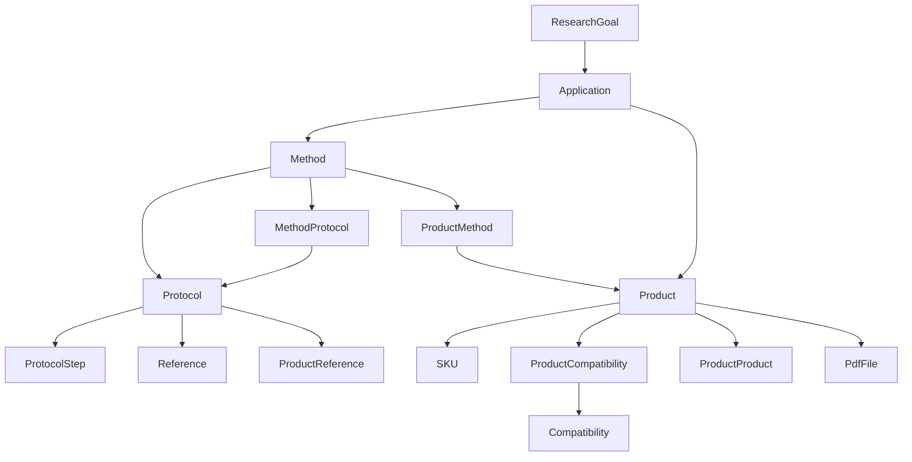

# Chapter 7 Research Knowledge Graph

## Document Authority

This chapter defines the scientific knowledge graph for LabPro Global.
It formalizes the relationships that let humans and AI systems navigate from research intent to applications, methods, protocols, products, and evidence.

If a later chapter conflicts with this chapter on node meaning, edge meaning, graph direction, evidence handling, or reasoning rules, this chapter wins on knowledge semantics.

This chapter is intentionally explicit:

- It defines the node types in the graph.
- It defines the edge types and their direction.
- It defines how evidence and compatibility attach to the graph.
- It defines canonical reasoning paths for users and AI agents.
- It defines how the graph is derived from canonical data.

## 1. Knowledge Graph Purpose

The LabPro Global knowledge graph exists to answer scientific questions in a structured way.

It must support:

- Goal-driven browsing
- Method discovery
- Protocol discovery
- Product discovery with context
- Evidence retrieval
- Compatibility reasoning
- Future agent-assisted scientific retrieval

The graph is not a generic taxonomy.
It is a directed scientific pathway that connects research intent to practical execution and commercial fulfillment.

## 2. Canonical Graph Chain

The core graph chain is:

`Research Goal -> Application -> Method -> Protocol -> Product -> SKU`

The PRD also states that future agent reasoning depends on this graph.

### 2.1 Canonical Chain Meaning

- Research Goal: the scientific intent or problem.
- Application: a use-case grouping that frames the intent.
- Method: a workflow family used to achieve the application outcome.
- Protocol: a versioned execution procedure within a method.
- Product: the reagent or scientific item used by the workflow.
- SKU: the purchasable variant of the product.

### 2.2 Additional Connected Nodes

The knowledge graph must also connect to:

- Reference
- Compatibility
- ProductCompatibility
- ProductMethod
- MethodProtocol
- ProductProduct
- ProductReference
- ProtocolStep
- PdfFile

These are not separate from the graph.
They are supporting nodes and edges that make the chain explainable and operational.

## 3. Graph Principles

### 3.1 Directionality

The primary graph should be directional from intent to execution to commerce.

Examples:

- ResearchGoal drives Applications
- Application groups Methods
- Method owns Protocols
- Protocol recommends or links Products

### 3.2 Canonical Ownership

Ownership and graph traversal are not the same thing.

- Ownership means the authoritative parent-child relationship.
- Traversal means the graph link used for discovery or explanation.

For example:

- `Protocol -> Method` is ownership.
- `Product -> Protocol` is traversal and association.

### 3.3 Evidence First

Scientific claims in the graph must be backed by:

- References
- Compatibility rules
- Canonical protocol structure
- Product metadata

### 3.4 Version Awareness

Protocols, references, and compatibility logic may evolve over time.
The graph must preserve historical traceability.

### 3.5 Machine Readability

The graph must be usable by:

- REST API consumers
- JSON-LD consumers
- Search surfaces
- Future MCP read models
- Agent capability layers

## 4. Node Types

### 4.1 ResearchGoal

Role:

- Top-level scientific intent node.

Graph function:

- Anchors the first step of discovery.

### 4.2 Application

Role:

- Scientific use-case grouping.

Graph function:

- Bridges research goals to methods.

### 4.3 Method

Role:

- Workflow family node.

Graph function:

- Bridges application intent to protocol execution.

### 4.4 Protocol

Role:

- Versioned procedure node.

Graph function:

- Provides execution detail and product context.

### 4.5 ProtocolStep

Role:

- Ordered sub-node of a protocol.

Graph function:

- Carries step-level procedure meaning and supports troubleshooting and product placement.

### 4.6 Product

Role:

- Commercial reagent and scientific item node.

Graph function:

- Connects scientific workflow to purchasable inventory.

### 4.7 SKU

Role:

- Variant node for purchase and inventory.

Graph function:

- Provides commerce-level granularity.

### 4.8 Reference

Role:

- Canonical citation node.

Graph function:

- Supports evidence, citation, and trust.

### 4.9 Compatibility

Role:

- Rule definition node.

Graph function:

- Defines compatibility semantics and validation logic.

### 4.10 ProductCompatibility

Role:

- Product-pair fact node.

Graph function:

- Records explicit compatibility outcomes governed by compatibility rules.

### 4.11 ProductMethod

Role:

- Semantic relation node between product and method.

Graph function:

- Explains which products are relevant to a method and why.

### 4.12 MethodProtocol

Role:

- Curation relation node between method and protocol.

Graph function:

- Controls how protocols are surfaced under methods.

### 4.13 ProductProduct

Role:

- Product-to-product relation node.

Graph function:

- Supports substitutes, complements, alternates, bundles, and related items.

### 4.14 ProductReference

Role:

- Product-to-reference relation node.

Graph function:

- Attaches evidence to products.

### 4.15 PdfFile

Role:

- Document asset node.

Graph function:

- Supplies supporting documents such as PDFs and product sheets.

## 5. Edge Types

### 5.1 Ownership Edges

Ownership edges define the canonical parent-child structure.

Canonical ownership edges include:

- ResearchGoal -> Application
- Application -> Method
- Method -> Protocol
- Protocol -> ProtocolStep
- Product -> SKU

### 5.2 Discovery Edges

Discovery edges support navigation and recommendation.

Examples:

- Product -> Method
- Product -> Protocol
- Method -> Product
- Application -> Product
- Application -> Method

### 5.3 Evidence Edges

Evidence edges attach citations and supporting material.

Examples:

- Product -> Reference
- Protocol -> Reference
- Product -> ProductReference
- Product -> PdfFile

### 5.4 Validation Edges

Validation edges express compatibility or rule-based constraints.

Examples:

- Product -> ProductCompatibility
- Product -> Compatibility

### 5.5 Presentation Edges

Presentation edges influence ranking, listing, and user-facing ordering.

Examples:

- Method -> MethodProtocol
- Product -> ProductMethod
- Product -> ProductProduct

## 6. Graph Diagram

## 7. Reasoning Paths

The graph must support a small set of canonical reasoning paths.

### 7.1 Goal to Product

Used when a user starts with scientific intent and needs a product outcome.

Path:

`ResearchGoal -> Application -> Method -> Protocol -> Product -> SKU`

### 7.2 Product to Goal

Used when a user starts with a product and needs scientific justification.

Path:

`Product -> Method -> Application -> ResearchGoal`

### 7.3 Protocol to Product

Used when a user has an execution procedure and needs the required products.

Path:

`Protocol -> Product -> SKU`

### 7.4 Product to Evidence

Used when a user needs to verify claims or cite supporting evidence.

Path:

`Product -> ProductReference -> Reference`

### 7.5 Product to Compatibility

Used when a user needs to know whether items can be used together.

Path:

`Product -> ProductCompatibility -> Compatibility`

### 7.6 Method to Protocol

Used when a user wants the procedure options for a method.

Path:

`Method -> MethodProtocol -> Protocol`

## 8. Evidence Model

Evidence is a first-class part of the graph.

### 8.1 Evidence Sources

Canonical evidence may come from:

- Published references
- Versioned protocols
- Compatibility rules
- Structured product metadata
- Supporting documents

### 8.2 Evidence Rules

- Evidence must be traceable to a canonical node or relation.
- Evidence should not be duplicated as free text across unrelated resources.
- Product claims should be supported by explicit links when possible.
- Protocol guidance should preserve reference and version context.

### 8.3 Evidence Layers

The system can expose evidence at multiple levels:

- Product-level evidence
- Protocol-level evidence
- Method-level evidence
- Compatibility-level evidence

## 9. Compatibility in the Graph

Compatibility is not a secondary note.
It is a graph feature.

### 9.1 Compatibility Semantics

Compatibility may express:

- Compatible
- Incompatible
- Conditional
- Warning

### 9.2 Compatibility Scope

Compatibility may apply to:

- Product-product
- Product-method
- Product-protocol
- Product-instrument in future expansions

### 9.3 Compatibility Usage

Compatibility is used for:

- Product recommendation
- Protocol guidance
- Inventory / workflow validation
- Agent reasoning

## 10. Graph Derivation

The knowledge graph must be derivable from canonical data rather than manually maintained as a separate source of truth.

### 10.1 Source Systems

The graph is derived from:

- The domain model in Chapter 3
- The database baseline in Chapter 4
- The API contracts in Chapter 6

### 10.2 Derivation Rules

- Canonical DB records are the source of truth.
- The graph may be materialized for search or read optimization.
- Any derived read model must be rebuildable.
- Derived views must not become authoritative editors.

### 10.3 Update Behavior

- Graph updates should follow canonical data changes.
- Published scientific content should preserve historical versions.
- Graph edges should not be rewritten casually if they affect citations or navigation stability.

## 11. Public and Private Graph Layers

### 11.1 Public Graph Layer

The public layer is what users and external readers can see:

- Public products
- Public applications
- Public methods
- Public protocols
- Public references where allowed
- Public compatibility summaries

### 11.2 Private Graph Layer

The private layer can include:

- Draft content
- Hidden or restricted products
- Editorial notes
- Internal compatibility reasoning
- Unpublished protocol versions

### 11.3 Boundary Rule

Private graph content must not leak through public endpoints or public structured data unless explicitly published.

## 12. Search and Retrieval Implications

The graph is a retrieval structure as much as a content structure.

### 12.1 Search Relevance

Search should leverage the graph to rank results by:

- Goal relevance
- Method relevance
- Protocol relevance
- Product relevance
- Evidence quality
- Compatibility confidence

### 12.2 Retrieval Questions

The graph must answer questions such as:

- What method should I use for this application?
- What protocol belongs to this method?
- What products are used in this protocol?
- What references support this product?
- Which products are compatible?

### 12.3 Explainability Rule

Search and retrieval results should be explainable through graph paths rather than opaque scores alone.

## 13. Agent Reasoning Model

### 13.1 Agent Use Cases

The PRD says future agent reasoning depends on this graph.

The graph must support agents that need:

- Product recommendation
- Protocol retrieval
- Compatibility validation
- Inventory validation

### 13.2 Agent Reasoning Rules

- Agents must reason from canonical nodes and edges.
- Agents must not invent unsupported links.
- Agents should prefer explicit evidence paths.
- Agents should preserve citations and version context.

### 13.3 Agent Output Expectations

Agent outputs should be able to cite:

- The application
- The method
- The protocol
- The product
- The reference
- The compatibility rule or fact

## 14. JSON-LD and MCP Alignment

### 14.1 JSON-LD Alignment

The public graph should map cleanly to JSON-LD entities and relations.

### 14.2 MCP Alignment

Future MCP payloads should expose the same canonical graph vocabulary in a read-only form.

### 14.3 Vocabulary Stability

- Canonical node names must stay stable.
- Canonical edge meanings must stay stable.
- Public IDs must remain consistent across REST, JSON-LD, and future MCP layers.

## 15. Graph Constraints

The following constraints are mandatory:

- A Protocol must belong to one Method.
- A Method must belong to one Application.
- An Application must belong to one ResearchGoal.
- A SKU must belong to one Product.
- Product evidence must be traceable.
- Compatibility must be explicit.
- Published protocol versions must remain historically referenceable.
- The graph must not be reduced to free text tags.

## 16. Cross-Chapter Dependencies

This chapter depends on the domain model, database architecture, and API specification chapters.
It also informs the frontend, agent, and roadmap chapters.

| Chapter | Dependency on This Chapter |
|---|---|
| Chapter 1 Product Vision | Defines the scientific-to-commercial purpose of the graph |
| Chapter 2 System Architecture | Defines the retrieval and service boundaries used by the graph |
| Chapter 3 Domain Model | Defines the entities and ownership rules represented here |
| Chapter 4 Database Architecture | Persists the canonical graph nodes and edges |
| Chapter 5 Frontend PRD | Must surface this graph in navigation and detail pages |
| Chapter 6 Backend API Spec | Must expose this graph through stable resource contracts |
| Chapter 8 Application / Method / Protocol Spec | Must operationalize the graph in page structure |
| Chapter 9 AI Agent Integration | Must consume this graph without mutating it |
| Chapter 10 Roadmap | Must sequence graph delivery and enrichment |
| Chapter 11 Codex Rules | Must protect graph integrity and version stability |

## 17. Acceptance Criteria

This chapter is complete when all of the following are true:

- The canonical graph chain is explicit.
- All supporting node types are defined.
- Edge types and direction are defined.
- Evidence handling is defined.
- Compatibility is part of the graph, not a side note.
- Graph derivation from canonical data is defined.
- Search and retrieval implications are defined.
- Agent reasoning implications are defined.
- JSON-LD and MCP alignment are defined.
- Downstream chapters can use this graph without inventing new scientific relationships.

