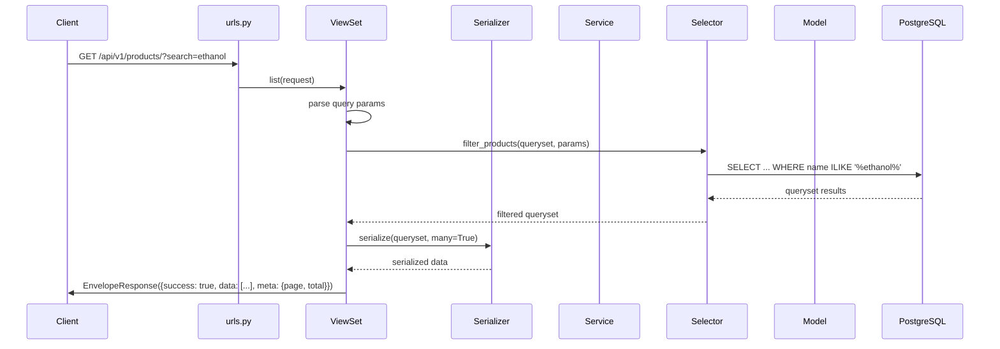
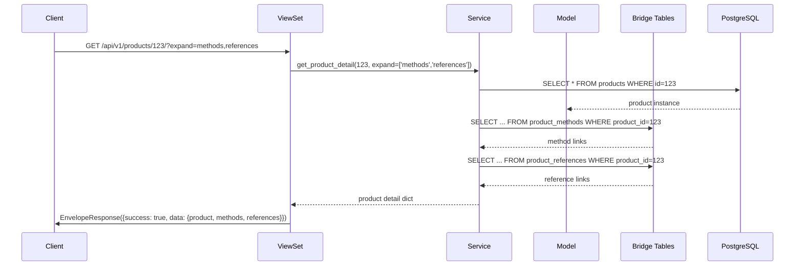
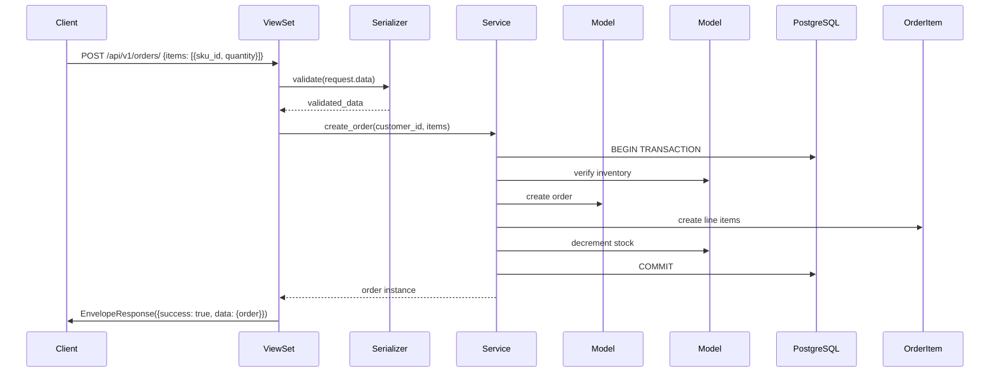
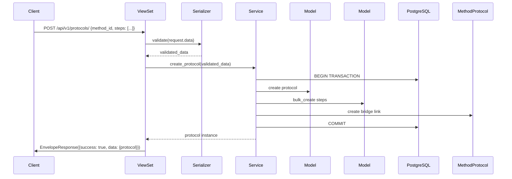
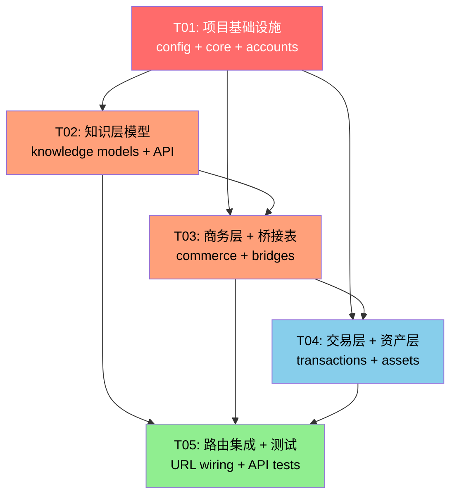

# Backend System Design & Task Decomposition

## Document Authority

This document provides the backend project skeleton design for "试剂网站AI化腾讯版" (LabPro Global) platform.
It is derived from Chapters 2, 4, 6, and 11 of the documentation pack, and is intended for direct consumption by the Engineer (implementing agent).

---

# Part A: System Design

## 1. Implementation Approach

### 1.1 Core Technical Challenges

| Challenge | Solution |
|-----------|----------|
| 23 models across 4 bounded contexts | Django apps per context + explicit through tables |
| Thin views, service-layer orchestration | Dedicated `services/` package with per-domain service classes |
| API response envelope `{success, data, meta}` | Custom DRF renderer + response utilities |
| API versioning `/api/v1/` | DRF URL namespace prefix |
| PostgreSQL array fields (`text[]` for Product.synonyms) | Django `ArrayField` with GIN index |
| PostgreSQL interval fields (`shelf_life`) | Django `DurationField` |
| JSONB fields (`Compatibility.expression_json`) | Django `JSONField` with validation |
| Search across multiple entity types | PostgreSQL full-text search + trigram via `django.contrib.postgres` |

### 1.2 Framework & Library Selection

| Component | Choice | Justification |
|-----------|--------|---------------|
| Web Framework | Django 5.1.3 | PRD requirement, mature ORM |
| API Layer | DRF 3.15.2 | PRD requirement, serializer/viewset pattern |
| Database | PostgreSQL (via psycopg2-binary) | ArrayField, JSONField, full-text search |
| API Schema | drf-spectacular 0.27.2 | OpenAPI 3.0 auto-generation |
| Filtering | django-filter 24.3 | Declarative queryset filtering |
| CORS | django-cors-headers 4.4.0 | Frontend cross-origin access |
| Rich Text | django-ckeditor-5 0.2.17 | Protocol content editing |
| Image/PDF | Pillow + PyMuPDF | Product image & PDF processing |
| Testing | pytest + factory-boy | Fast test execution, fixture factories |
| Cache | django-redis | Optional performance layer |

### 1.3 Architecture Pattern

**Layered Architecture with Service Layer**

```
HTTP Request
    ↓
URL Router (api/v1/...)
    ↓
ViewSet (thin — dispatch only)
    ↓
Serializer (validate + shape)
    ↓
Service Layer (business logic + transaction)
    ↓
Model Layer (ORM + PostgreSQL)
```

**Key Rules:**
- Views: only accept request, call service, return response
- Serializers: validate input, shape output, no side effects
- Services: own transactions, cross-model writes, business rules
- Models: define schema, constraints, indexes, no orchestration

---

## 2. File List

### 2.1 Project Structure

```
backend/
├── config/                          # Django project config
│   ├── __init__.py
│   ├── settings.py                  # Main settings (split by environment)
│   ├── settings/
│   │   ├── __init__.py
│   │   ├── base.py                  # Shared settings
│   │   ├── development.py           # Dev overrides
│   │   └── production.py            # Prod overrides
│   ├── urls.py                      # Root URL configuration
│   ├── wsgi.py                      # WSGI entry point
│   └── asgi.py                      # ASGI entry point
│
├── apps/                            # Django apps by bounded context
│   ├── __init__.py
│   │
│   ├── knowledge/                   # Knowledge Context
│   │   ├── __init__.py
│   │   ├── apps.py                  # AppConfig
│   │   ├── models.py               # ResearchGoal, Application, Method, Protocol, ProtocolStep, Reference, Compatibility
│   │   ├── admin.py                 # Admin registrations
│   │   ├── api/                     # API layer
│   │   │   ├── __init__.py
│   │   │   ├── v1/
│   │   │   │   ├── __init__.py
│   │   │   │   ├── serializers.py   # Knowledge serializers
│   │   │   │   ├── views.py         # Knowledge viewsets
│   │   │   │   ├── filters.py       # Knowledge filtersets
│   │   │   │   └── urls.py          # Knowledge URL patterns
│   │   │   └── __init__.py
│   │   ├── services.py             # Knowledge domain services
│   │   ├── selectors.py            # Reusable query builders
│   │   ├── tests/
│   │   │   ├── __init__.py
│   │   │   ├── factories.py         # Test factories
│   │   │   ├── test_models.py
│   │   │   ├── test_services.py
│   │   │   └── test_api.py
│   │   └── migrations/
│   │       └── __init__.py
│   │
│   ├── commerce/                    # Commerce Context (Product, SKU, ProductClass, CatalogGroup)
│   │   ├── __init__.py
│   │   ├── apps.py
│   │   ├── models.py               # Product, SKU, ProductClass, CatalogGroup
│   │   ├── admin.py
│   │   ├── api/
│   │   │   ├── __init__.py
│   │   │   └── v1/
│   │   │       ├── __init__.py
│   │   │       ├── serializers.py
│   │   │       ├── views.py
│   │   │       ├── filters.py
│   │   │       └── urls.py
│   │   ├── services.py
│   │   ├── selectors.py
│   │   ├── tests/
│   │   │   ├── __init__.py
│   │   │   ├── factories.py
│   │   │   ├── test_models.py
│   │   │   ├── test_services.py
│   │   │   └── test_api.py
│   │   └── migrations/
│   │       └── __init__.py
│   │
│   ├── bridges/                     # Bridge/Mapping tables (cross-context)
│   │   ├── __init__.py
│   │   ├── apps.py
│   │   ├── models.py               # ProductCompatibility, ProductMethod, MethodProtocol, ProductProduct, ProductReference
│   │   ├── admin.py
│   │   ├── services.py
│   │   ├── tests/
│   │   │   ├── __init__.py
│   │   │   └── test_models.py
│   │   └── migrations/
│   │       └── __init__.py
│   │
│   ├── transactions/                # Transaction Context
│   │   ├── __init__.py
│   │   ├── apps.py
│   │   ├── models.py               # Order, OrderItem, Quote, QuoteItem, Basket, Wishlist
│   │   ├── admin.py
│   │   ├── api/
│   │   │   ├── __init__.py
│   │   │   └── v1/
│   │   │       ├── __init__.py
│   │   │       ├── serializers.py
│   │   │       ├── views.py
│   │   │       ├── filters.py
│   │   │       └── urls.py
│   │   ├── services.py
│   │   ├── selectors.py
│   │   ├── tests/
│   │   │   ├── __init__.py
│   │   │   ├── factories.py
│   │   │   ├── test_models.py
│   │   │   ├── test_services.py
│   │   │   └── test_api.py
│   │   └── migrations/
│   │       └── __init__.py
│   │
│   ├── assets/                      # Asset Context
│   │   ├── __init__.py
│   │   ├── apps.py
│   │   ├── models.py               # PdfFile
│   │   ├── admin.py
│   │   ├── api/
│   │   │   ├── __init__.py
│   │   │   └── v1/
│   │   │       ├── __init__.py
│   │   │       ├── serializers.py
│   │   │       ├── views.py
│   │   │       └── urls.py
│   │   ├── services.py
│   │   ├── tests/
│   │   │   ├── __init__.py
│   │   │   └── test_models.py
│   │   └── migrations/
│   │       └── __init__.py
│   │
│   └── accounts/                    # User/Auth
│       ├── __init__.py
│       ├── apps.py
│       ├── models.py               # Custom User model
│       ├── admin.py
│       ├── api/
│       │   ├── __init__.py
│       │   └── v1/
│       │       ├── __init__.py
│       │       ├── serializers.py
│       │       ├── views.py
│       │       └── urls.py
│       ├── services.py
│       ├── tests/
│       │   ├── __init__.py
│       │   └── test_models.py
│       └── migrations/
│           └── __init__.py
│
├── core/                            # Shared infrastructure
│   ├── __init__.py
│   ├── models.py                   # Base model mixins (TimeStamped, Slugged, StatusMixin)
│   ├── serializers.py              # EnvelopeRenderer, BaseSerializer
│   ├── renderers.py                # Custom DRF renderer for {success, data, meta} envelope
│   ├── pagination.py               # Standard pagination classes
│   ├── exceptions.py               # Custom exception handler
│   ├── permissions.py              # Custom permission classes
│   └── mixins.py                   # ViewSet mixins (envelope wrapping, etc.)
│
├── services/                        # Cross-app services (empty initially)
│   └── __init__.py
│
├── manage.py                        # Django management command entry
├── requirements.txt                 # Python dependencies (already exists)
├── pyproject.toml                   # Project metadata + tool configs
├── .env.example                     # Environment variables template (already exists)
└── pytest.ini                       # Pytest configuration
```

### 2.2 File Count Summary

| Category | Count |
|----------|-------|
| Config files | 10 |
| Knowledge app | 16 |
| Commerce app | 16 |
| Bridges app | 9 |
| Transactions app | 16 |
| Assets app | 11 |
| Accounts app | 11 |
| Core infrastructure | 8 |
| Root files | 4 |
| **Total** | **~101 files** |

---

## 3. Data Structures and Interfaces

### 3.1 Class Diagram (Models)

```mermaid
classDiagram
    direction TB

    class TimeStampedModel {
        +DateTimeField created_at
        +DateTimeField updated_at
    }

    class SluggedModel {
        +CharField slug
        +SlugField name
    }

    %% ──────────── Knowledge Context ────────────

    class ResearchGoal {
        +CharField name
        +SlugField slug
        +TextField summary
        +IntegerField priority
        +CharField status
    }

    class Application {
        +ForeignKey research_goal
        +CharField name
        +SlugField slug
        +TextField summary
        +IntegerField sort_order
        +CharField status
    }

    class Method {
        +ForeignKey application
        +CharField name
        +SlugField slug
        +TextField purpose
        +TextField advantages
        +TextField limitations
        +CharField cost_band
        +CharField timeline
        +CharField status
    }

    class Protocol {
        +ForeignKey method
        +SlugField slug
        +CharField version
        +TextField objective
        +TextField principle
        +TextField materials
        +TextField reagents
        +TextField equipment
        +TextField troubleshooting
        +TextField expected_results
        +CharField status
    }

    class ProtocolStep {
        +ForeignKey protocol
        +IntegerField step_no
        +CharField title
        +TextField body
        +IntegerField duration_seconds
        +TextField warnings
    }

    class Reference {
        +CharField title
        +TextField authors
        +CharField journal
        +IntegerField year
        +CharField doi
        +CharField pmid
        +URLField url
        +TextField citation_text
        +CharField source_type
    }

    class Compatibility {
        +CharField code
        +CharField scope
        +CharField rule_type
        +CharField severity
        +JSONField expression_json
        +TextField summary
        +CharField status
    }

    %% ──────────── Commerce Context ────────────

    class Product {
        +CharField name
        +SlugField slug
        +CharField cas
        +TextField smiles
        +ArrayField synonyms
        +TextField inchi
        +CharField purity
        +TextField storage
        +TextField shipping
        +CharField lead_time
        +TextField handling_notes
        +DurationField shelf_life
        +BooleanField research_use_only
        +CharField status
        +ForeignKey product_class
    }

    class SKU {
        +ForeignKey product
        +CharField sku_code
        +CharField pack_size
        +DecimalField price
        +CharField currency
        +CharField inventory_status
    }

    class ProductClass {
        +CharField name
        +SlugField slug
        +ForeignKey parent
        +IntegerField sort_order
    }

    class CatalogGroup {
        +CharField name
        +SlugField slug
        +CharField locale
        +BooleanField active
    }

    %% ──────────── Bridge Tables ────────────

    class ProductCompatibility {
        +ForeignKey source_product
        +ForeignKey target_product
        +ForeignKey compatibility
        +CharField verdict
        +TextField notes
    }

    class ProductMethod {
        +ForeignKey product
        +ForeignKey method
        +CharField role
        +CharField evidence_level
        +IntegerField display_order
    }

    class MethodProtocol {
        +ForeignKey method
        +ForeignKey protocol
        +IntegerField display_order
        +BooleanField featured
        +CharField status
    }

    class ProductProduct {
        +ForeignKey source_product
        +ForeignKey target_product
        +CharField relation_type
        +CharField direction
        +CharField strength
        +TextField notes
    }

    class ProductReference {
        +ForeignKey product
        +ForeignKey reference
        +CharField citation_role
        +IntegerField display_order
    }

    %% ──────────── Transaction Context ────────────

    class Order {
        +CharField order_no
        +ForeignKey customer
        +CharField status
        +DecimalField subtotal
        +DecimalField tax_total
        +DecimalField grand_total
        +CharField currency
    }

    class OrderItem {
        +ForeignKey order
        +ForeignKey product
        +ForeignKey sku
        +IntegerField quantity
        +DecimalField unit_price
    }

    class Quote {
        +CharField quote_no
        +ForeignKey customer
        +CharField status
        +DateField valid_until
        +DecimalField subtotal
        +DecimalField grand_total
    }

    class QuoteItem {
        +ForeignKey quote
        +ForeignKey product
        +ForeignKey sku
        +IntegerField quantity
        +DecimalField unit_price
    }

    class Basket {
        +ForeignKey user
        +CharField session_key
        +CharField state
        +DateTimeField expires_at
    }

    class Wishlist {
        +ForeignKey user
        +CharField name
        +CharField state
        +CharField visibility
    }

    %% ──────────── Asset Context ────────────

    class PdfFile {
        +FileField file
        +CharField checksum
        +CharField mime_type
        +IntegerField page_count
        +CharField extraction_state
    }

    %% ──────────── Relationships ────────────

    ResearchGoal "1" --> "*" Application : has
    Application "1" --> "*" Method : groups
    Method "1" --> "*" Protocol : owns
    Protocol "1" --> "*" ProtocolStep : contains
    ProductClass "1" --> "*" Product : classifies
    Product "1" --> "*" SKU : variants

    Product "*" --> "*" Method : via ProductMethod
    Method "*" --> "*" Protocol : via MethodProtocol
    Product "*" --> "*" Reference : via ProductReference
    Product "*" --> "*" Product : via ProductProduct
    Product "*" --> "*" Compatibility : via ProductCompatibility

    Order "1" --> "*" OrderItem : contains
    Quote "1" --> "*" QuoteItem : contains
```



### 3.2 API ViewSets and Services

```mermaid
classDiagram
    direction TB

    %% ──────────── Core Infrastructure ────────────

    class EnvelopeRenderer {
        +render(data, media_type, renderer_context)
    }

    class EnvelopeResponse {
        +bool success
        +Any data
        +dict meta
        +from_ok(data, meta)
        +from_error(error, status)
    }

    class StandardPagination {
        +int page_size
        +int page_size_query_param
        +paginate_queryset(queryset, request, view)
    }

    %% ──────────── Knowledge API ────────────

    class ResearchGoalViewSet {
        +list(request)
        +retrieve(request, pk)
    }

    class ApplicationViewSet {
        +list(request)
        +retrieve(request, pk)
        +create(request)
        +partial_update(request, pk)
    }

    class MethodViewSet {
        +list(request)
        +retrieve(request, pk)
        +create(request)
        +partial_update(request, pk)
    }

    class ProtocolViewSet {
        +list(request)
        +retrieve(request, pk)
        +create(request)
        +partial_update(request, pk)
    }

    class ReferenceViewSet {
        +list(request)
        +retrieve(request, pk)
        +create(request)
        +partial_update(request, pk)
    }

    class CompatibilityViewSet {
        +list(request)
        +retrieve(request, pk)
        +create(request)
        +partial_update(request, pk)
    }

    %% ──────────── Commerce API ────────────

    class ProductViewSet {
        +list(request)
        +retrieve(request, pk)
        +create(request)
        +partial_update(request, pk)
    }

    class SKUViewSet {
        +list(request)
        +retrieve(request, pk)
        +create(request)
        +partial_update(request, pk)
    }

    class ProductClassViewSet {
        +list(request)
        +retrieve(request, pk)
    }

    class CatalogGroupViewSet {
        +list(request)
    }

    %% ──────────── Transaction API ────────────

    class OrderViewSet {
        +list(request)
        +retrieve(request, pk)
        +create(request)
        +partial_update(request, pk)
    }

    class QuoteViewSet {
        +list(request)
        +retrieve(request, pk)
        +create(request)
        +partial_update(request, pk)
    }

    class BasketViewSet {
        +retrieve(request)
        +add_item(request)
        +update_item(request, item_id)
        +remove_item(request, item_id)
    }

    class WishlistViewSet {
        +list(request)
        +retrieve(request, pk)
        +create(request)
        +add_item(request, pk)
        +remove_item(request, pk, item_id)
    }

    %% ──────────── Services ────────────

    class KnowledgeService {
        +publish_protocol(protocol_id)
        +supersede_protocol(protocol_id, new_version)
        +link_product_to_method(product_id, method_id, role)
        +link_product_to_reference(product_id, ref_id, role)
    }

    class CommerceService {
        +create_product(data)
        +update_product(product_id, data)
        +get_product_detail(product_id, expand)
        +search_products(query, filters)
    }

    class TransactionService {
        +create_order(customer_id, items)
        +update_order_status(order_id, status)
        +add_to_basket(user_id, product_id, sku_id, qty)
        +create_quote(customer_id, items)
    }
```



---

## 4. Program Call Flow

### 4.1 Product List API Flow



### 4.2 Product Detail (with expansions) Flow



### 4.3 Order Creation Flow



### 4.4 Protocol Publishing Flow



---

## 5. Anything UNCLEAR

| Item | Assumption / Action |
|------|---------------------|
| Existing `ProductCatalog` model | Assumed to be renamed to `SKU` as per Ch.4 §0. Phase 1 creates fresh models; no legacy data migration needed yet. |
| `sku_no` → `sku_code` field rename | Will use `sku_code` as the canonical field name in new code. |
| Transaction models (Order, Quote, etc.) | Spec says "retained" — Phase 1 creates schema stubs only, full logic deferred to later phases. |
| User/Account model | Assumed Django's built-in `User` with possible extension. Custom `accounts.User` inherits `AbstractUser`. |
| `Product.inventory_status` | Per Ch.4 §5.1: NOT persisted on Product; derived from SKU aggregation. Will be a computed property/serializer field. |
| `CatalogGroup` ↔ `Product` relation | The ERD shows a relationship but no explicit through table is defined. Will use a simple FK on Product → CatalogGroup. |
| Search implementation | Phase 1 uses PostgreSQL full-text search (no Elasticsearch). Search view/service will be a read model aggregating across Product, Method, Protocol, Reference. |
| Media file storage | Phase 1 uses local filesystem (`MEDIA_ROOT`). S3/CDN deferred. |
| `Protocol.references` text field | Per Ch.6 §7.4 note: `reference_ids` in Protocol detail is derived by parsing the `references` text field. Phase 1 adds a `references` TextField; derivation logic implemented in selector. |

---

# Part B: Task Decomposition

## 6. Required Packages

```
# Already in requirements.txt
Django==5.1.3
djangorestframework==3.15.2
django-cors-headers==4.4.0
django-ckeditor-5==0.2.17
psycopg2-binary==2.9.9
dj-database-url==2.3.0
gunicorn==22.0.0
whitenoise==6.7.0
Pillow==11.1.0
PyMuPDF==1.25.4
python-dotenv==1.0.1
sqlparse==0.5.2
django-filter==24.3
drf-spectacular==0.27.2
django-redis==5.4.0
pytest==8.3.3
pytest-django==4.8.0
pytest-cov==5.0.0
factory-boy==3.3.0
```

## 7. Task List (ordered by dependency)

### T01: Project Infrastructure & Core Framework

**Task ID**: T01
**Task Name**: 项目基础设施 — Django配置 + 核心中间件 + 入口文件
**Priority**: P0
**Dependencies**: None

**Source Files** (21 files):
| File | Purpose |
|------|---------|
| `config/__init__.py` | Package marker |
| `config/settings/__init__.py` | Settings package |
| `config/settings/base.py` | Shared Django settings (INSTALLED_APPS, MIDDLEWARE, REST_FRAMEWORK, DATABASES) |
| `config/settings/development.py` | Dev overrides (DEBUG=True, local DB) |
| `config/settings/production.py` | Prod overrides (DEBUG=False, security hardening) |
| `config/urls.py` | Root URL router: `/api/v1/knowledge/`, `/api/v1/commerce/`, etc. |
| `config/wsgi.py` | WSGI application entry |
| `config/asgi.py` | ASGI application entry |
| `core/__init__.py` | Core package marker |
| `core/models.py` | BaseModel mixin (TimeStampedModel, SluggedModel, StatusMixin with TextChoices) |
| `core/renderers.py` | `EnvelopeRenderer` — wraps all responses in `{success, data, meta}` |
| `core/pagination.py` | `StandardPagination` — page/page_size with meta in envelope |
| `core/exceptions.py` | Custom DRF exception handler → envelope error shape |
| `core/permissions.py` | Base permission classes (IsAdminOrReadOnly, etc.) |
| `core/mixins.py` | ViewSet mixins (EnvelopeMixin for automatic envelope wrapping) |
| `core/serializers.py` | Base serializer with envelope-aware response helpers |
| `manage.py` | Django CLI entry point |
| `pyproject.toml` | Project metadata, black/ruff configs |
| `pytest.ini` | Pytest settings (DJANGO_SETTINGS_MODULE, test paths) |
| `apps/__init__.py` | Apps package marker |
| `apps/accounts/__init__.py` | Accounts app package |
| `apps/accounts/apps.py` | AccountsConfig |
| `apps/accounts/models.py` | Custom User model (extends AbstractUser) |
| `apps/accounts/admin.py` | User admin registration |
| `apps/accounts/migrations/__init__.py` | Migrations package |

**Acceptance Criteria**:
- `python manage.py check` passes
- `pytest` discovers and runs (0 tests, no errors)
- Envelope renderer returns `{success: true, data: {...}, meta: {...}}` shape

---

### T02: Knowledge Context Models & Migrations

**Task ID**: T02
**Task Name**: 知识层模型 — ResearchGoal, Application, Method, Protocol, ProtocolStep, Reference, Compatibility
**Priority**: P0
**Dependencies**: T01

**Source Files** (14 files):
| File | Purpose |
|------|---------|
| `apps/knowledge/__init__.py` | Package marker |
| `apps/knowledge/apps.py` | KnowledgeConfig |
| `apps/knowledge/models.py` | All 7 knowledge models with Meta.constraints, indexes, TextChoices enums |
| `apps/knowledge/admin.py` | Admin site registrations for all knowledge models |
| `apps/knowledge/migrations/__init__.py` | Migrations package |
| `apps/knowledge/services.py` | `KnowledgeService` — publish_protocol, supersede_protocol, create_method, etc. |
| `apps/knowledge/selectors.py` | `get_methods_by_application`, `get_protocols_with_steps`, etc. |
| `apps/knowledge/api/__init__.py` | API package marker |
| `apps/knowledge/api/v1/__init__.py` | V1 package marker |
| `apps/knowledge/api/v1/serializers.py` | All knowledge serializers (list/detail/create) |
| `apps/knowledge/api/v1/views.py` | All knowledge viewsets (thin — delegate to service/selector) |
| `apps/knowledge/api/v1/filters.py` | Django-filter filtersets for knowledge models |
| `apps/knowledge/api/v1/urls.py` | URL patterns: `/research-goals/`, `/applications/`, `/methods/`, etc. |
| `apps/knowledge/tests/__init__.py` | Tests package marker |
| `apps/knowledge/tests/factories.py` | Factory-boy factories for knowledge models |

**Model Details**:

```
ResearchGoal: id, slug, name, summary, priority(int), status(draft|active|archived)
Application: id, slug, name, summary, sort_order, status, research_goal_id(FK→ResearchGoal)
Method: id, slug, name, purpose, summary, advantages, limitations, cost_band, timeline, status, application_id(FK→Application)
Protocol: id, slug, version, objective, principle, materials, reagents, equipment, troubleshooting, expected_results, status, references(text), method_id(FK→Method)
ProtocolStep: id, step_no, title, body, duration_seconds, warnings, protocol_id(FK→Protocol)
Reference: id, title, authors, journal, year, doi(unique), pmid(unique), url, citation_text, source_type
Compatibility: id, code(unique), scope, rule_type, severity, expression_json(JSONField), summary, status
```

**Acceptance Criteria**:
- `python manage.py makemigrations knowledge` generates clean migration
- `python manage.py migrate` succeeds
- All 7 models appear in Django admin
- Factory-boy factories can create each model

---

### T03: Commerce Context + Bridge Tables

**Task ID**: T03
**Task Name**: 商务层 + 桥接表 — Product, SKU, ProductClass, CatalogGroup, 5 bridge tables
**Priority**: P0
**Dependencies**: T02 (bridge tables reference knowledge models)

**Source Files** (25 files):
| File | Purpose |
|------|---------|
| `apps/commerce/__init__.py` | Package marker |
| `apps/commerce/apps.py` | CommerceConfig |
| `apps/commerce/models.py` | Product, SKU, ProductClass, CatalogGroup |
| `apps/commerce/admin.py` | Commerce admin registrations |
| `apps/commerce/migrations/__init__.py` | Migrations package |
| `apps/commerce/services.py` | `CommerceService` — create_product, update_product, search_products |
| `apps/commerce/selectors.py` | `get_product_detail`, `filter_products`, `get_sku_summary` |
| `apps/commerce/api/__init__.py` | API package marker |
| `apps/commerce/api/v1/__init__.py` | V1 package marker |
| `apps/commerce/api/v1/serializers.py` | Commerce serializers (ProductListSerializer, ProductDetailSerializer, SKUSerializer) |
| `apps/commerce/api/v1/views.py` | Commerce viewsets (thin) |
| `apps/commerce/api/v1/filters.py` | Commerce filtersets (CAS, SMILES, name, application, method) |
| `apps/commerce/api/v1/urls.py` | URL patterns: `/products/`, `/skus/`, `/product-classes/`, `/catalog-groups/` |
| `apps/commerce/tests/__init__.py` | Tests package |
| `apps/commerce/tests/factories.py` | Factory-boy factories for commerce models |
| `apps/bridges/__init__.py` | Bridges package marker |
| `apps/bridges/apps.py` | BridgesConfig |
| `apps/bridges/models.py` | ProductCompatibility, ProductMethod, MethodProtocol, ProductProduct, ProductReference |
| `apps/bridges/admin.py` | Bridge admin registrations |
| `apps/bridges/migrations/__init__.py` | Migrations package |
| `apps/bridges/services.py` | Bridge services (link/unlink operations) |
| `apps/bridges/tests/__init__.py` | Tests package |
| `apps/bridges/tests/factories.py` | Bridge table factories |
| `apps/bridges/tests/test_models.py` | Bridge model constraint tests |

**Model Details**:

```
ProductClass: id, name, slug, parent_id(self FK), sort_order
CatalogGroup: id, name, slug, locale, active(bool)
Product: id, slug, name, cas, smiles, synonyms(ArrayField), inchi, purity, storage, shipping, lead_time, handling_notes, shelf_life(DurationField), research_use_only(bool), status, product_class_id(FK→ProductClass)
SKU: id, sku_code, pack_size, price(Decimal), currency, inventory_status, product_id(FK→Product)

ProductMethod: id, role(enum), evidence_level(enum), display_order, product_id(FK), method_id(FK) — unique_together(product, method, role)
MethodProtocol: id, display_order, featured(bool), status, method_id(FK), protocol_id(FK) — unique_together(method, protocol)
ProductReference: id, citation_role(enum), display_order, product_id(FK), reference_id(FK) — unique_together(product, reference, citation_role)
ProductCompatibility: id, verdict, notes, source_product_id(FK), target_product_id(FK), compatibility_id(FK) — unique_together(source, target, compatibility)
ProductProduct: id, relation_type(enum), direction(enum), strength, notes, source_product_id(FK), target_product_id(FK) — unique_together(source, target, relation_type)
```

**Acceptance Criteria**:
- `python manage.py makemigrations commerce bridges` generates clean migrations
- `python manage.py migrate` succeeds
- Product has ArrayField `synonyms` with GIN index
- All bridge table unique constraints enforced
- No circular import errors between commerce and knowledge

---

### T04: Transaction Context + Asset Context

**Task ID**: T04
**Task Name**: 交易层 + 资产层 — Order, Quote, Basket, Wishlist, PdfFile
**Priority**: P1
**Dependencies**: T03 (OrderItem/QuoteItem reference Product and SKU)

**Source Files** (20 files):
| File | Purpose |
|------|---------|
| `apps/transactions/__init__.py` | Package marker |
| `apps/transactions/apps.py` | TransactionsConfig |
| `apps/transactions/models.py` | Order, OrderItem, Quote, QuoteItem, Basket, Wishlist |
| `apps/transactions/admin.py` | Transaction admin registrations |
| `apps/transactions/migrations/__init__.py` | Migrations package |
| `apps/transactions/services.py` | `TransactionService` — create_order, add_to_basket, create_quote |
| `apps/transactions/selectors.py` | `get_order_detail`, `get_user_basket`, `get_user_wishlists` |
| `apps/transactions/api/__init__.py` | API package marker |
| `apps/transactions/api/v1/__init__.py` | V1 package marker |
| `apps/transactions/api/v1/serializers.py` | Transaction serializers |
| `apps/transactions/api/v1/views.py` | Transaction viewsets (thin) |
| `apps/transactions/api/v1/filters.py` | Transaction filtersets |
| `apps/transactions/api/v1/urls.py` | URL patterns: `/orders/`, `/quotes/`, `/basket/`, `/wishlist/` |
| `apps/transactions/tests/__init__.py` | Tests package |
| `apps/transactions/tests/factories.py` | Transaction factories |
| `apps/assets/__init__.py` | Assets package marker |
| `apps/assets/apps.py` | AssetsConfig |
| `apps/assets/models.py` | PdfFile model |
| `apps/assets/admin.py` | Asset admin |
| `apps/assets/api/v1/urls.py` | Asset URL patterns |
| `apps/assets/migrations/__init__.py` | Migrations package |

**Acceptance Criteria**:
- `python manage.py migrate` succeeds for all apps
- Order can be created with OrderItems referencing Product and SKU
- Basket and Wishlist models are queryable
- PdfFile model has proper file upload configuration

---

### T05: URL Wiring, Tests & Integration

**Task ID**: T05
**Task Name**: 路由集成 + 端点测试 + API验证
**Priority**: P1
**Dependencies**: T01, T02, T03, T04

**Source Files** (15 files):
| File | Purpose |
|------|---------|
| `config/urls.py` | Final root URL config wiring all app API routers |
| `apps/knowledge/tests/test_models.py` | Knowledge model constraint tests |
| `apps/knowledge/tests/test_services.py` | Knowledge service tests |
| `apps/knowledge/tests/test_api.py` | Knowledge API endpoint tests |
| `apps/commerce/tests/test_models.py` | Commerce model tests |
| `apps/commerce/tests/test_services.py` | Commerce service tests |
| `apps/commerce/tests/test_api.py` | Commerce API endpoint tests |
| `apps/transactions/tests/test_models.py` | Transaction model tests |
| `apps/transactions/tests/test_services.py` | Transaction service tests |
| `apps/transactions/tests/test_api.py` | Transaction API endpoint tests |
| `apps/assets/tests/__init__.py` | Tests package |
| `apps/assets/tests/test_models.py` | Asset model tests |
| `apps/assets/services.py` | Asset service (PDF upload/extract) |
| `apps/assets/api/v1/serializers.py` | Asset serializers |
| `apps/assets/api/v1/views.py` | Asset viewsets |

**Acceptance Criteria**:
- All API endpoints accessible at `/api/v1/...`
- All endpoints return `{success, data, meta}` envelope
- `pytest` passes with >80% model coverage
- `drf-spectacular` generates valid OpenAPI schema at `/api/docs/`
- Product list/detail API returns expected fields per Ch.6
- Method list/detail includes `protocol_ids` and `product_ids`

---

## 8. Shared Knowledge

### Cross-cutting Concerns

| Concern | Convention |
|---------|------------|
| API Response Format | All responses: `{ "success": bool, "data": {}, "meta": {} }` |
| API Versioning | All URLs prefixed with `/api/v1/` |
| Auth Model | Django `AbstractUser` extended in `accounts.User` |
| Status Enums | Use `TextChoices` — common values: `draft`, `active`, `deprecated`, `archived` |
| Bridge Tables | Always explicit through models, never anonymous M2M |
| Date/Time | All timestamps in UTC, `DateTimeField(auto_now_add=True)` for created, `auto_now=True` for updated |
| Slug Generation | Auto-generate from `name` field using `django.utils.text.slugify` + uniqueness check |
| Pagination | Default page_size=20, max=100, exposed in `meta.pagination` |
| Error Shape | `{ "success": false, "data": null, "meta": { "error": { "code": "...", "message": "..." } } }` |
| Index Naming | `{table}_{field}_idx`, unique: `{table}_{field}_uniq` |
| db_table naming | `snake_case` matching model name, e.g., `research_goal`, `product_method` |
| related_name | Explicit, e.g., `applications`, `methods`, `protocols` |

### Django Settings Highlights

```python
INSTALLED_APPS = [
    # Django core
    'django.contrib.admin',
    'django.contrib.auth',
    'django.contrib.contenttypes',
    'django.contrib.sessions',
    'django.contrib.messages',
    'django.contrib.staticfiles',
    'django.contrib.postgres',  # ArrayField, JSONField, full-text search
    # Third party
    'rest_framework',
    'corsheaders',
    'django_filters',
    'drf_spectacular',
    # Local apps
    'apps.accounts',
    'apps.knowledge',
    'apps.commerce',
    'apps.bridges',
    'apps.transactions',
    'apps.assets',
]

REST_FRAMEWORK = {
    'DEFAULT_RENDERER_CLASSES': [
        'core.renderers.EnvelopeRenderer',
    ],
    'DEFAULT_PAGINATION_CLASS': 'core.pagination.StandardPagination',
    'PAGE_SIZE': 20,
    'DEFAULT_FILTER_BACKENDS': [
        'django_filters.rest_framework.DjangoFilterBackend',
        'rest_framework.filters.SearchFilter',
        'rest_framework.filters.OrderingFilter',
    ],
    'DEFAULT_SCHEMA_CLASS': 'drf_spectacular.openapi.AutoSchema',
    'EXCEPTION_HANDLER': 'core.exceptions.custom_exception_handler',
}
```

---

## 9. Task Dependency Graph



**Critical Path**: T01 → T02 → T03 → T05
**Parallelizable**: T02, T03, T04 can partially overlap after T01

---

## Appendix A: Model-to-App Mapping

| # | Model | App | Status |
|---|-------|-----|--------|
| 1 | ResearchGoal | knowledge | new |
| 2 | Application | knowledge | new |
| 3 | Method | knowledge | new |
| 4 | Protocol | knowledge | new |
| 5 | ProtocolStep | knowledge | new |
| 6 | Reference | knowledge | new |
| 7 | Compatibility | knowledge | new |
| 8 | Product | commerce | new |
| 9 | SKU | commerce | new |
| 10 | ProductClass | commerce | new |
| 11 | CatalogGroup | commerce | new |
| 12 | ProductCompatibility | bridges | new |
| 13 | ProductMethod | bridges | new |
| 14 | MethodProtocol | bridges | new |
| 15 | ProductProduct | bridges | new |
| 16 | ProductReference | bridges | new |
| 17 | Order | transactions | new |
| 18 | OrderItem | transactions | new |
| 19 | Quote | transactions | new |
| 20 | QuoteItem | transactions | new |
| 21 | Basket | transactions | new |
| 22 | Wishlist | transactions | new |
| 23 | PdfFile | assets | new |

## Appendix B: API Endpoint Map

| Endpoint | Methods | ViewSet | App |
|----------|---------|---------|-----|
| `/api/v1/research-goals/` | GET | ResearchGoalViewSet | knowledge |
| `/api/v1/applications/` | GET, POST, PATCH | ApplicationViewSet | knowledge |
| `/api/v1/methods/` | GET, POST, PATCH | MethodViewSet | knowledge |
| `/api/v1/protocols/` | GET, POST, PATCH | ProtocolViewSet | knowledge |
| `/api/v1/references/` | GET, POST, PATCH | ReferenceViewSet | knowledge |
| `/api/v1/compatibility/` | GET, POST, PATCH | CompatibilityViewSet | knowledge |
| `/api/v1/products/` | GET, POST, PATCH | ProductViewSet | commerce |
| `/api/v1/skus/` | GET, POST, PATCH | SKUViewSet | commerce |
| `/api/v1/product-classes/` | GET | ProductClassViewSet | commerce |
| `/api/v1/catalog-groups/` | GET | CatalogGroupViewSet | commerce |
| `/api/v1/orders/` | GET, POST, PATCH | OrderViewSet | transactions |
| `/api/v1/order-items/` | POST, PATCH, DELETE | OrderItemViewSet | transactions |
| `/api/v1/quotes/` | GET, POST, PATCH | QuoteViewSet | transactions |
| `/api/v1/quote-items/` | POST, PATCH, DELETE | QuoteItemViewSet | transactions |
| `/api/v1/basket/` | GET, POST, PATCH, DELETE | BasketViewSet | transactions |
| `/api/v1/wishlist/` | GET, POST, PATCH | WishlistViewSet | transactions |
| `/api/v1/search/` | GET | SearchViewSet | core |
