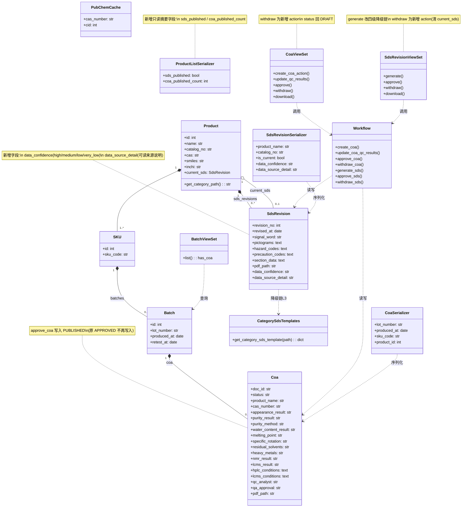
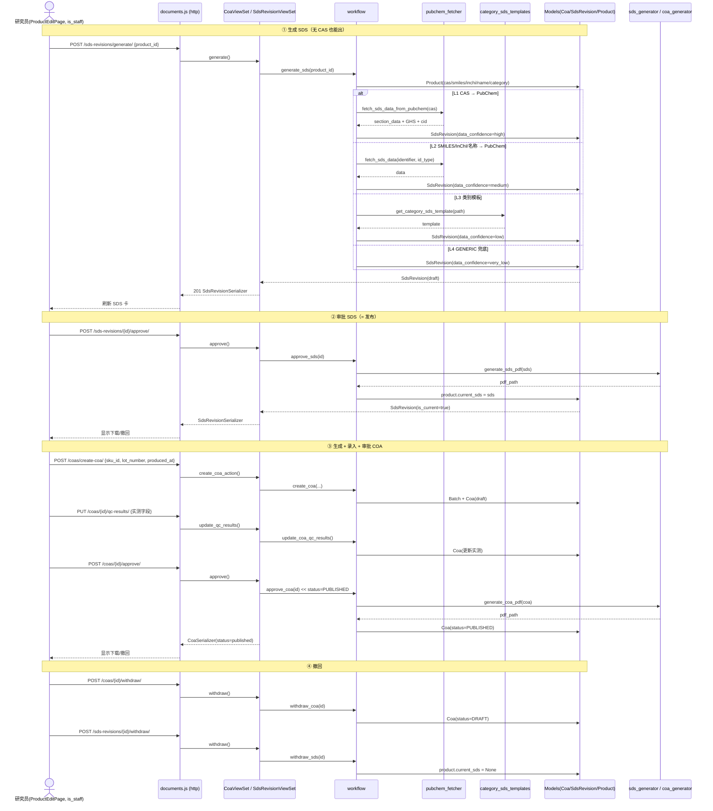
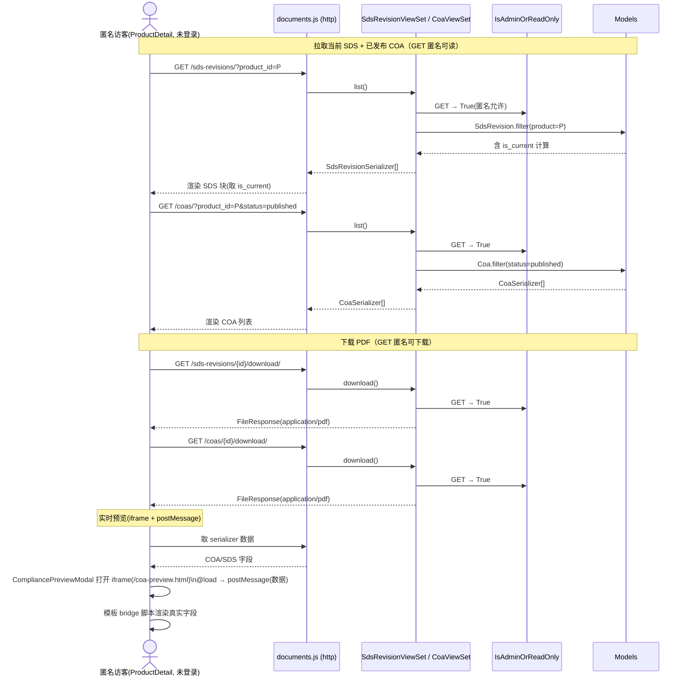

# COA / SDS 合规文档功能 — 系统架构设计 + 任务分解（ARCH）

> 文档版本：2026-07-09 · 作者：架构师 高见远（SciReAgent 软件开发团队）
> 范围：仅前端呈现 + API 接线 + 少量后端权限/状态补全（**不重做后端生成 / PDF 逻辑**）
> 依据：产品经理 PRD（`docs/COA_SDS_PRD.md`）+ 已锁定 5 个用户决策 + 4 个微决策 + **实读后端/前端代码**
> 协作：本文件为「标准 SOP 第二步」产出，供 Engineer 实现、QA 回归。

---

## 0. 关键纠偏（基于实读代码，务必先读）

以下为**代码事实**，与 PRD 描述一致或已就地确认，作为设计铁律：

1. **权限无需改**：`backend/core/permissions.py` 的 `IsAdminOrReadOnly` 逻辑已是
   `SAFE_METHODS(GET/HEAD/OPTIONS) → True（匿名可读）` / `其余写方法 → request.user.is_staff`。
   这恰好满足需求 #2/#3。**严禁**替换为 `IsStaffUser`（该类要求登录，会阻断匿名浏览/下载，违反 #3）。
   4 个 ViewSet 的 `permission_classes=[IsAdminOrReadOnly]` 全部保持不变。
2. **`approve_coa` 当前写 `status=APPROVED`（workflow.py:97）** → 须改为 `Coa.Status.PUBLISHED`。
   `Coa.Status` 已含 `PUBLISHED` 值（`models.py:81`）。
3. **`generate_sds` 在 workflow.py:123-124 对无 CAS 产品硬 `raise ValueError`** → 这是 P0 核心缺陷，
   须改为**四级降级链**：`CAS → SMILES/InChI/名称 → 类别模板 → GENERIC_SAFETY_NOTES 兜底`。
   `pubchem_fetcher.py` 中已存在 `_GHS_FALLBACK` 与 `GENERIC_SAFETY_NOTES` 可复用。
   **不得改 `sds_generator.py` / `coa_generator.py` 的 PDF 逻辑**。
4. **⚠️ 响应信封不一致（重要纠偏）**：PRD §6 的模板称响应为 `{code, data, message}`，
   但真实 `core/mixins.EnvelopeMixin` 定义的是 `{success, data, meta}`，且 **documents 的 ViewSet 虽然继承了
   EnvelopeMixin，其 action 方法却直接 `return Response(serializer.data)`（裸 DRF），并未走 `success_response`
   包装**。因此：
   - **documents 端点返回裸 DRF**：detail/action → `resp.data` 即对象；list → `resp.data.results`；
     错误 → `resp.data.error`（视图返回 `{'error': str(e)}`，含 400/500）。
   - **products 端点走 EnvelopeMixin**：`resp.data.data.results`。
   两者不一致。本期**建议保持 documents 裸结构（最小改动）**，前端 `documents.js` 按裸结构解析（详见 §7）。
   是否需要统一由主理人拍板（见 §8 #1）。
5. **前端 API 基址约定**：`frontend/src/api/products.js` 与 `ProductsPage.vue` 均
   `import http from '@/utils/http'` 并以 `/products`、`/products/{id}/detail` 这种**不含 `/api/v1` 前缀**的路径调用，
   说明 `http` 客户端已内置 `baseURL=/api/v1`。`documents.js` 必须沿用同一 import 与同一路径风格
   （即 `/coas`、`/sds-revisions`、`/batches`，**不要**写 `/api/v1/...`）。
6. **SDS 无 `status` 字段**：其"已发布"由 `Product.current_sds` 外键指针表示（`commerce/models.py:171`，可空）。
   COA 有 `status`（draft/published）。两者状态机机制不同，撤回实现不同（见 §4 / PRD §4.4）。
7. **前端当前零接线**：`frontend/src/api/` 下**无** coa/sds/compliance 封装，确认须新建 `documents.js`。
8. **预览模板为硬编码样本**：`public/coa-preview.html`（~30KB）+ `public/sds-preview.html`（~9KB）是完整静态样式，
   但数值为写死的示例，未绑 API、元素无 `id`。本期"接线"= 注入真实数据（见 §7 预览方案）。

---

## 1. 实现方案 + 框架选型

### 本期改动性质（按已锁定决策）

| 层 | 改动 | 性质 |
|---|---|---|
| 后端 | `approve_coa` 状态值 `APPROVED → PUBLISHED` | 1 行修改 |
| 后端 | `generate_sds` 硬 raise → 四级降级链 | 逻辑重写（不碰 PDF 生成） |
| 后端 | 新增 `withdraw_coa` / `withdraw_sds` 服务 + 两个 ViewSet `withdraw` action | 小增量 |
| 后端 | `SdsRevision` 新增 `data_confidence` / `data_source_detail`；`ProductListSerializer` 新增 `sds_published` / `coa_published_count` | 模型/序列化器小增量 + 1 个迁移 |
| 后端 | 新建 `category_sds_templates.py`（类别兜底模板） | 新建小模块 |
| 前端 | 新建 `documents.js` API 封装 + `previewInject.js` 桥接工具 | 新建 |
| 前端 | `ProductEditPage.vue` 新增 Compliance Section（SDS 卡 + 按 SKU 批次 COA 卡） | 视图增量 |
| 前端 | `ProductsPage.vue` 新增「合规」列徽章 | 视图增量 |
| 前端 | `ProductDetail.vue` 470-478 行 `product.documents` → 只读 COA/SDS 区 | 视图替换 |
| 前端 | `coa-preview.html` / `sds-preview.html` 追加 id + bridge 脚本 | 模板接线 |

### 框架 / 技术栈

- **沿用现有栈，不引入任何新依赖**：
  - 前端：Vue 3 + Vite + Element Plus（`ElMessage`/`ElDialog` 已在 `ProductsPage.vue`、`ProductEditPage.vue` 使用）。
  - 后端：Django + DRF（ViewSet / `@action` / `ModelSerializer`）。
  - 降级链复用 Python 标准库 `urllib`（PubChem REST，已用于 `pubchem_fetcher.py`），**无需新 pip 包**。
  - 前端预览复用原生 `iframe` + `postMessage`，**无需新 npm 包**。
- **架构模式**：后端保持 DRF 分层（Model → Service(`workflow.py`) → Serializer → ViewSet `@action`）；
  前端保持「页面组件 → `api/*.js` 封装 → `http` 客户端」分层，不引入状态管理新范式。

### 四级降级链（`generate_sds` 改造，P0-3）

```
L1  CAS         → fetch_sds_data_from_pubchem(cas)            [现有]  confidence=high
L2  SMILES/InChI/名称 → fetch_sds_data(identifier, id_type)  [扩展 pubchem_fetcher] confidence=medium
L3  类别模板     → get_category_sds_template(category_path)    [新建]  confidence=low
L4  GENERIC 兜底 → _build_section_data(..., cid=None)         [复用]  confidence=very_low
```

- 任意一级成功即 `SdsRevision.objects.create(...)` 并返回 draft；四级全失败（理论上仅当无任何标识且类别/通用均异常）才 `raise`。
- 每个 SdsRevision 落地时写入 `data_confidence`（high/medium/low/very_low）与 `data_source_detail`（可读来源说明，如 `PubChem CID 12345` / `Category template: Oligonucleotides` / `Generic safety notes (no identifier matched)`）。
- `category_sds_templates.py` 内部复用 `_build_section_data`（来自 `pubchem_fetcher`）生成通用 16 节骨架，仅按大类覆盖 GHS（`signal_word`/`pictograms`/`hazard_codes`/`precaution_codes`）。

---

## 2. 文件列表及相对路径

> 项目根：`src_claude/`。路径以该根为基准。

### 后端（修改 / 新建）

| 操作 | 相对路径 | 说明 |
|---|---|---|
| 修改 | `backend/apps/documents/models.py` | `SdsRevision` 新增 `data_confidence`(TextChoices: high/medium/low/very_low)、`data_source_detail`(TextField)；`Coa.Status` 保留 `APPROVED` 但不再写入 |
| 新建 | `backend/apps/documents/migrations/XXXX_add_sdsrevision_dataconf.py` | 由 `makemigrations` 生成（仅新字段，无数据迁移） |
| 修改 | `backend/apps/documents/services/workflow.py` | `approve_coa` 改 `PUBLISHED`；新增 `withdraw_coa`/`withdraw_sds`；`generate_sds` 改四级降级链 |
| 修改 | `backend/apps/documents/services/pubchem_fetcher.py` | 扩展 `_get_cid_from_identifier(identifier, id_type)` 支持 `smiles`/`inchi`/`name`；新增 `fetch_sds_data(identifier, id_type='cas', ...)` 包装（复用 `_pubchem_get`/`_build_section_data`/`GENERIC_SAFETY_NOTES`） |
| 新建 | `backend/apps/documents/services/category_sds_templates.py` | `get_category_sds_template(category_path: str) -> dict\|None`，覆盖 8 条产品线 |
| 修改 | `backend/apps/documents/api/v1/serializers.py` | `SdsRevisionSerializer` 暴露 `data_confidence`/`data_source_detail`；`CoaSerializer` 确认 `status` 可读 |
| 修改 | `backend/apps/documents/api/v1/views.py` | `CoaViewSet` 新增 `withdraw` action；`SdsRevisionViewSet` 新增 `withdraw` action（generate 的 `except ValueError` 保留但常态不触发） |
| 确认 | `backend/apps/documents/api/v1/urls.py` | **无需改动**——`DefaultRouter` 自动把 `@action(url_path='withdraw')` 注册为 `coas/{id}/withdraw/` 与 `sds-revisions/{id}/withdraw/` |
| 修改 | `backend/apps/commerce/api/v1/serializers.py` | `ProductListSerializer` 新增只读方法字段 `sds_published: bool`、`coa_published_count: int` |

### 前端（修改 / 新建）

| 操作 | 相对路径 | 说明 |
|---|---|---|
| 新建 | `frontend/src/api/documents.js` | 统一封装全部 COA/SDS/Batch 端点；`import http from '@/utils/http'` |
| 修改 | `frontend/src/api/index.js` | 增加 `export * as documentsApi from './documents'` |
| 新建 | `frontend/src/utils/previewInject.js` | 预览桥接工具：`openPreview(type, data)` —— 打开 modal + iframe 并 `postMessage` 真实数据 |
| 修改 | `frontend/src/views/workspace/ProductEditPage.vue` | 新增 Section 7「Compliance — COA & SDS」：SDS 卡 + 按 SKU 批次 COA 卡；生成/审批/撤回/下载/预览/录入按钮；无 CAS 禁用生成 + tooltip |
| 新建 | `frontend/src/components/CompliancePreviewModal.vue` | 共享预览弹窗（iframe + `@load` 后 `postMessage`），`ProductEditPage` 与 `ProductDetail` 复用 |
| 修改 | `frontend/src/views/workspace/ProductsPage.vue` | 新增「合规」列 + `SDS✓` / `COA N` 徽章，沿用 `.tag`/`.status-tag` |
| 修改 | `frontend/src/views/ProductDetail.vue` | 470-478 行 `product.documents` 替换为只读 COA/SDS 区（匿名可看/下载/预览） |
| 修改 | `frontend/public/coa-preview.html` | 追加 `id`/`data-field` 属性 + bridge `<script>`（监听 `message` 渲染真实字段） |
| 修改 | `frontend/public/sds-preview.html` | 同上 |

---

## 3. 数据结构与接口（类图）



### 关键接口契约（修正后，以代码为准）

**COA**

| Method | Path | 请求体 | 响应 | 本期变更 |
|---|---|---|---|---|
| POST | `/coas/create-coa/` | `{sku_id, lot_number, produced_at, retest_at?}` | `CoaSerializer`(draft) | 不变 |
| PUT | `/coas/{id}/qc-results/` | QC 实测字段(可选) | `CoaSerializer` | 不变 |
| POST | `/coas/{id}/approve/` | `{qc_analyst?, qa_approval?}` | `CoaSerializer`(`status=published`) | **status 改 `published`** |
| POST | `/coas/{id}/withdraw/` | 无 | `CoaSerializer`(`status=draft`) | **新增** |
| GET | `/coas/{id}/download/` | — | `application/pdf` | 不变（匿名可） |
| GET | `/coas/?product_id=&status=&batch_id=` | query | `CoaSerializer[]` | 不变（匿名可） |

**SDS**

| Method | Path | 请求体 | 响应 | 本期变更 |
|---|---|---|---|---|
| POST | `/sds-revisions/generate/` | `{product_id}` | `SdsRevisionSerializer`(draft) | **四级降级链，不再硬 raise** |
| POST | `/sds-revisions/{id}/approve/` | 无 | `SdsRevisionSerializer`(`pdf_path`+`is_current`) | 不变（机制已实现） |
| POST | `/sds-revisions/{id}/withdraw/` | 无 | `SdsRevisionSerializer` | **新增**（清 `current_sds`） |
| GET | `/sds-revisions/{id}/download/` | — | `application/pdf` | 不变（匿名可） |
| GET | `/sds-revisions/?product_id=` | query | `SdsRevisionSerializer[]`(`is_current`) | 不变（匿名可） |

**Batch / 列表摘要**

| Method | Path | 说明 |
|---|---|---|
| GET | `/batches/?sku_id=&product_id=` | `has_coa` 指示是否已出 COA |
| GET | `/products/?page_size=500` | `ProductListSerializer` 新增 `sds_published` / `coa_published_count` |

> 所有端点 `permission_classes=[IsAdminOrReadOnly]`，GET/下载匿名可，写操作需 `is_staff`。

---

## 4. 程序调用流程（时序图）

### (a) 研究员在 ProductEditPage 生成并审批 SDS / COA



### (b) 匿名访客在 ProductDetail 拉取并下载 COA / SDS



---

## 5. 任务列表（有序、含依赖、按实现顺序）

> 每条含：任务 / 涉及文件 / 依赖前序任务 / 验收点。

### T1 · 后端数据层补全（模型 + 序列化器 + 迁移 + 列表摘要）

- **涉及文件**：`backend/apps/documents/models.py`、`backend/apps/documents/migrations/XXXX_add_sdsrevision_dataconf.py`（由 `makemigrations` 生成）、`backend/apps/documents/api/v1/serializers.py`、`backend/apps/commerce/api/v1/serializers.py`
- **依赖**：无
- **验收**：
  - `SdsRevision` 新增 `data_confidence`（TextChoices: high/medium/low/very_low，默认 low）、`data_source_detail`（TextField，默认 ''）；`makemigrations` 生成迁移且无报错。
  - `SdsRevisionSerializer` 输出含 `data_confidence` / `data_source_detail`。
  - `ProductListSerializer` 每条输出含 `sds_published: bool`（`p.current_sds_id is not None`）、`coa_published_count: int`（`Coa.objects.filter(batch__sku__product=p, status='published').count()`）。

### T2 · 后端工作流补全（降级链 + approve 状态 + withdraw + category 模板）

- **涉及文件**：`backend/apps/documents/services/workflow.py`、`backend/apps/documents/services/category_sds_templates.py`（新建）、`backend/apps/documents/services/pubchem_fetcher.py`
- **依赖**：T1
- **验收**：
  - `approve_coa` 写入 `Coa.Status.PUBLISHED`（不再写 `APPROVED`）。
  - `generate_sds` 在无 CAS 时不 raise；四级（CAS→SMILES/InChI/名称→类别→GENERIC）任一成功返回 `SdsRevision(draft)` 并写入 `data_confidence`/`data_source_detail`。
  - 新增 `withdraw_coa(coa_id)`（`status=DRAFT`）、`withdraw_sds(revision_id)`（若 `product.current_sds_id==revision_id` 则置 `None`）。
  - `category_sds_templates.get_category_sds_template(path)` 对已知 8 类返回合理 `section_data` + GHS；未知类返回 `None`（落到 GENERIC）。
  - `pubchem_fetcher` 扩展支持按 `smiles`/`inchi`/`name` 查询 CID（复用 `_pubchem_get`，不引入新依赖）。

### T3 · 后端视图接线（withdraw action + 路由确认）

- **涉及文件**：`backend/apps/documents/api/v1/views.py`、`backend/apps/documents/api/v1/urls.py`（确认无需改）
- **依赖**：T2
- **验收**：
  - `CoaViewSet.withdraw`（POST `coas/{id}/withdraw/`）→ 调 `withdraw_coa`，返回 `status=draft`。
  - `SdsRevisionViewSet.withdraw`（POST `sds-revisions/{id}/withdraw/`）→ 调 `withdraw_sds`，返回后 `is_current=false`。
  - 4 个 ViewSet 的 `permission_classes` 仍为 `[IsAdminOrReadOnly]`（未改）；`generate` 的 `except ValueError` 保留但常态不触发。

### T4 · 前端 API 封装（documents.js + previewInject.js + index 导出）

- **涉及文件**：`frontend/src/api/documents.js`（新建）、`frontend/src/api/index.js`（修改：导出 `documentsApi`）、`frontend/src/utils/previewInject.js`（新建）
- **依赖**：T1（字段已知；运行期行为依赖 T2/T3）
- **验收**：
  - `documents.js` 暴露：`generateSds(productId)`、`approveSds(id)`、`withdrawSds(id)`、`getSdsList(productId)`、`createCoa(payload)`、`updateCoaQc(id, payload)`、`approveCoa(id, payload)`、`withdrawCoa(id)`、`getCoaList(params)`、`getBatches(params)`、`downloadSdsUrl(id)`、`downloadCoaUrl(id)`。
  - 响应按**裸 DRF**解析：detail/action → `resp.data`；list → `resp.data.results`；错误 → `resp.data.error`（axios 错误走 `err.response?.data?.error`）。
  - `import http from '@/utils/http'`，路径不含 `/api/v1` 前缀（与 `products.js` 一致）。
  - `previewInject.js` 提供 `openPreview(type, data)`：打开 `CompliancePreviewModal` 并向 iframe `postMessage` 真实数据。

### T5 · ProductEditPage Compliance Section

- **涉及文件**：`frontend/src/views/workspace/ProductEditPage.vue`、`frontend/src/components/CompliancePreviewModal.vue`（新建）、`frontend/src/api/documents.js`（复用 T4）
- **依赖**：T3、T4
- **验收**：
  - `is_staff` 进入编辑页可见 Section 7「Compliance — COA & SDS」（置于现有最后 section 之后、`.form-actions` 之前）。
  - SDS 卡：显示版本/`is_current`/GHS/数据来源（`data_confidence`+`data_source_detail`）；按钮按状态显隐（draft→审批；current→撤回；始终→下载/预览/生成）。
  - 每个 SKU 下列其批次；每批次一张 COA 卡（无 COA 显示「生成 COA」）：含生成/录入实测/审批/撤回/下载/预览；调用 `documents.js` 并刷新。
  - `!form.cas && !form.smiles && !form.inchi` 时「生成 SDS」按钮禁用 + tooltip（文案见 §7）。
  - 撤回后状态正确回退（COA→draft；SDS→is_current=false）。

### T6 · ProductsPage 徽章

- **涉及文件**：`frontend/src/views/workspace/ProductsPage.vue`
- **依赖**：T1（需 `sds_published` / `coa_published_count`）
- **验收**：
  - 新增「合规」列：每行显示 `SDS✓`（绿）/ `SDS—`（灰）与 `COA N`（N=已发布批次数，蓝/灰）。
  - 徽章沿用现有 `.tag` / `.status-tag` 体系（配色：绿 `#176b3a`、蓝主色、灰 `#64748b`）；悬停有说明。
  - 无数据不报错；排序/筛选逻辑不受影响。

### T7 · ProductDetail 只读区

- **涉及文件**：`frontend/src/views/ProductDetail.vue`、`frontend/src/components/CompliancePreviewModal.vue`（复用 T5）
- **依赖**：T4、T3
- **验收**：
  - 将 470-478 行 `product.documents` 通用列表替换为只读 COA/SDS 区（匿名可见）。
  - SDS 块：取 `getSdsList(productId)` 中 `is_current=true` 的一条，展示版本/GHS/数据来源 + 下载/预览。
  - COA 块：取 `getCoaList({product_id, status:'published'})`，逐条展示 `doc_id`/`lot_number`/`produced_at` + 下载/预览。
  - 无任何合规文档显示「合规文档整理中」空态；不报错。

### T8 · 实时预览注入（模板改造）

- **涉及文件**：`frontend/public/coa-preview.html`、`frontend/public/sds-preview.html`、`frontend/src/utils/previewInject.js`（复用 T4）
- **依赖**：T4
- **验收**：
  - 两个模板追加稳定 `id`/`data-field` 属性 + 末尾 bridge `<script>`：监听 `window.addEventListener('message', e => render(e.data))`；`render(data)` 用真实数据填充 DOM；未收到消息时保持示例样本（可直接打开预览）。
  - 点击「实时预览」→ `CompliancePreviewModal` 打开 `iframe(:src="/coa-preview.html" 或 "/sds-preview.html")`，`@load` 后 `frame.contentWindow.postMessage(previewData, location.origin)`。
  - COA 显示快照 + 实测表；SDS 显示 16 节 + GHS 标注；内容来自真实 serializer 数据而非硬编码样本。

---

## 6. 依赖包列表

**本期不新增任何 pip / npm 依赖。**

- 后端降级链复用 Python 标准库 `urllib.request`（PubChem REST），`pubchem_fetcher.py` 已使用，无需新包。
- 前端预览复用原生 `iframe` + `postMessage`，无需新 npm 包；`Element Plus`（`ElMessage`/`ElDialog`）已在现有工作台视图中引入，直接复用。
- 除 `SdsRevision` 两个新字段对应的 Django 迁移外，无数据库 schema 外的变更。

---

## 7. 共享知识（跨文件约定）

1. **前端统一用 `documents.js` 封装**：所有 COA/SDS/Batch 调用只走 `documents.js`，页面组件不直接 `http.get` 文档端点。`import http from '@/utils/http'`，路径风格 `/coas`、`/sds-revisions`、`/batches`（**不要**写 `/api/v1/` 前缀，与 `products.js` 一致）。

2. **⚠️ 响应解析（documents vs products 不一致）**：
   - documents 端点返回**裸 DRF**：
     - detail / action（如 approve / generate / withdraw）→ `resp.data` 即对象（如 `CoaSerializer` 字典）。
     - list（如 `get /coas/`、`get /sds-revisions/`）→ `resp.data.results`（DRF 分页默认 `{results, count}`）。
     - 错误 → `err.response?.data?.error`（视图返回 `{'error': str(e)}`，HTTP 400/500）。
   - products 端点走 EnvelopeMixin → `resp.data.data.results`。
   - 两端分别处理，禁止混用。

3. **状态枚举字符串**：
   - COA：`draft` / `published`（审批后写 `published`；撤回写 `draft`）。
   - SDS：无 `status` 字段，用 `is_current: bool` 表达发布态（`product.current_sds` 指向即"已发布"）。
   - `Coa.Status.APPROVED='approved'` 保留在 choices 中（兼容历史行），但本期新审批不再写入。

4. **错误提示文案**（前端统一）：
   - 写操作失败：`ElMessage.error(err.response?.data?.error || '操作失败，请重试')`。
   - 无 CAS 且降级缺失时生成按钮禁用 + tooltip：`缺少 CAS / 结构标识（SMILES / InChI），无法生成 SDS，请先补全产品标识`。

5. **实时预览注入方案（落地，采用 iframe + postMessage）**：
   - **模板侧（一次性改造）**：在 `coa-preview.html` / `sds-preview.html` 的需填充元素上加 `id`（如 `pv-product-name`、`pv-cas`、`pv-lot`、`pv-qc-tbody` 等）；文件末尾追加 bridge 脚本：
     ```html
     <script>
       function __fillCOA(d){ /* 用 d 填 document.getElementById(...) */ }
       function __fillSDS(d){ /* 用 d.section_data 等填 16 节 */ }
       window.addEventListener('message', function(e){
         if (!e.data) return;
         if (e.data.__type === 'coa') __fillCOA(e.data);
         else if (e.data.__type === 'sds') __fillSDS(e.data);
       });
     </script>
     ```
     未收到消息时保持示例样本（文件可独立打开预览，兼容现有）。
   - **前端侧**：`CompliancePreviewModal.vue` 渲染 `<iframe ref="frame" :src="previewUrl" @load="onLoad">`；`onLoad` 中 `frame.contentWindow.postMessage(previewData, location.origin)`。`previewInject.js` 的 `openPreview(type, data)` 负责实例化该 modal 并传入 `previewData`。
   - **备选（不推荐）**：`fetch('/coa-preview.html')` 取文本 → `String.replace` 占位符 → `iframe.srcdoc`。更脆弱，仅作 fallback。
   - **字段映射约定（serializer → 模板 DOM）**：
     - COA：`product_name→pv-product-name`、`catalog_no→pv-catalog`、`cas_number→pv-cas`、`lot_number→pv-lot`、`molecular_formula→pv-formula`、`molecular_weight→pv-mw`、`produced_at→pv-mfg`、`retest_at→pv-retest`、`storage_condition→pv-storage`、`appearance_*`、`purity_*`、`water_content_*`、`melting_point`、`specific_rotation`、`residual_solvents`、`heavy_metals`、`nmr_result`、`lcms_result`、`hplc_conditions`、`lcms_conditions`、`qc_analyst`、`qa_approval`、`doc_id`。QC 行由 `pv-qc-tbody` 动态生成（spec/result/method/verdict）。
     - SDS：`product_name`、`catalog_no`、`revision_no`、`signal_word`、`pictograms`(JSON)、`hazard_codes`(JSON)、`precaution_codes`(JSON)、`section_data`(JSON 16 节)、`data_confidence`、`data_source_detail`。

6. **徽章样式**：沿用 `ProductsPage.vue` 现有 `.tag` / `.status-tag` 体系与新 `.tag-complete`/`.tag-incomplete` 配色。新增建议：`.tag-sds{background:#dcf7e8;color:#176b3a;}`（绿，已出）、`.tag-coa{background:#e0f2fe;color:#0369a1;}`（蓝，批次数）。灰态用 `#f1f5f9`/`#64748b`。

7. **权限边界（前端无需分支）**：`IsAdminOrReadOnly` 由后端保证"读=公开/写=is_staff"。前端：
   - `ProductEditPage` 的写按钮（生成/审批/撤回/录入）仅在已登录 `is_staff` 工作台页可见/可点（该页本身已要求 `is_staff`，可参照 `ProductsPage.vue` 顶部 `if (!auth.isStaff) router.replace('/')` 模式）。
   - `ProductDetail` 匿名即显示下载/预览，按钮恒显示（后端允许匿名 GET/下载）。

8. **数据来源等级（SdsRevision.data_confidence）**：`high`(PubChem CID 命中，CAS 或结构标识解析) / `medium`(SMILES/InChI/名称解析) / `low`(类别模板) / `very_low`(GENERIC 兜底)。`data_source_detail` 存可读说明：`PubChem CID 12345` / `Category template: Oligonucleotides` / `Generic safety notes (no identifier matched)`。前端 SDS 卡与预览展示该等级 + 说明。

9. **批量拉取**：`ProductsPage` 已用 `page_size=500` 一次性拉取；徽章字段走同一响应体，无 N+1 轮询。`ProductDetail` 直接按 `product_id` 调文档端点（匿名 GET 已允许），无需改产品序列化器。

---

## 8. 待明确事项（需主理人/用户拍板，架构侧已给建议）

| # | 问题 | 架构侧建议 |
|---|---|---|
| 1 | **响应信封不一致**：documents 端点返回裸 DRF（非 EnvelopeMixin 的 `{success,data,meta}`），与 products 端点不一致；前端 `documents.js` 按裸结构解析。是否要统一为 EnvelopeMixin？ | **本期不统一**，保持裸结构（最小改动、风险最低）。若未来要统一，建议反过来让 products 也走裸结构或统一加 `success_response` 包装——但非本期范围。 |
| 2 | **无 CAS 降级链 L2 实现细节**：当前 `fetch_sds_data_from_pubchem` 仅支持 CAS 名查询。SMILES/InChI/名称查询 PubChem 的方式？ | 复用 `_pubchem_get` 新增 `_get_cid_from_identifier(identifier, id_type)`：`smiles→/compound/smiles/{smiles}/cids/JSON`、`inchi→/compound/inchi/{inchi}/cids/JSON`、`name→/compound/name/{name}/cids/JSON`。**名称仅作 L2 末位兜底**（避免同名词冲突）。不引入新依赖。 |
| 3 | **类别模板内容**：8 条产品线具体 `category_path` 与各自 GHS/section 微调由谁提供？ | 先给"通用骨架 + 按大类的 GHS 分级"（如寡核苷酸/核苷类普遍 GHS07 + 低毒；小分子/PROTAC 类按已知分级），研究员后续在 P2-1 可编辑。请主理人/用户确认 **8 条产品线清单与默认分类**。 |
| 4 | **撤回后旧 PDF 处置**：PRD §6 #2 默认"保留旧 PDF 文件"。 | 接受默认：SDS 撤回仅清 `current_sds` 指针（PDF 文件保留在 MEDIA）；COA 撤回 `status=DRAFT`（`pdf_path` 保留）。重新审批生成新 PDF 并更新 `pdf_path`。无需新字段。请确认。 |
| 5 | **徽章精确文案/配色**：PRD §6 #3 已给默认（SDS✓绿 / SDS—灰 / COA N 蓝）。 | 沿用现有 `.tag` 体系 + 建议配色（§7 #6）。无需新设计，确认即可。 |
| 6 | **`cas_not_applicable` 本期是否落地**（PRD §6 #5）？ | **本期不落地**；前端用 `!cas && !smiles && !inchi` 判定禁用生成按钮（P1-4）。该字段移入下期/ROADMAP。 |
| 7 | **实时预览实现方式**：PRD §6 #6 倾向"注入真实数据"。 | 采用 **iframe + postMessage**（§7 #5 已给落地方案）。备选 fetch+srcdoc 字符串替换不推荐。请确认。 |
| 8 | **是否给 SdsRevision 增加 `status` 字段**以与 COA 对齐？ | **不增加**，保持现状（多版本 + `current_sds` 指针），避免破坏 `approve_sds`/`current_sds` 机制。前端用 `is_current` 判发布态。 |
| 9 | **`data_confidence`/`data_source_detail` 本期加**（PRD §6 #7 已确认）？ | 确认加；枚举值 high/medium/low/very_low 与 §7 #8 文案映射。 |
| 10 | **ProductsPage 徽章数据来源**：后端 `ProductListSerializer` 新增 `sds_published`/`coa_published_count`（PRD §6 #4 已确认）？ | 确认；仅需一次 Django 迁移（`SdsRevision` 新字段），`ProductListSerializer` 方法字段无需迁移。 |
| 11 | **列表分页**：`ProductsPage` 用 `page_size=500` 一次性拉取，徽章同响应。 | 确认 OK（避免 N+1）。若产品数超 500 需分页，则徽章改为前端按需聚合——但当前规模下 `page_size=500` 足够。 |
| 12 | **权限类名是否重命名** `IsAdminOrReadOnly → IsStaffWriteOrAnonRead`（PRD §6 #8 说"可选"）？ | **本期不改名**（最小改动，避免连带修改 4 个 ViewSet 引用），保持 `IsAdminOrReadOnly`。行为不变。请主理人确认。 |
| 13 | **历史 `status='approved'` 数据迁移**：若库中存在旧 `approved` 行，是否批量改 `published`？ | 当前应无生产数据；若有，建议一次性 data migration 把 `approved→published`。请确认是否需要。 |

---

*设计依据：实读 `docs/COA_SDS_PRD.md`、`backend/apps/documents/{models,services/workflow,services/pubchem_fetcher,api/v1/views,api/v1/serializers,api/v1/urls}.py`、`backend/core/permissions.py`、`backend/core/mixins.py`、`backend/apps/commerce/{models,api/v1/serializers}.py`、`frontend/src/api/{http,index,products}.js`、`frontend/src/views/ProductDetail.vue`、`frontend/src/views/workspace/{ProductEditPage,ProductsPage}.vue`、`frontend/public/{coa-preview,sds-preview}.html`。所有接口字段/路径以代码为准，未编造。*
