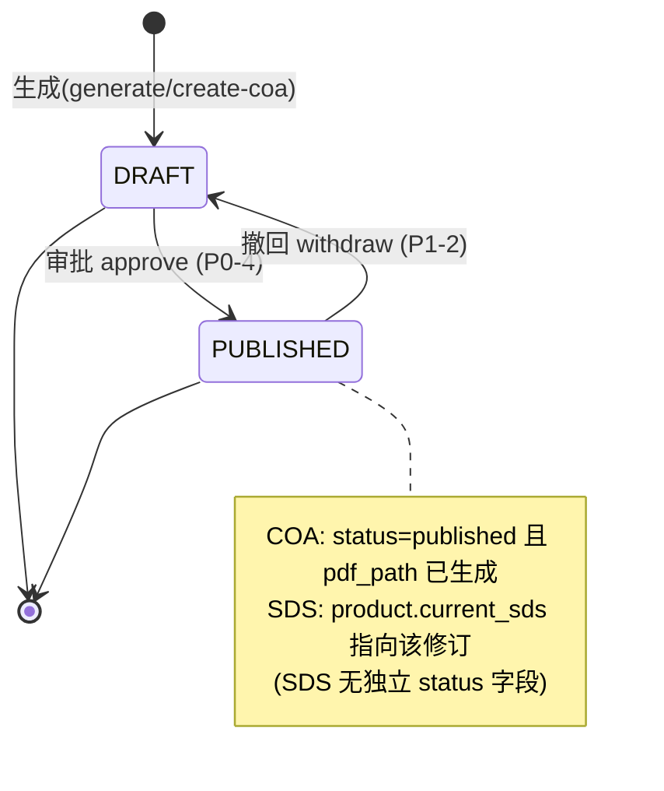

# COA / SDS 合规文档功能 — 简单 PRD（Simple PRD）

> 文档版本：2026-07-09 · 作者：产品经理 许清楚（SciReAgent 软件开发团队）
> 范围：仅前端呈现 + API 接线 + 少量后端权限/状态补全（**不重做后端生成 / PDF 逻辑**）
> 依据：已锁定 5 个用户决策 + 已批准主位置方案 + 4 个微决策；并实读后端/前端代码核对现状

---

## 0. 代码现状核对（实读结果，路径以代码为准）

| 项 | 任务描述路径 | 实际核对路径 | 结论 |
|---|---|---|---|
| COA/SDS 模型 | `documents/models.py` 或 `commerce/models.py` | `backend/apps/documents/models.py`（`Batch`/`Coa`/`SdsRevision`/`PubChemCache` 均在此） | ✅ 模型在 documents app |
| 工作流 | `documents/services/workflow.py` | `backend/apps/documents/services/workflow.py` | ✅ 已读 |
| 无 CAS 硬 raise | 约 line 113 | **实际 line 123-124**：`if not cas: raise ValueError('产品没有 CAS 号，无法生成 SDS')` | ✅ 确认为 P0 缺陷 |
| ViewSet | `coa_views.py` / `sds_views.py` | 实际合并在 `backend/apps/documents/api/v1/views.py`（`BatchViewSet`/`CoaViewSet`/`SdsRevisionViewSet`/`PubChemCacheViewSet`） | ✅ 已读 |
| 权限类 | — | `backend/core/permissions.py`：`IsAdminOrReadOnly`（读=公开、写=`is_staff`）、`IsStaffUser`（须登录+is_staff） | ⚠️ 见 §3 P0-2 |
| 生成器 | `coa_generator.py` / `sds_generator.py` | `backend/apps/documents/services/` 下均存在（ReportLab） | ✅ 不动 |
| 产品详情页 | `ProductDetail.vue` ~470-475 | `frontend/src/views/ProductDetail.vue` **470-478** 行 `product.documents` 通用列表区 | ✅ 已读 |
| 产品编辑页 | `workspace/ProductEditPage.vue` | `frontend/src/views/workspace/ProductEditPage.vue`（含 AI AUTO MATCH / JenaMatch / CAS 冲突，无 COA/SDS） | ✅ 已读 |
| 产品列表页 | 待核实 | `frontend/src/views/workspace/ProductsPage.vue`（表格列：Catalog No/Name/CAS/Status/Category） | ✅ 已读 |
| 预览模板 | `public/coa-preview.html` / `sds-preview.html` | 两个静态文件均存在（9KB / 30KB），但为**硬编码样本，未绑 API** | ⚠️ 见 §4 |
| 前端 API service | `frontend/src/api/` | **无** coa/sds/compliance 封装文件（确认前端零接线） | ✅ 须新建 |

**关键核验结论（影响架构决策，务必先读）：**

1. **「后端权限放宽」实际已满足。** 所有 4 个 ViewSet 用的 `IsAdminOrReadOnly` 逻辑为：`SAFE_METHODS(GET/HEAD/OPTIONS) → True（匿名可读）`，其余写方法 → `request.user.is_staff`。即**当前已是「读=公开、写=is_staff」**，与需求 #2/#3 完全一致。任务描述中"is_staff 只能读不能写"与代码不符。**切勿**将其替换为 `IsStaffUser`（该类要求登录，会直接阻断匿名浏览/下载，违反需求 #3）。
2. **无 CAS 三级降级链是纸面方案**，代码仅实现 CAS→PubChem 一级；`pubchem_fetcher.py` 中已存在 `_GHS_FALLBACK` 与 `GENERIC_SAFETY_NOTES` 可用作降级兜底数据，但 `generate_sds` 未调用。
3. **COA 有 `status` 字段（DRAFT/APPROVED/PUBLISHED）；SDS 无 status 字段**——其"已发布"状态由 `Product.current_sds` 外键指针表示（`commerce/models.py:171`，可空）。两者状态机机制不同，撤回实现方式不同（见 §4 / §5）。
4. **`SdsRevision` 无 `data_confidence` / `data_source_detail` 字段**，`Product` 无 `cas_not_applicable` 字段——均为 docs/COA_SDS.md §8.1/§8.4 规划但未落地项。
5. **`ProductDetailSerializer` 含 `documents` 字段（通用文档），不含 COA/SDS 摘要。** 详情页 COA/SDS 数据须由前端直接调文档端点（匿名 GET 已允许），无需改产品序列化器即可满足"公开浏览"。

---

## 1. 产品目标

为科研试剂平台的「研究员工作台」与「产品详情页」补齐 COA（分析证书）与 SDS（安全数据表）的合规文档能力：研究员在 ProductEditPage 内对 SDS（按产品）与各 SKU 批次的 COA（按批次）完成生成/录入实测/审批/撤回/下载/实时预览；产品详情页向匿名访客只读展示已发布的 COA/SDS 并提供下载。后端核心生成与 PDF 逻辑已就绪，本期只做前端三处页面接线、权限与状态机的少量补全、以及无 CAS 三级降级链的落地，使"无 CAS 产品也能出 SDS"的合规底线得以满足。

---

## 2. 用户故事

### 视角 A：研究员（登录工作台，`is_staff=True`）

1. 作为研究员，我想在产品编辑页的 Compliance 区为某产品一键**生成 SDS 草稿**，以便后续审批发布供采购人员查看。
2. 作为研究员，我想为某个 SKU 的批次**生成 COA 并录入 QC 实测值**（外观/纯度/水分等），以便出具该批次的质量证明。
3. 作为研究员，我想**审批** COA/SDS（审批即发布），以便合规文档对访客可见、可下载。
4. 作为研究员，我想在发布后发现数据有误时**撤回** COA/SDS 回到草稿态更正重发，以便保证合规文档准确性。
5. 作为研究员，当产品无 CAS 且降级数据也缺失时，我希望**生成按钮被禁用并提示原因**，以免无效点击。

### 视角 B：匿名访客 / 采购人员（产品详情页，无需登录）

1. 作为访客，我想在产品详情页**直接看到该产品的 SDS 与已发布 COA 列表**，以便快速判断合规可用性。
2. 作为访客，我想**一键下载** SDS/COA 的 PDF，以便归档与内部评审。
3. 作为访客，我想**实时预览** SDS/COA 内容（无需下载），以便快速核对关键安全/质量信息。
4. 作为访客，我想在 ProductsPage 列表上通过**徽章（SDS✓ / COA N）**快速识别哪些产品已有合规文档，以便筛选。

---

## 3. 需求池（P0 / P1 / P2）

> 优先级：P0=Must / P1=Should / P2=Nice-to-have。每条含「需求 / 涉及页面或模块 / 验收标准」。

### P0（必须）

**P0-1 产品编辑页 Compliance Section（SDS 卡 + COA 卡）接线**
- 涉及：`frontend/src/views/workspace/ProductEditPage.vue`（新增 `<section class="form-section compliance-section">`，置于现有 Section 6 之后、`.form-actions` 保存行之前）；新建 `frontend/src/api/documents.js` 封装端点。
- 验收：研究员进入任一产品编辑页可见 Compliance 区；SDS 卡显示该产品的 SDS 版本/状态与 生成/审批/下载/预览/撤回 按钮；每个 SKU 下列出其批次，每批次一张 COA 卡，含 生成/录入实测/审批/下载/预览/撤回 按钮；所有按钮调用对应端点并刷新状态。

**P0-2 后端权限确认（读=公开 / 写=is_staff）**
- 涉及：`backend/apps/documents/api/v1/views.py` 的 4 个 ViewSet `permission_classes`。
- 验收：**代码核实 `IsAdminOrReadOnly` 已满足需求**（匿名 GET/下载可、is_staff 可写）。架构师须**保留 `IsAdminOrReadOnly` 不变**（不得改用 `IsStaffUser`，否则破坏匿名浏览）。建议仅做可选重命名（`IsStaffWriteOrAnonRead`）提升可读性，不改行为。无需新增权限代码。

**P0-3 无 CAS 三级降级链落地（拆除 `generate_sds` 硬 raise）**
- 涉及：`backend/apps/documents/services/workflow.py` `generate_sds`（line 123-124 改为降级分支）；复用 `pubchem_fetcher.py` 的 `_GHS_FALLBACK` / `GENERIC_SAFETY_NOTES`；新增 `category_sds_templates.py`（按 `category_path` 匹配，覆盖 8 条产品线）；**不改** `sds_generator.py` PDF 逻辑。
- 验收：`generate_sds` 在「无 CAS → 尝试 SMILES/InChI/名称 → 尝试类别模板 → 兜底 GENERIC_SAFETY_NOTES」链路下不再 raise；任意一级成功即产出 `SdsRevision(draft)`；返回对象含数据来源等级（见 P0-4）。

**P0-4 approve = publish 状态机（COA）**
- 涉及：`backend/apps/documents/services/workflow.py` `approve_coa`（当前写 `status=APPROVED`，须改为 `PUBLISHED`）；`Coa.Status` 已有 PUBLISHED。
- 验收：研究员审批 COA 后 `status=PUBLISHED` 且 `pdf_path` 已生成；详情页/列表仅对 `status=PUBLISHED` 的 COA 展示与允许下载。SDS 的"发布"= `approve_sds` 将 `product.current_sds` 指向该修订（机制已实现，沿用）。

**P0-5 产品详情页只读 COA/SDS 区（匿名可看/可下载）**
- 涉及：`frontend/src/views/ProductDetail.vue`（将 470-478 行 `product.documents` 通用列表**替换为** COA/SDS 只读区）；前端调 `GET /api/v1/coas/?product_id=&status=published` 与 `GET /api/v1/sds-revisions/?product_id=` 取 `is_current` 版。
- 验收：未登录用户打开产品详情页可见当前 SDS（is_current）与已发布 COA 列表，每条可下载/预览；无任何 COA/SDS 时显示友好空态。

### P1（应当）

**P1-1 ProductsPage 行级徽章（SDS✓ / COA N）**
- 涉及：`frontend/src/views/workspace/ProductsPage.vue`（新增"合规"列）；数据来源建议后端在 `ProductListSerializer` 增加只读摘要字段 `sds_published: bool`、`coa_published_count: int`（少量后端补全，符合约束），避免前端 N+1 轮询。
- 验收：列表每一行显示 SDS 是否已出（✓/—）与已发布 COA 批次数 N；鼠标悬停有说明；无数据不报错。

**P1-2 撤回（withdraw）能力**
- 涉及：后端新增 `withdraw` action（COA：`status` 回 `DRAFT`；SDS：`product.current_sds` 置空/回退）；前端 Compliance 区在已发布态显示「撤回」按钮。
- 验收：已发布 COA 可撤回为草稿；已发布 SDS 可撤回（current_sds 清空）；撤回后前端状态与按钮正确回退。旧 PDF 处置见 §6 待确认 #2。

**P1-3 实时预览接线**
- 涉及：复用 `frontend/public/coa-preview.html` / `sds-preview.html` 静态模板，注入真实 COA/SDS 字段渲染（后端无预览端点，本期"接线"= 绑定真实数据；不重新实现预览）。
- 验收：点「实时预览」打开预览视图，内容来自真实 serializer 数据而非硬编码样本；COA 显示快照+实测表，SDS 显示 16 节 + GHS 标注。

**P1-4 无 CAS 时生成按钮禁用 + tooltip（微决策 C）**
- 涉及：`ProductEditPage.vue` Compliance 区 SDS 卡「生成」按钮；判定 `!product.cas && !product.smiles && !product.inchi`（本期不依赖 `cas_not_applicable` 字段）。
- 验收：产品既无 CAS 也无 SMILES/InChI 时按钮置灰，hover 显示"缺少 CAS / 结构标识，无法生成 SDS，请先补全产品标识"；三级降级任一可用时按钮恢复。

**P1-5 SdsRevision 数据来源标注字段（8.1 部分）**
- 涉及：模型新增 `data_confidence`（高/中/低/极低）与 `data_source_detail`（CID / 类别模板名等）；前端 SDS 卡与预览展示置信度标注。
- 验收：每条 SDS 显示数据来源等级与说明文字（如"数据来源于 PubChem CID xxx" / "基于 {类别} 通用安全数据"）。

### P2（可选）

**P2-1 类别通用 SDS 模板库扩充与研究员可编辑（8.2）**：模板 schema 完善 + 8 条产品线覆盖 + 工作台可改（标注"自定义"）。
**P2-2 SDS/COA PDF 数据来源标注栏样式美化（8.3）**。
**P2-3 `cas_not_applicable` 字段落地（8.4）**：`Product` 增加布尔字段区分"天然无 CAS"与"数据缺失"，供产品完整度评估。
**P2-4 模板/预览视觉美化**：统一与产品详情页设计语言。

---

## 4. UI 设计稿（三处页面 Section + 字段/按钮/触发 API）

> 说明：仅描述字段与按钮行为，不画图；每个按钮标注触发端点与状态变化。前端新建 `frontend/src/api/documents.js` 统一封装下文端点（沿用 `http.js` 基址 `/api/v1/`）。

### 4.1 ProductEditPage.vue — Compliance Section（研究员，需 is_staff）

位置：现有 Section 1–6 之后、`.form-actions` 之前，新增：

```html
<section class="form-section compliance-section">
  <h3>7. Compliance — COA & SDS</h3>
  <!-- SDS 卡（每产品一张） -->
  <!-- 每个 SKU → 其批次 COA 卡 -->
</section>
```

**SDS 卡（每产品一张）字段与按钮：**

| 元素 | 字段/来源 | 按钮 | 触发 API 与状态变化 |
|---|---|---|---|
| 标题 | `product.name` / `catalog_no` | — | — |
| 当前版本 | `SdsRevision.revision_no` / `revised_at` / `is_current` | — | — |
| GHS | `signal_word` / `pictograms` | — | — |
| 数据来源 | `data_confidence` / `data_source_detail`（P1-5） | — | — |
| 生成 SDS | — | 「生成 SDS」 | `POST /api/v1/sds-revisions/generate/` `{product_id}` → 201 新建 draft；无 CAS 且降级缺失时按钮禁用+tooltip（P1-4） |
| 审批 | 仅 draft 显示 | 「审批」 | `POST /api/v1/sds-revisions/{id}/approve/` `{}` → 生成 PDF + `product.current_sds` 指向该版（发布） |
| 撤回 | 仅 current 显示 | 「撤回」 | `POST /api/v1/sds-revisions/{id}/withdraw/`（P1-2） → `product.current_sds` 清空 |
| 下载 | `pdf_path` | 「下载 PDF」 | `GET /api/v1/sds-revisions/{id}/download/`（匿名亦可） |
| 预览 | — | 「实时预览」 | 加载 `sds-preview.html` 注入真实数据（P1-3） |

**COA 卡（每 SKU 的每批次一张）字段与按钮：**
- 数据来源：先 `GET /api/v1/batches/?sku_id={sku_id}` 列出批次（`has_coa` 指示是否已出 COA）；无 COA 的批次显示「生成 COA」。

| 元素 | 字段/来源 | 按钮 | 触发 API 与状态变化 |
|---|---|---|---|
| 批次信息 | `lot_number` / `produced_at` | — | — |
| 状态 | `Coa.status`（draft/published） | — | — |
| 生成 COA | 需输入 `lot_number` + `produced_at` | 「生成 COA」 | `POST /api/v1/coas/create-coa/` `{sku_id, lot_number, produced_at, retest_at?}` → 创建 Batch+Coa(draft) |
| 录入实测 | `appearance_result`/`purity_result`/`purity_method`/`water_content_*`/`melting_point`/`specific_rotation`/`residual_solvents`/`heavy_metals`/`nmr_result`/`lcms_result`/`hplc_conditions`/`lcms_conditions` | 「保存实测」 | `PUT /api/v1/coas/{id}/qc-results/` 对应字段 → 更新 draft |
| 审批 | 仅 draft 显示 | 「审批」 | `POST /api/v1/coas/{id}/approve/` `{qc_analyst?, qa_approval?}` → `status=PUBLISHED` + 生成 PDF（P0-4） |
| 撤回 | 仅 published 显示 | 「撤回」 | `POST /api/v1/coas/{id}/withdraw/`（P1-2） → `status=DRAFT` |
| 下载 | `pdf_path` | 「下载 PDF」 | `GET /api/v1/coas/{id}/download/`（匿名亦可） |
| 预览 | — | 「实时预览」 | 加载 `coa-preview.html` 注入真实数据（P1-3） |

### 4.2 ProductsPage.vue — 行级徽章（研究员列表）

| 列 | 内容 | 数据来源 |
|---|---|---|
| 新增「合规」列 | `SDS✓`（绿）/ `SDS—`；`COA N`（N=已发布批次数） | 建议 `ProductListSerializer` 新增 `sds_published: bool`、`coa_published_count: int`（P1-1）；或前端按 `product_id` 调文档端点聚合 |

徽章样式沿用现有 `.status-tag` / `.tag` 体系；无数据时显示 `SDS—` 与 `COA 0`，不阻断列表渲染。

### 4.3 ProductDetail.vue — 只读 COA/SDS 区（匿名可看/可下载）

- 将 470-478 行 `product.documents` 通用列表**替换为**只读区：
  - **SDS 块**：取 `GET /api/v1/sds-revisions/?product_id={id}` 中 `is_current=true` 的一条，展示 `revision_no`/`signal_word`/`pictograms`/`data_confidence`(P1-5) + 「下载 PDF」「实时预览」。
  - **COA 块**：取 `GET /api/v1/coas/?product_id={id}&status=published`，逐条展示 `doc_id`/`lot_number`/`produced_at` + 「下载 PDF」「实时预览」。
- 权限：上述 GET 与 download 均为 `IsAdminOrReadOnly` 的匿名可读/可下载，满足需求 #3。
- 空态：无任何合规文档时显示"合规文档整理中"占位，不报错。

### 4.4 状态机（approve=publish / withdraw）



---

## 5. 关键 API 端点契约（基于实读后端代码，路径以代码为准）

> 基址：`/api/v1/`（见 `backend/config/urls.py:30`）。所有端点 `permission_classes=[IsAdminOrReadOnly]`：GET/下载匿名可，写操作需 `is_staff`。

### COA

| Method | Path | 请求体（关键字段） | 响应（关键字段） | 说明 |
|---|---|---|---|---|
| POST | `/api/v1/coas/create-coa/` | `sku_id:int`, `lot_number:str`, `produced_at:date`, `retest_at:date?` | `CoaSerializer`（含 `doc_id`,`status=draft`,`lot_number`,`sku_code`） | 创建 Batch+Coa 草稿；返回 201 |
| PUT | `/api/v1/coas/{id}/qc-results/` | `appearance_result`,`purity_result`,`purity_method`,`water_content_spec/result`,`melting_point`,`specific_rotation`,`residual_solvents`,`heavy_metals`,`nmr_result`,`lcms_result`,`hplc_conditions`,`lcms_conditions`（均可选） | `CoaSerializer` | 更新实测值（不影响 status） |
| POST | `/api/v1/coas/{id}/approve/` | `qc_analyst:str?`, `qa_approval:str?` | `CoaSerializer`（`status` 须改为 `published`，`pdf_path` 非空） | **P0-4：当前代码写 `approved`，须改为 `published`** |
| GET | `/api/v1/coas/{id}/download/` | — | `application/pdf` 文件流（`filename=COA-{doc_id}.pdf`） | 匿名可下载；无 PDF 返 404 `{'error':'PDF 尚未生成'}` |
| GET | `/api/v1/coas/?product_id=&status=&batch_id=` | query: `product_id`,`status`,`batch_id` | `CoaSerializer[]`（含 `lot_number`,`produced_at`,`sku_code`,`status`,`pdf_path`） | 列表/筛选，匿名可 |

### SDS

| Method | Path | 请求体（关键字段） | 响应（关键字段） | 说明 |
|---|---|---|---|---|
| POST | `/api/v1/sds-revisions/generate/` | `product_id:int` | `SdsRevisionSerializer`（draft） | **P0-3：当前无 CAS 硬 raise；须改为三级降级链** |
| POST | `/api/v1/sds-revisions/{id}/approve/` | 无 | `SdsRevisionSerializer`（`pdf_path` 非空，`product.current_sds` 已设） | 生成 PDF + 设为当前版（发布） |
| POST | `/api/v1/sds-revisions/{id}/withdraw/`（**待新增，P1-2**） | 无 | `SdsRevisionSerializer` | 清空 `product.current_sds`（撤回） |
| GET | `/api/v1/sds-revisions/{id}/download/` | — | `application/pdf`（`filename=SDS-{catalog_no}-v{rev}.pdf`） | 匿名可下载 |
| GET | `/api/v1/sds-revisions/?product_id=` | query: `product_id` | `SdsRevisionSerializer[]`（含 `is_current`,`revision_no`,`signal_word`,`pictograms`,`pdf_path`） | 列表，匿名可；`is_current` 由 `product.current_sds_id` 计算 |

### Batch / 其他

| Method | Path | 说明 |
|---|---|---|
| GET | `/api/v1/batches/?sku_id=&product_id=` | 列批次；`has_coa` 指示是否已出 COA（用于 Compliance 区渲染 COA 卡） |
| GET/POST/… | `/api/v1/pubchem-cache/` | PubChem 缓存只读管理（研究员可用，is_staff 写） |

**序列化器关键只读字段（前端展示用）：**
- `CoaSerializer`：`id,doc_id,status,lot_number,produced_at,sku_code,product_id,product_name,catalog_number,cas_number,molecular_formula,molecular_weight,storage_condition,appearance_spec/result,purity_spec/result,purity_method,water_content_spec/result,melting_point,specific_rotation,residual_solvents,heavy_metals,nmr_result,lcms_result,hplc_conditions,lcms_conditions,qc_analyst,qa_approval,approved_at,pdf_path`
- `SdsRevisionSerializer`：`id,product,product_name,catalog_no,revision_no,revised_at,change_note,signal_word,pictograms,hazard_codes,precaution_codes,section_data,pdf_path,is_current`（**注：暂无 `data_confidence`/`data_source_detail`，P1-5 新增**）

---

## 6. 待确认问题（含建议默认值）

| # | 问题 | 建议默认值 |
|---|---|---|
| 1 | SDS 多版本并存 vs 单当前版？ | **多版本并存**；`product.current_sds` 指向当前发布版，历史版本保留可查。 |
| 2 | 撤回后旧 PDF 是否保留？ | **保留旧 PDF 文件**（合规记录不可变）；仅状态/指针回退；重新审批生成新 PDF 并更新 `pdf_path`。 |
| 3 | 徽章精确文案？ | 列名「合规」；`SDS✓`（绿）/ `SDS—`（灰）；`COA N`（N=已发布批次数，蓝/灰）。 |
| 4 | ProductsPage 徽章数据来源（N+1 vs 后端摘要）？ | **后端在 `ProductListSerializer` 增加 `sds_published:bool`、`coa_published_count:int`**（少量后端补全，符合约束），前端直接读，避免逐产品轮询。 |
| 5 | `cas_not_applicable` 字段本期是否落地（8.4）？ | **本期不落地**；前端用 `!product.cas && !product.smiles && !product.inchi` 判定禁用生成按钮（P1-4）。该字段移入下期/ROADMAP。 |
| 6 | 实时预览实现方式？ | 后端无预览端点；**本期复用 `public/coa-preview.html`/`sds-preview.html` 静态模板，注入真实 serializer 字段**实现预览（即"接线"）。下期可评估后端 HTML 渲染端点。 |
| 7 | `SdsRevision.data_confidence` / `data_source_detail` 是否本期加（8.1）？ | **本期加**（属"少量后端补全"），三级降级链（P0-3）产出时一并写入，前端展示置信度（P1-5）。 |
| 8 | 权限类名语义？ | **保留 `IsAdminOrReadOnly`**（已满足读=公开/写=is_staff）；可选重命名 `IsStaffWriteOrAnonRead`，**不得换 `IsStaffUser`**（会阻断匿名浏览）。 |

---

## 7. 非目标（本期不做）

- 不重写 `coa_generator.py` / `sds_generator.py` PDF 生成逻辑。
- 不新增 COA/SDS 的在线编辑 16 节内容（SDS 内容来自生成链路，研究员仅审批）。
- 不做供应商爬虫反向纳入 SDS 数据源（8.5，P2/下期）。
- 不做 PubChem 数据准确性交叉验证增强（8.6，P2/下期）。

---

*生成依据：实读 `docs/COA_SDS.md`、`backend/apps/documents/{models,services/workflow,api/v1/views,api/v1/serializers,api/v1/urls}.py`、`backend/core/permissions.py`、`backend/apps/commerce/models.py`、`frontend/src/views/ProductDetail.vue`、`frontend/src/views/workspace/ProductEditPage.vue`、`frontend/src/views/workspace/ProductsPage.vue` 及 `frontend/public/*-preview.html`。所有接口字段以代码为准，未编造。*
