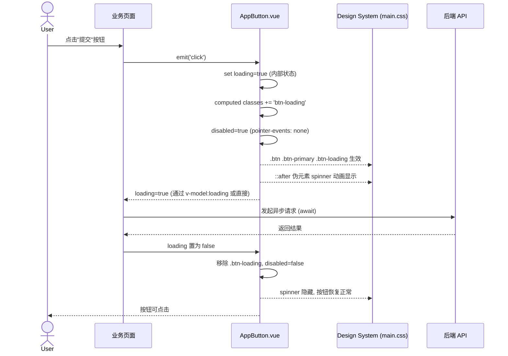
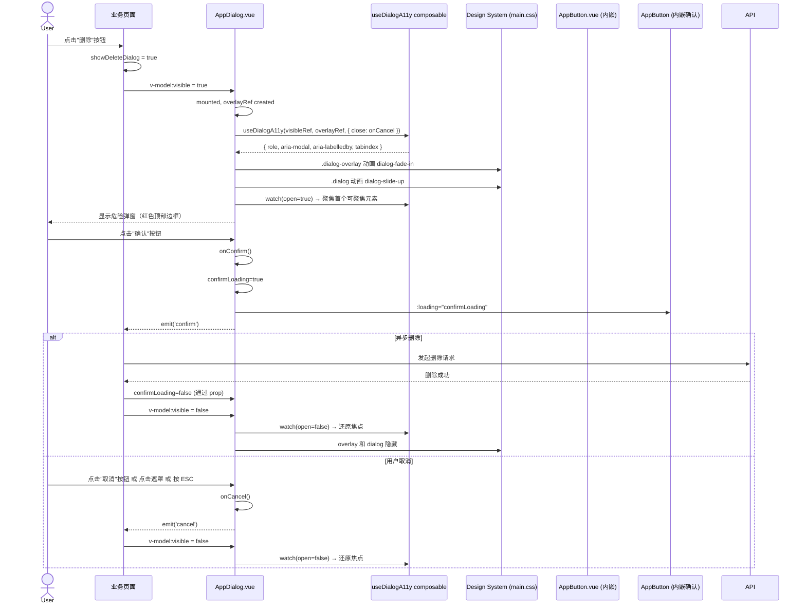
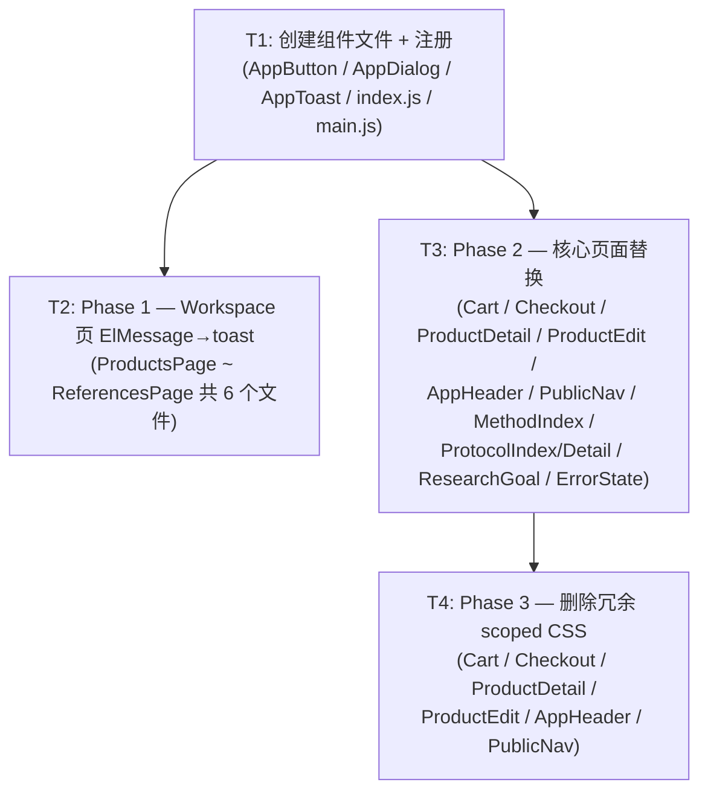

# UI 公共组件实现架构设计 & 任务分解

> **文档状态**：定稿 · v0.1  
> **编制**：架构师 Gao  
> **依据**：`UI_COMPONENT_STANDARDS.md`（v0.1）  
> **策略路径**：路径 B — 渐进式抽象公共组件  
> **适用项目**：SciReagent 前端（Vue3 + Vite + Tailwind CSS v4 + Element Plus v2.9.1）

---

## 1. 实现方案 + 框架选型

### 1.1 总体策略

三个组件采用 **三种不同的实现路线**，均不引入新依赖：

| 组件 | 实现路线 | 依赖设施 | 理由 |
|------|---------|---------|------|
| **AppButton.vue** | **DS CSS 类**（`.btn` + variant/size class） | `main.css` 的 `.btn` / `.btn-primary`~`.btn-link` / `.btn-sm`~`.btn-icon-sm` / `.btn-loading` | 按钮 7 种 variant + 5 种 size 已完整定义在 DS 中，无需 Element Plus |
| **AppDialog.vue** | **DS CSS 类**（`.dialog-overlay` + `.dialog`） + `useDialogA11y` composable | `main.css` 的 dialog 体系 + `composables/useDialogA11y.js` | DS 已定义完整的弹窗结构、变体、动画；composable 已实现 a11y |
| **AppToast.js** | **封装 ElMessage**（函数式） | Element Plus 的 `ElMessage` + `main.css` 的 `.el-message` overrides | ElMessage 已全局注册且 CSS override 已完成，封装后统一 API |

### 1.2 现有设施复用清单

| 设施 | 位置 | 复用方式 |
|------|------|---------|
| `.btn` + variant/size classes | `main.css` L614-L772 | AppButton 内部 computed 拼接 className |
| `.btn-loading` + `@keyframes btnSpinner` | `main.css` L753-L772 | AppButton `loading=true` 时添加 |
| `.dialog-overlay` + `.dialog` | `main.css` L1038-L1061 | AppDialog 的 template 结构 |
| `.dialog--wide` / `.dialog--narrow` / `.dialog--danger` | `main.css` L1063-L1068 | 通过 `width` prop 和 `variant` prop 映射 |
| `useDialogA11y(openRef, overlayRef, { titleId, close })` | `composables/useDialogA11y.js` | AppDialog 内部调用，传入 visible ref、overlay ref、close 回调 |
| `dialog-fade-in` / `dialog-slide-up` 动画 | `main.css` L1206-L1220 | AppDialog 的 `<Transition>` 组件用动画名 |
| `ElMessage`（全局已注册） | element-plus | AppToast 内部 import 调用 |
| `.el-message` / `.el-message--success/error/warning/info` | `main.css` L1228-L1259 | AppToast 通过 ElMessage 自动继承 |

### 1.3 关键设计决策

1. **AppButton 不处理 loading 当 href/to 时的场景**：`<a>` 和 `<router-link>` 模式下不支持 loading（原生 `<a>` 没有 disabled 语义）。当 `loading=true` 且 `href` 或 `to` 存在时，loading 静默不生效。
2. **AppDialog 不使用 `<el-dialog>`**：保持轻量，直接操作 DOM 结构，完全受 DS CSS 控制。
3. **AppDialog 内部按钮使用 AppButton**：形成组件组合，一致风格。
4. **AppToast 不替换 http.js 中的 `ElMessage.error()`**：避免公共模块循环依赖。
5. **ProductEditPage 的 `saveFeedback` 保留原有逻辑**：其持久显示行为与 AppToast 自动消失不同，可改用 `toast` API 但设 `duration: 0`。

---

## 2. 文件列表及相对路径

### 2.1 新建文件

| 文件路径 | 类型 | 预估行数 |
|---------|------|---------|
| `frontend/src/components/common/AppButton.vue` | 新建 | ~120 行 |
| `frontend/src/components/common/AppDialog.vue` | 新建 | ~160 行 |
| `frontend/src/components/common/AppToast.js` | 新建 | ~30 行 |
| `frontend/src/components/common/index.js` | 新建 | ~20 行 |

### 2.2 修改文件

| 文件路径 | 修改内容 | 所属阶段 |
|---------|---------|---------|
| `frontend/src/main.js` | +2 行：import toast + app.config.globalProperties.$toast | Phase 1 |
| `frontend/src/views/workspace/ProductsPage.vue` | `ElMessage.*` → `toast.*`（~7 处） | Phase 1 |
| `frontend/src/views/workspace/GoalsPage.vue` | `ElMessage.*` → `toast.*`（1 处） | Phase 1 |
| `frontend/src/views/workspace/AppsPage.vue` | `ElMessage.*` → `toast.*`（1 处） | Phase 1 |
| `frontend/src/views/workspace/MethodsPage.vue` | `ElMessage.*` → `toast.*`（1 处） | Phase 1 |
| `frontend/src/views/workspace/ProtocolsPage.vue` | `ElMessage.*` → `toast.*`（1 处） | Phase 1 |
| `frontend/src/views/workspace/ReferencesPage.vue` | `ElMessage.*` → `toast.*`（1 处） | Phase 1 |
| `frontend/src/views/shop/CartPage.vue` | 按钮 → AppButton + toast → AppToast（~10 处按钮 + scoped CSS 清理） | Phase 2 |
| `frontend/src/views/shop/CheckoutPage.vue` | 按钮 → AppButton（~2 处） | Phase 2 |
| `frontend/src/views/product/ProductDetail.vue` | 按钮 → AppButton + toast → AppToast（~8 处按钮） | Phase 2 |
| `frontend/src/views/product/ProductEditPage.vue` | 按钮 → AppButton + dialog → AppDialog（~30 处按钮 + 2 个 dialog） | Phase 2 |
| `frontend/src/components/layout/AppHeader.vue` | 按钮 → AppButton（~3 处） | Phase 2 |
| `frontend/src/components/layout/PublicNav.vue` | 按钮 → AppButton（~4 处） | Phase 2 |
| `frontend/src/views/methods/MethodIndex.vue` | `el-button` → AppButton（2 处） | Phase 2 |
| `frontend/src/views/protocols/ProtocolIndex.vue` | `el-button` → AppButton（2 处） | Phase 2 |
| `frontend/src/views/protocols/ProtocolDetail.vue` | `el-button` → AppButton（1 处） | Phase 2 |
| `frontend/src/views/goals/ResearchGoalDetail.vue` | `el-button` → AppButton（2 处） | Phase 2 |
| `frontend/src/components/common/ErrorState.vue` | `el-button` → AppButton（1 处） | Phase 2 |
| `frontend/src/components/common/CompliancePreviewModal.vue` | 评估（暂不修改） | Phase 2 |

### 2.3 Phase 3 清理（仅删除 scoped CSS，不修改逻辑）

| 文件路径 | 清理内容 |
|---------|---------|
| `CartPage.vue` | 删除 scoped `.btn` / `.btn-primary` / `.btn-outline` / `.btn-full` / `.toast` |
| `CheckoutPage.vue` | 删除 scoped `.btn-checkout` / `.btn-primary` |
| `ProductDetail.vue` | 删除 scoped `.pd-cart-btn` / `.pd-rfq-btn` / `.pd-doc-btn` / `.pd-doc-btn-ghost` / `.pd-toast` |
| `ProductEditPage.vue` | 删除 scoped `.toast` 等 |
| `AppHeader.vue` | 删除 scoped `.header-btn` |
| `PublicNav.vue` | 删除 scoped `.nav-btn` / `.nav-btn-outline` / `.nav-btn-solid` |

---

## 3. 数据结构与接口（类图）

```mermaid
classDiagram
    %% ── AppButton ──
    class AppButton {
        <<Vue Component>>
        +String variant
        +String size
        +Boolean loading
        +Boolean disabled
        +Boolean icon
        +String nativeType
        +String href
        +String|Object to
        +--- computed ---
        +String[] classes
        +Boolean isLink
        +Boolean isRouterLink
        +--- internal ---
        +handleClick(event)
    }
    note for AppButton "variant: 'primary'|'secondary'|'outline'|'ghost'|'danger'|'accent'|'link'\nsize: 'sm'|'md'|'lg'|'icon'|'icon-sm'"

    class AppButtonSlots {
        <<Slots>>
        +default 按钮文字/内容
        +icon 图标内容
    }

    AppButton --> AppButtonSlots : has

    %% ── AppDialog ──
    class AppDialog {
        <<Vue Component>>
        +Boolean visible (v-model)
        +String title
        +String width
        +String variant
        +Boolean closeOnClickOverlay
        +String confirmText
        +String cancelText
        +Boolean showConfirm
        +Boolean showCancel
        +Boolean confirmLoading
        +String titleId
        +--- internal ---
        +onConfirm()
        +onCancel()
        +onOverlayClick()
        +useDialogA11y(openRef, overlayRef, opts)
        +--- refs ---
        +Ref overlayRef
    }
    note for AppDialog "variant: 'default'|'danger'\nwidth CSS value, default '480px'"

    class AppDialogEvents {
        <<Events>>
        +update:visible(boolean)
        +confirm()
        +cancel()
    }

    class AppDialogSlots {
        <<Slots>>
        +default 弹窗主体内容
        +footer 自定义底部操作区
    }

    AppDialog --> AppDialogEvents : emits
    AppDialog --> AppDialogSlots : has
    AppDialog --> AppButton : uses (confirm/cancel btn)

    %% ── AppToast ──
    class AppToast {
        <<Module (函数式)>>
        +success(msg: string, duration?: number)
        +error(msg: string, duration?: number)
        +warning(msg: string, duration?: number)
        +info(msg: string, duration?: number)
    }
    note for AppToast "内部封装 ElMessage\n默认 duration: 3000ms"

    AppToast --> ElMessage : wraps

    %% ── useDialogA11y composable ──
    class useDialogA11y {
        <<Composable>>
        +useDialogA11y(openRef: Ref~boolean~, overlayRef: Ref~HTMLElement~, opts: {titleId?, close})
        +returns { role, aria-modal, aria-labelledby, tabindex }
    }

    AppDialog --> useDialogA11y : integrates

    %% ── index.js ──
    class CommonIndex {
        <<Export>>
        +export { default as AppButton } from './AppButton.vue'
        +export { default as AppDialog } from './AppDialog.vue'
        +export { default as AppToast, toast } from './AppToast.js'
        +export { default as DataPagination } from './DataPagination.vue'
        +export { default as EmptyState } from './EmptyState.vue'
        +export { default as ErrorState } from './ErrorState.vue'
        +export { default as LoadingSpinner } from './LoadingSpinner.vue'
        +...
    }
```

---

## 4. 程序调用流程（时序图）

### 4.1 用户点击提交 → AppButton loading → 异步完成 → loading 解除



### 4.2 用户点击删除 → AppDialog(variant=danger) 确认 → confirm → 执行操作



---

## 5. 任务列表（有序、含依赖关系）

### T1：项目基础设施 — 创建组件文件 + 注册

| 项目 | 内容 |
|------|------|
| **任务 ID** | T1 |
| **任务名称** | 创建公共组件文件并注册 |
| **涉及文件** | `AppButton.vue`（新建）、`AppDialog.vue`（新建）、`AppToast.js`（新建）、`index.js`（新建）、`main.js`（修改 +2 行） |
| **依赖前序** | 无 |
| **优先级** | P0 |
| **验收点** | 三组件可在页面中按需引入使用；`$toast.success()` 可通过 `getCurrentInstance().proxy.$toast` 全局访问 |

**AppButton 内部 class 绑定策略（关键实现指引）**：
```js
// computed 动态拼接 className
const classes = computed(() => {
  const cls = ['btn']
  cls.push(variantMap[props.variant])   // 'btn-primary' | 'btn-secondary' | ...
  cls.push(sizeMap[props.size])         // 'btn-md' | 'btn-sm' | ...
  if (props.loading && !props.href && !props.to) cls.push('btn-loading')
  return cls
})

// variant → DS CSS class 映射
const variantMap = {
  primary: 'btn-primary', secondary: 'btn-secondary', outline: 'btn-outline',
  ghost: 'btn-ghost', danger: 'btn-danger', accent: 'btn-accent', link: 'btn-link',
}

// size → DS CSS class 映射
const sizeMap = {
  sm: 'btn-sm', md: 'btn-md', lg: 'btn-lg', icon: 'btn-icon', 'icon-sm': 'btn-icon-sm',
}
```

**AppDialog 与 useDialogA11y 集成方式**：
```js
// 在 <script setup> 中
import { useDialogA11y } from '@/composables/useDialogA11y'

const overlayRef = ref(null)
const emit = defineEmits(['update:visible', 'confirm', 'cancel'])

function onCancel() { emit('update:visible', false); emit('cancel') }

const dialogAttrs = useDialogA11y(
  toRef(props, 'visible'),
  overlayRef,
  { titleId: props.titleId || undefined, close: onCancel }
)
// 模板中: <div ref="overlayRef" v-bind="dialogAttrs" class="dialog-overlay">
```

### T2：Phase 1 迁移 — Workspace 工具页 ElMessage → toast

| 项目 | 内容 |
|------|------|
| **任务 ID** | T2 |
| **任务名称** | Workspace 管理页 ElMessage 替换为 toast |
| **涉及文件** | `ProductsPage.vue`（~7 处）、`GoalsPage.vue`（1 处）、`AppsPage.vue`（1 处）、`MethodsPage.vue`（1 处）、`ProtocolsPage.vue`（1 处）、`ReferencesPage.vue`（1 处） |
| **依赖前序** | T1 |
| **优先级** | P1 |
| **验收点** | 所有 workspace 页面的成功/错误/警告消息均通过 `toast.*()` 显示，样式与之前一致 |

**迁移映射规则**：
```
ElMessage.success(msg)   →  import { toast } from '@/components/common'  →  toast.success(msg)
ElMessage.warning(msg)   →  toast.warning(msg)
ElMessage.error(msg)     →  toast.error(msg)
```

### T3：Phase 2 迁移 — 核心页面按钮/Dialog/Toast 替换

| 项目 | 内容 |
|------|------|
| **任务 ID** | T3 |
| **任务名称** | 核心业务页面组件替换 |
| **涉及文件** | `CartPage.vue`、`CheckoutPage.vue`、`ProductDetail.vue`、`ProductEditPage.vue`、`AppHeader.vue`、`PublicNav.vue`、`MethodIndex.vue`、`ProtocolIndex.vue`、`ProtocolDetail.vue`、`ResearchGoalDetail.vue`、`ErrorState.vue` |
| **依赖前序** | T1 |
| **优先级** | P1 |
| **验收点** | 核心页面按钮风格一致（不再有 `pd-cart-btn` / `header-btn` / `nav-btn` 等自定义类）；弹窗使用 AppDialog；toast 使用全局 API |

**按钮属性迁移映射表（综合 PRD §4.1 + §4.2）**：

| 当前写法 | 迁移后写法 |
|---------|-----------|
| `class="btn btn-primary"` → | `<AppButton variant="primary">` |
| `class="btn btn-ghost btn-sm"` → | `<AppButton variant="ghost" size="sm">` |
| `class="btn btn-outline"` → | `<AppButton variant="outline">` |
| `class="btn btn-secondary"` → | `<AppButton variant="secondary">` |
| `class="btn btn-danger"` → | `<AppButton variant="danger">` |
| `class="btn btn-accent"` → | `<AppButton variant="accent">` |
| `class="btn btn-link"` → | `<AppButton variant="link">` |
| `class="btn btn-icon"` → | `<AppButton icon variant="ghost">` |
| `class="btn btn-full"` → | `<AppButton style="width:100%">` |
| `class="btn-checkout"` → | `<AppButton variant="primary" size="lg" style="width:100%">` |
| `class="pd-cart-btn"` → | `<AppButton variant="primary" size="sm">` |
| `class="pd-rfq-btn"` → | `<AppButton variant="outline">` |
| `class="pd-doc-btn-ghost"` → | `<AppButton variant="ghost" size="sm">` |
| `class="header-btn"` → | `<AppButton variant="ghost" icon>` |
| `class="nav-btn nav-btn-solid"` → | `<AppButton variant="primary" size="sm">` |
| `class="nav-btn nav-btn-outline"` → | `<AppButton variant="outline" size="sm">` |
| `<el-button type="primary">` → | `<AppButton variant="primary">` |

### T4：Phase 3 — 收尾清理 scoped CSS 删除

| 项目 | 内容 |
|------|------|
| **任务 ID** | T4 |
| **任务名称** | 删除已替换页面的冗余 scoped CSS |
| **涉及文件** | `CartPage.vue`、`CheckoutPage.vue`、`ProductDetail.vue`、`ProductEditPage.vue`、`AppHeader.vue`、`PublicNav.vue` |
| **依赖前序** | T3 |
| **优先级** | P2 |
| **验收点** | 各页面 `<style scoped>` 中不再包含已迁移的自定义按钮/弹窗/消息样式；视觉回归测试通过 |

**清理检查清单**：
- `CartPage.vue`: 删除 `.cart-page .btn {`, `.btn-primary {`, `.btn-outline {`, `.btn-full {`, `.toast {` 及相关 CSS 块
- `CheckoutPage.vue`: 删除 `.btn-checkout {`, `.btn-primary {`（页面内 scoped）
- `ProductDetail.vue`: 删除 `.pd-cart-btn {`, `.pd-rfq-btn {`, `.pd-doc-btn {`, `.pd-doc-btn-ghost {`, `.pd-toast {`
- `ProductEditPage.vue`: 删除 `.toast {`, `.save-feedback {` 等
- `AppHeader.vue`: 删除 `.header-btn {`
- `PublicNav.vue`: 删除 `.nav-btn {`, `.nav-btn-outline {`, `.nav-btn-solid {`

---

## 6. 共享知识（跨文件约定）

### 6.1 AppButton 内部 className 绑定约定

- 永远使用 **computed 属性** 动态拼接 class 数组，不写在 template 内联
- 基础类 `btn` 始终存在
- variant/size 通过映射表找到对应 DS class
- loading 类 `.btn-loading` 仅当 `loading=true` 且非 link/非 router-link 时添加
- disabled 由原生属性控制（DS 的 `.btn:disabled` 已定义样式）
- 当 `to` prop 存在时，渲染 `<router-link class="btn ...">`
- 当 `href` prop 存在时，渲染 `<a class="btn ..." href="...">`
- 默认渲染为 `<button class="btn ...">`

### 6.2 AppDialog 与 useDialogA11y 集成约定

- 使用 `ref="overlayRef"` 绑定到根元素 `.dialog-overlay`
- 调用 `useDialogA11y()` 时传入：
  - `openRef`: `toRef(props, 'visible')`
  - `overlayRef`: `overlayRef`
  - `opts.titleId`: `props.titleId || undefined`（避免传入空字符串）
  - `opts.close`: `onCancel`（关闭时统一 emit cancel）
- 返回值 `dialogAttrs` 通过 `v-bind="dialogAttrs"` 展开到 `.dialog-overlay` 元素
- 弹窗内容 `<div class="dialog">` 中的 `<h3>` 使用 `:id="titleId"` 与 ARIA 联动

### 6.3 Variant/Size → DS CSS Class 映射表

| AppButton Prop | DS CSS 类名 | 文件位置 |
|---------------|------------|---------|
| `variant="primary"` | `.btn-primary` | main.css L651 |
| `variant="secondary"` | `.btn-secondary` | main.css L669 |
| `variant="outline"` | `.btn-outline` | main.css L684 |
| `variant="ghost"` | `.btn-ghost` | main.css L699 |
| `variant="danger"` | `.btn-danger` | main.css L713 |
| `variant="accent"` | `.btn-accent` | main.css L727 |
| `variant="link"` | `.btn-link` | main.css L739 |
| `size="sm"` | `.btn-sm` | main.css L642 |
| `size="md"` | `.btn-md` | main.css L643 |
| `size="lg"` | `.btn-lg` | main.css L644 |
| `size="icon"` | `.btn-icon` | main.css L645 |
| `size="icon-sm"` | `.btn-icon-sm` | main.css L646 |
| `loading=true`（追加） | `.btn-loading` | main.css L753 |

### 6.4 AppDialog Variant → DS CSS 类映射

| AppDialog Prop | DS CSS 类名 | 效果 |
|---------------|------------|------|
| `variant="default"` | （无追加） | 标准白色弹窗 |
| `variant="danger"` | `.dialog--danger` | 红色顶部边框 + 红色标题 |
| `width="640px"` | （追加 `style`） | 对应 DS `.dialog--wide` 的 `max-width: 640px` |
| `width="360px"` | （追加 `style`） | 对应 DS `.dialog--narrow` 的 `max-width: 360px` |

### 6.5 导入约定

```js
// 页面中按需引入 AppButton / AppDialog
import { AppButton, AppDialog } from '@/components/common'

// toast 通过全局属性（Options API）或 import（Composition API）
// 方式 A（Options API）:
export default { methods: { handleSave() { this.$toast.success('Saved!') } } }

// 方式 B（Composition API）:
import { toast } from '@/components/common'
toast.success('Saved!')

// 方式 C（Composition API <script setup>）:
import { toast } from '@/components/common'
toast.success('Saved!')
```

### 6.6 迁移工作流建议

1. **非侵入式**：先创建组件，再逐步替换，不修改全局注册
2. **逐个页面推进**：按 Phase 1 → Phase 2 → Phase 3 顺序
3. **视觉回归**：每迁移一个页面后立即手动验证视觉效果
4. **git 提交粒度**：T1 一个独立提交，T2 一个独立提交，T3/T4 可合并在一个大提交

---

## 7. 待明确事项（架构侧建议）

针对 PRD §8 的 6 个待确认问题，从架构角度逐一给出建议：

| # | 问题 | 架构师建议 |
|---|------|-----------|
| 1 | AppButton 是否支持 `el-button` 特有的 props（preset/circle/text）？ | **不同意实现**。DS 的 7 variant × 5 size 已覆盖所有场景。如果将来需要 circle 形状，可追加 `rounded` prop（boolean）。 |
| 2 | AppDialog 是否基于 `<el-dialog>`？ | **同意不基于 el-dialog**。DS 有完整的 dialog CSS 体系，且 `useDialogA11y` composable 已解决 a11y 问题。 |
| 3 | CompliancePreviewModal.vue 是否统一为 AppDialog？ | **同意暂不统一**。该组件结构特殊（iframe 全高），待 Phase 2 评估后发现其 overlay/dialog 结构与 AppDialog 无法直接对齐。可考虑未来为其增加 `variant="preview"`。 |
| 4 | AppButton loading 在 `<a>` / `<router-link>` 下是否有效？ | **设计上不支持**。`<a>` 没有 disabled 语义。实现时应在 `loading=true && (href || to)` 时静默忽略 loading（不报错、不生效）。可通过 console.warn 提示开发者。 |
| 5 | ProductEditPage 的 `saveFeedback` 如何处理？ | **保留原有逻辑**。其"持久显示至下次操作"的行为与 AppToast 自动消失语义不同。可改为使用 `toast.info(msg, 0)`（duration=0 不自动关闭），再由下次操作时主动 `ElMessage.closeAll()`。 |
| 6 | `http.js` 中的 `ElMessage.error()` 是否替换？ | **同意不替换**。`http.js` 是公共基础设施模块，引入 AppToast（来自 components/common）会创建不必要的循环引用路径。保持直接使用 `ElMessage`。 |

### 额外架构建议

1. **AppButton 的 `nativeType` 默认值**：PRD 规定默认 `'button'`（不是 `'submit'`），防止按钮在 form 内意外提交表单。
2. **AppDialog 的 `<Transition>` 动画**：使用 DS 定义的 `dialog-fade-in` 和 `dialog-slide-up` 动画名，通过 Vue `<Transition>` 包裹。注意使用 `appear` 属性确保首次渲染也有动画。
3. **AppToast 的关闭行为**：ElMessage 默认支持点击关闭，AppToast 不覆盖此行为（保持用户期望）。
4. **ErrorState.vue 中的 el-button**：虽然建议 Phase 2 替换为 AppButton，但 ErrorState 是 common 组件，替换后要注意自身不形成循环导入（因 AppButton 与 ErrorState 同目录，通过 index.js 导出不会循环）。

---

## 任务依赖图



---

## 附录：关键文件当前位置确认

| 关注点 | 确认结果 |
|--------|---------|
| `main.css` 的 `.btn` 体系 | ✅ 完整定义（L614-L772），含 7 variant × 5 size + loading 动画 |
| `main.css` 的 `.dialog` 体系 | ✅ 完整定义（L1031-L1220），含 overlay/dialog/variants/animation |
| `main.css` 的 `.el-message` overrides | ✅ 已覆盖 success/warning/error/info 四种状态 |
| `useDialogA11y` composable | ✅ 位于 `composables/useDialogA11y.js`，94 行，功能完整 |
| `components/common/` 现有组件 | ✅ 8 个已有组件，**无 index.js**（需新建） |
| `main.js` 现有注册 | ✅ 已注册 ElementPlus + 所有图标，**无 $toast**（需追加） |
| `ErrorState.vue` 使用 el-button | ✅ 确认使用 `<el-button type="primary">` |
