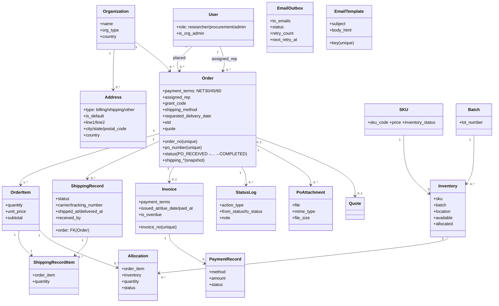
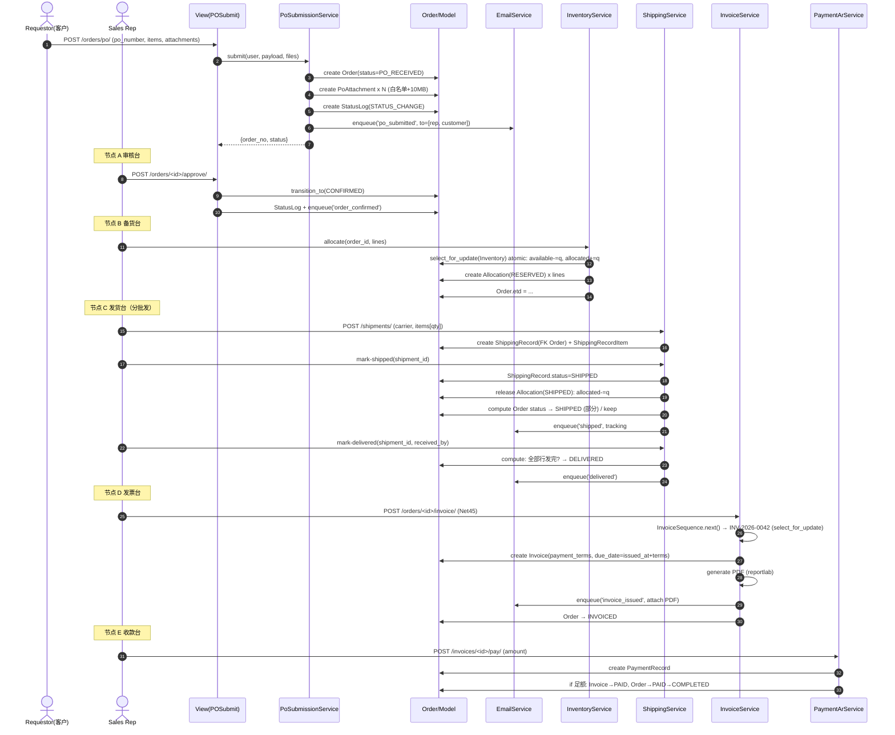
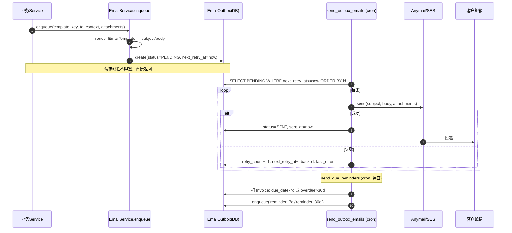

# PO 采购门户 — 系统架构设计 + 任务分解

> 文档归属：SciReAgent / 架构师 高见远（Gao）
> 配套：PRD v0.1（`docs/po-portal/PRD.md`）、设计系统（`docs/DESIGN_STANDARDS.md`）
> 文档状态：架构设计 v1（基于 2026-07-10 四项架构级决策 + PRD §6 开放项默认方案）
> 约束铁律：Django 5.1.3 + DRF（View 薄 → Service 厚 → Model）；所有 API 走信封 `{success,data,meta}`；Serializer 字段显式声明（禁 `__all__`）；跨模型写入在 Service 层；**严禁 Celery**（Outbox + cron）；新增依赖须讨论。

---

## 0. 与 PRD 不符事实的修正（读模型后勘误，必须先看）

> 下列条目在 `ARCHITECTURE.md` 中已按**实际模型**落地，并在文档内标注，供主理人复核。

| # | PRD 标注 | 实际模型（`Read` 结果） | 修正建议 |
|---|---|---|---|
| R1 | §6.2 "复用假设的 `assets.PdfFile`" | `assets.PdfFile` **确实存在**（`file`/`checksum`/`mime_type`/`page_count`/`extraction_state`），但它是为「PDF 文本抽取」设计的，含 `extraction_state` 等无关字段 | 按用户决策 #4 **新建 `po_attachments`**，自包含存 `FileField`；不污染 `PdfFile`。若未来需抽取 PO 文本再考虑关联 `PdfFile` |
| R2 | §5 "Invoice / ShippingRecord 均为 `OneToOneField(Order)`" | 确认属实 | 按决策 #3：**仅 `ShippingRecord` 改为 `ForeignKey(Order)`（OneToMany）**；`Invoice` 保持 `OneToOne`（每单一张发票，符合 Net 条款语义） |
| R3 | §6.4 "Batch 当前无数量字段" | 确认属实（`Batch` 仅 `lot_number`/`produced_at`/`retest_at`） | 按决策 #1 **不往 `Batch` 加字段**，独立 `Inventory` 表承载可用/占用，避免 Batch 模型膨胀 |
| R4 | §4 节点3 "PO Number 唯一性校验" | `Order.po_number` 当前 `blank=True, default=''`，**非 unique** | 本期加 `unique=True`（全局唯一客户 PO 号）；迁移须先清洗历史空值（置唯一占位符） |
| R5 | §5 状态机现状 | `Order.Status` 混合了采购态（DRAFT/CONFIRMED/INVOICED/PAID/PROCESSING/SHIPPED/COMPLETED/CANCELLED）与询价态（QUOTE_PENDING/QUOTED/QUOTE_ACCEPTED/QUOTE_REJECTED），且 `PROCESSING` 处于 `paid→shipped` 之间，与确认机倒挂 | 采购流以新 8 态为准；`QUOTE_*` 与 `PROCESSING` 标记为 **deprecated**（保留枚举值以兼容存量数据，新流程不再使用） |
| R6 | Invoice 账期 | `Invoice` **无 `payment_terms` 字段**，仅 `Order.payment_terms` 默认 NET30；`Invoice.due_date` 为必填 `DateField`，`issued_at` 可空 | 按决策 #10 给 `Invoice` 加 `payment_terms`；开票时由 `issued_at + terms` 推导 `due_date`（见 §3） |
| R7 | 节点4 "签收人需[扩展]" | `ShippingRecord` 仅 `delivered_at`，无签收人字段 | 新增 `ShippingRecord.received_by`（CharField） |
| R8 | 地址 | `Organization` 已有扁平地址字段（`address_line1/2`/`city`/`state`/`postal_code`/`country` 默认 `'China'`），`User` 有 `shipping_*` 快照 | 按决策 #2 新建 `Address` 表（一对多挂 `Organization`，`type=billing/shipping`），`Order` 保留既有 `shipping_*`/`billing_*` 快照并增加可选 `Address` 溯源外键；`Organization.country` 允许录入 `'US'` |

---

## 1. 实现方案 + 框架选型

### 1.1 技术栈（重申，已否决项）

| 维度 | 选型 | 理由 |
|---|---|---|
| 后端 | Django 5.1.3 + DRF | 既有栈，复用 `Order`/`Invoice`/`ShippingRecord`/`Quote`/`Product`/`Coa` |
| 分层 | View(薄) → Service(厚) → Model | View 仅参数校验+信封；状态机/库存扣减/PDF/邮件全在 Service |
| API 信封 | `{success,data,meta}` | 沿用 `core/mixins.py:EnvelopeMixin`（已落地 `success_response`/`error_response`） |
| 前端 | Vue3 + Vite + Pinia | 复用现有 `src/views/*`、`src/api/*`、`src/stores/*` |
| 设计系统 | `docs/DESIGN_STANDARDS.md` | emerald 主色 / amber 强调 / 4px 圆角 / 状态标签中性灰边框+语义色点 |
| 邮件 | **django-anymail**（新增依赖） | 通过 SES/SMTP 后端发信，与 Outbox 解耦 |
| PDF | **reportlab**（新增依赖） | Invoice PDF / Packing List 服务端生成 |
| 异步 | **Outbox 模式 + cron 管理命令** | 邮件不阻塞请求、可重试、零新依赖 |
| 定时 | 系统 cron / 容器 cron 调 `manage.py` 命令 | 严禁 Celery / 消息队列 |

**已否决（架构已拍板，不得回退）**：Celery / FastAPI / GraphQL / Neo4j / 微服务。

### 1.2 新增 Django App 决策

| App | 是否新增 | 理由 |
|---|---|---|
| `inventory` | **新增** | 独立 `Inventory` + `Allocation`，跨 `commerce.SKU`/`documents.Batch`；原子扣减逻辑隔离，避免污染 `transactions` |
| `notifications` | **新增** | 承载 `EmailOutbox` + `EmailTemplate` + 管理命令，跨订单/发票事件，与业务解耦 |
| `transactions`（扩展） | 扩展 | 加 `Order` 字段/状态机、`ShippingRecord`→FK、`ShippingRecordItem`、`PoAttachment`、`StatusLog` |
| `accounts`（扩展） | 扩展 | 加 `Address` 表 |
| `commerce` / `documents` | 复用 | `SKU`/`Product`/`Batch`/`Coa`/`SdsRevision` 只读复用 |

---

## 2. 文件列表及相对路径

### 2.1 后端（新增 / 修改）

**新增 App：`inventory`**
| 文件 | 职责 |
|---|---|
| `apps/inventory/__init__.py` | — |
| `apps/inventory/apps.py` | AppConfig `name='apps.inventory'` |
| `apps/inventory/models.py` | `Inventory`、`Allocation` |
| `apps/inventory/services.py` | `InventoryService`（原子 allocate/release/查询可用量） |
| `apps/inventory/selectors.py` | 可用量聚合查询 |
| `apps/inventory/api/v1/serializers.py` | `InventorySerializer`、`AllocationSerializer` |
| `apps/inventory/api/v1/views.py` | 可用量/分配接口 |
| `apps/inventory/api/v1/urls.py` | 路由 |
| `apps/inventory/admin.py` | 后台 |
| `apps/inventory/migrations/__init__.py` | — |

**新增 App：`notifications`**
| 文件 | 职责 |
|---|---|
| `apps/notifications/__init__.py`、`apps/notifications/apps.py` | — |
| `apps/notifications/models.py` | `EmailOutbox`、`EmailTemplate` |
| `apps/notifications/services.py` | `EmailService`（入队、模板渲染、cron 发送封装） |
| `apps/notifications/api/v1/serializers.py` | `EmailOutboxSerializer`、`EmailTemplateSerializer` |
| `apps/notifications/api/v1/views.py` | Outbox 列表/重发、模板 CRUD |
| `apps/notifications/api/v1/urls.py` | 路由 |
| `apps/notifications/management/commands/send_outbox_emails.py` | 发送 Outbox（cron） |
| `apps/notifications/management/commands/send_due_reminders.py` | 到期前 7 天 / 超期 30 天扫描（cron） |
| `apps/notifications/admin.py`、`apps/notifications/migrations/__init__.py` | — |

**扩展 `transactions`（重点）**
| 文件 | 修改点 |
|---|---|
| `apps/transactions/models.py` | `Order`：扩展 `Status`/`VALID_TRANSITIONS` + 字段 `assigned_rep`/`grant_code`/`shipping_method`/`requested_delivery_date`/`etd`/`quote`(FK)/`shipping_address_ref`/`billing_address_ref`；`ShippingRecord` `OneToOne→ForeignKey(Order)` + `received_by`；新增 `ShippingRecordItem`、`PoAttachment`、`StatusLog` |
| `apps/transactions/services.py` | 新增 `OrderStateMachine`、`PoSubmissionService`、`ShippingService`、`InvoiceService`、`PaymentArService`、`InvoiceSequence`（原子编号） |
| `apps/transactions/selectors.py` | 订单队列/详情/AR 聚合查询 |
| `apps/transactions/api/v1/serializers.py` | 扩展 `OrderSerializer`；新增 `ShippingRecordSerializer`/`ShippingRecordItemSerializer`/`PoAttachmentSerializer`/`StatusLogSerializer`/`InvoiceIssueSerializer`/`PaymentCreateSerializer` |
| `apps/transactions/api/v1/views.py` | PO 提交、订单详情（含时间线/发货/发票）、发货、开票、收款接口 |
| `apps/transactions/api/v1/urls.py` | 路由 |
| `apps/transactions/admin.py` | 新模型后台 |

**扩展 `accounts`**
| 文件 | 修改点 |
|---|---|
| `apps/accounts/models.py` | 新增 `Address`（FK `Organization`，`type`、`is_default`、地址字段、`country`） |
| `apps/accounts/api/v1/serializers.py` | `AddressSerializer` |
| `apps/accounts/api/v1/views.py` | 地址 CRUD |
| `apps/accounts/api/v1/urls.py` | 路由 |

**复用 / 小改**
| 文件 | 修改点 |
|---|---|
| `core/permissions.py` | 新增 `IsProcurementOrAdmin`、`IsAdmin`（复用 `BasePermission`） |
| `config/settings.py` | `INSTALLED_APPS` 注册 `inventory`/`notifications`；`ANYMAIL` 配置；`REPORTLAB` 无需配置 |
| `requirements.txt` | 加 `django-anymail`、`reportlab` |
| `apps/transactions/migrations/` | 新迁移（模型变更） |

### 2.2 前端（新增 / 修改，路径相对 `frontend/src`）

| 文件 | 节点 | 类型 | 说明 |
|---|---|---|---|
| `views/PurchaseOrderSubmit.vue` | 节点3 | 新增 | PO 提交表单 + 文件拖拽 + 地址选择 |
| `views/OrderTrackingPage.vue` | 节点4 | 新增 | 8 节点 Stepper + 时间戳 + 发货/发票子信息 |
| `views/InvoicesPage.vue` | 节点5 | 新增 | 发票列表 + PDF 下载 + 付款状态 |
| `views/products/ProductIndex.vue`、`views/products/ProductDetail.vue` | 节点1 | 扩展 | 库存徽标 + COA/SDS 下载 |
| `views/CartPage.vue`、`views/QuoteRequestPage.vue` | 节点2 | 扩展 | Quote→PO 关联 |
| `views/OrderListPage.vue` | 节点6 | 扩展 | 搜索/导出/Re-order |
| `views/admin/AdminOrdersPage.vue`、`views/admin/AdminOrderDetail.vue` | 节点A | 扩展 | 审核台 + 分配 Rep + PO PDF 预览 + 逐行库存 |
| `views/admin/AdminFulfillmentPage.vue` | 节点B | 新增 | 库存备货台 + Allocate + ETD |
| `views/admin/AdminShippingPage.vue` | 节点C | 新增 | 发货台 + 分批发 + COA + Packing List |
| `views/admin/AdminInvoicingPage.vue` | 节点D | 新增 | 发票台 + INV 编号 + Net 条款 |
| `views/admin/AdminARPage.vue` | 节点E | 新增 | 收款台 + AR Aging 30/60/90 |
| `api/poPortal.js` | — | 新增 | PO 提交/追踪/发票客户侧 API |
| `api/inventory.js`、`api/addresses.js`、`api/notifications.js`、`api/adminPo.js` | — | 新增 | 库存/地址/通知/内部台 API |
| `api/orders.js`、`api/documents.js` | — | 扩展 | 复用并补字段 |
| `stores/orders.js`、`stores/basket.js`、`stores/auth.js` | — | 扩展 | 复用 |
| `stores/fulfillment.js`、`stores/invoicing.js`、`stores/ar.js`、`stores/addresses.js` | — | 新增 | Pinia stores |

---

## 3. 数据结构和接口

### 3.1 模型变更一览（字段表）

#### 3.1.1 `accounts.Address`（**新增**）

| 字段 | 类型 | 说明 |
|---|---|---|
| `organization` | `FK(Organization, CASCADE, related='addresses')` | 归属机构 |
| `type` | `CharField(choices=BILLING/SHIPPING/OTHER)` | 用途标记 |
| `is_default` | `BooleanField(default=False)` | 默认地址（每 type 唯一约束） |
| `attention` | `CharField` | 收件人/部门 |
| `line1`/`line2` | `CharField` | 街道 |
| `city`/`state`/`postal_code` | `CharField` | 城市/州/ZIP |
| `country` | `CharField(default='US')` | 支持美国机构 |
| `phone` | `CharField` | 电话 |

#### 3.1.2 `inventory.Inventory`（**新增**）

| 字段 | 类型 | 说明 |
|---|---|---|
| `sku` | `FK(commerce.SKU, CASCADE, related='inventory')` | 关联 SKU |
| `batch` | `FK(documents.Batch, CASCADE, null=True, blank=True)` | 关联批次（库位级可空） |
| `location` | `CharField(default='MAIN')` | 库位 |
| `available` | `IntegerField(default=0)` | **可分配量**（free to allocate） |
| `allocated` | `IntegerField(default=0)` | **已占用量**（被订单锁定） |
| 方法 | — | `allocate(qty)` / `release(qty)` 均 `select_for_update` 原子执行 |

> 约定：`available` 表示「可被分配」；分配时 `available-=q, allocated+=q`；发货时 `allocated-=q`（实物已出，`available` 不变）。`on_hand ≈ available + allocated`。

#### 3.1.3 `inventory.Allocation`（**新增**）

| 字段 | 类型 | 说明 |
|---|---|---|
| `order_item` | `FK(transactions.OrderItem, CASCADE, related='allocations')` | 归属订单行 |
| `inventory` | `FK(inventory.Inventory, CASCADE)` | 占用哪条库存 |
| `quantity` | `IntegerField` | 占用数量 |
| `status` | `CharField(RESERVED/SHIPPED/RELEASED)` | 预留→发货→释放 |
| `created_at` | `DateTimeField(auto_now_add)` | — |

#### 3.1.4 `transactions.Order`（**扩展**）

新增字段：
| 字段 | 类型 | 说明 |
|---|---|---|
| `assigned_rep` | `FK(User, null=True, blank=True, related='assigned_orders', limit_choices_to=role∈{procurement,admin})` | 分配 Sales Rep（决策 #4） |
| `grant_code` | `CharField(blank=True, default='')` | 基金/赞助号 |
| `shipping_method` | `CharField(choices=AMBIENT/COLD_PACK/DRY_ICE/BLUE_ICE, blank=True)` | 运输方式（与 `Product.shipping` 对齐） |
| `requested_delivery_date` | `DateField(null=True, blank=True)` | 期望到货日 |
| `etd` | `DateField(null=True, blank=True)` | 预计发货（节点 B 同步客户端） |
| `quote` | `FK(quotes.Quote, null=True, blank=True, related='orders')` | 关联 Quote（P1-2） |
| `shipping_address_ref` | `FK(Address, null=True, blank=True)` | 溯源（可选） |
| `billing_address_ref` | `FK(Address, null=True, blank=True)` | 溯源（可选） |

> 保留既有 `order_no`(unique, 内部 `ORD-`)、`po_number`(本期改 **unique**)、`shipping_*`/`billing_*` 快照、`payment_terms`(扩展为 `NET30/NET45/NET60`)。

**状态机重定义（`Order.Status` + `VALID_TRANSITIONS`）**
| 新增值 | 含义 |
|---|---|
| `PO_RECEIVED = 'po_received'` | 初态（PO 提交后） |
| `IN_PRODUCTION = 'in_production'` | 合成件生产中（可选分支） |
| `DELIVERED = 'delivered'` | 全部发完且签收 |
| （保留）`CONFIRMED/SHIPPED/INVOICED/PAID/COMPLETED/CANCELLED` | 同前 |
| （deprecated）`DRAFT/QUOTE_PENDING/QUOTED/QUOTE_ACCEPTED/QUOTE_REJECTED/PROCESSING` | 存量兼容，新流程不用 |

```python
# 确认状态机（canonical）
VALID_TRANSITIONS = {
    'po_received':   ['confirmed', 'cancelled'],
    'confirmed':     ['in_production', 'shipped', 'cancelled'],  # 无需生产则直发
    'in_production': ['shipped', 'cancelled'],
    'shipped':       ['delivered', 'cancelled'],  # 部分发货保持 shipped
    'delivered':     ['invoiced', 'cancelled'],
    'invoiced':      ['paid', 'cancelled'],
    'paid':          ['completed'],
    'completed':     [],
    'cancelled':     [],
    # —— deprecated 仅用于存量数据回放，新代码不写入 ——
    'draft': ['confirmed', 'quote_pending', 'cancelled'],
    'quote_pending': ['quoted', 'cancelled'],
    'quoted': ['quote_accepted', 'quote_rejected'],
    'quote_accepted': ['confirmed'],
    'quote_rejected': [],
    'processing': ['shipped'],
}
```

**分批发语义（决策 #3 重设计核心）**
- `ShippingRecord` 由 `OneToOne`→`ForeignKey(Order)`：一个 `Order` 多条发货记录。
- 每条 `ShippingRecord` 通过 `ShippingRecordItem` 记录「发了多少 `OrderItem` 的哪几行、数量多少」。
- `Order` 进入 `SHIPPED`：当**任一批** `ShippingRecord` 标记为 shipped。
- `Order` 进入 `DELIVERED`：当且仅当「对**每一个** `OrderItem`，所有已签收发货记录中的 `ShippingRecordItem` 数量之和 ≥ 该 `OrderItem.quantity`」**且**所有发货记录均已 `delivered`。即「全部发完才 DELIVERED」。
- 状态推进由 `ShippingService.mark_shipped/mark_delivered` 在事务内统一计算并 `transition_to`，同时写 `StatusLog`。

#### 3.1.5 `transactions.ShippingRecord`（**重构**）+ `ShippingRecordItem`（**新增**）

`ShippingRecord` 改动：
| 字段 | 变更 |
|---|---|
| `order` | `OneToOneField` → `ForeignKey(Order, related='shipments')` |
| `received_by` | **新增** `CharField(blank=True)` 签收人 |
| （保留）`status`/`carrier`/`tracking_number`/`tracking_url`/`shipped_at`/`estimated_delivery`/`delivered_at`/`notes` | 不变 |

`ShippingRecordItem`（新增）：
| 字段 | 类型 |
|---|---|
| `shipping_record` | `FK(ShippingRecord, CASCADE, related='items')` |
| `order_item` | `FK(OrderItem, CASCADE)` |
| `quantity` | `IntegerField` |

#### 3.1.6 `transactions.Invoice`（**扩展** — 决策 #10）

| 字段 | 变更 |
|---|---|
| `payment_terms` | **新增** `CharField(choices=NET30/NET45/NET60, default='NET30')` |
| `due_date` | 开票时由 `issued_at + payment_terms` 推导（保留既有字段） |
| （保留）`invoice_no`(unique)、`status`、`issued_at`、`paid_at`、金额字段、`is_overdue`、`payment_ref` | 不变 |

> 以 **Invoice 为准**：开票初值取自 `Order.payment_terms`，但可在发票台改 Net 条款，AR 计算一律用 `Invoice.payment_terms` + `Invoice.due_date`。

#### 3.1.7 `transactions.PoAttachment`（**新增** — 决策 #4）

| 字段 | 类型 |
|---|---|
| `order` | `FK(Order, CASCADE, related='attachments')` |
| `file` | `FileField(upload_to='po_attachments/%Y%m/')` |
| `original_filename` | `CharField` |
| `mime_type` | `CharField` |
| `file_size` | `IntegerField` |
| `uploaded_by` | `FK(User, null=True)` |
| `created_at` | `DateTimeField(auto_now_add)` |

> 校验：白名单 `application/pdf`, `image/png`, `image/jpeg`；≤10MB（Service 层 + Serializer `validate` 双校验）。`assets.PdfFile` 不复用（见 R1）。

#### 3.1.8 `transactions.StatusLog`（**新增** — 开放项 #3 默认方案）

| 字段 | 类型 |
|---|---|
| `order` | `FK(Order, CASCADE, related='status_logs')` |
| `actor` | `FK(User, null=True, blank=True)` 操作人 |
| `action_type` | `CharField(choices=STATUS_CHANGE/REP_ASSIGNED/REJECTED/NOTED/SHIPMENT/INVOICE)` |
| `from_status` | `CharField(blank=True)` |
| `to_status` | `CharField(blank=True)` |
| `note` | `TextField(blank=True)` 拒绝原因 / 分配说明等 |
| `created_at` | `DateTimeField(auto_now_add)` |

> **默认决策**：单表同时记录「状态变更」与「内部操作」（分配 Rep、拒绝原因、备注），以 `action_type` 区分；前端时间线统一从 `status_logs` 渲染。

#### 3.1.9 `notifications.EmailOutbox` / `EmailTemplate`（**新增**）

`EmailOutbox`：
| 字段 | 类型 |
|---|---|
| `to_emails` | `CharField`（逗号分隔或 JSON） |
| `cc_emails` | `CharField(blank=True)` |
| `subject` | `CharField` |
| `body_text` / `body_html` | `TextField` |
| `attachment_paths` | `JSONField(default=list)` 媒体文件路径列表 |
| `status` | `CharField(PENDING/SENT/FAILED, default=PENDING)` |
| `retry_count` | `IntegerField(default=0)` |
| `next_retry_at` | `DateTimeField(null=True)` |
| `sent_at` | `DateTimeField(null=True)` |
| `last_error` | `TextField(blank=True)` |
| `template_key` | `CharField(blank=True)` |
| `context_json` | `JSONField(default=dict)` |

`EmailTemplate`：
| 字段 | 类型 |
|---|---|
| `key` | `SlugField(unique=True)` 如 `po_submitted`/`order_confirmed`/`shipped`/`delivered`/`invoice_issued`/`reminder_7d`/`reminder_30d` |
| `subject` | `CharField` |
| `body_html` | `TextField` |
| `body_text` | `TextField` |
| `description` | `TextField(blank=True)` |
| `language` | `CharField(default='en')` |

> Admin 可改模板（角色 C）；首次部署用 `EmailTemplate` 种子数据初始化。

### 3.2 类图（Mermaid classDiagram）



### 3.3 关键 API 端点清单

| 方法 | 路径 | 职责 | 请求要点 | 响应要点 |
|---|---|---|---|---|
| POST | `/api/v1/orders/po/` | 提交 PO → `PO_RECEIVED` | `po_number`(唯一校验)、`quote_id`、`grant_code`、`shipping_method`、`requested_delivery_date`、地址、`attachments[]`(≤10MB)、`items[]` | 新建 `Order`+`PoAttachment`+`StatusLog`+入队邮件；信封 `data:{order_no, status}` |
| GET | `/api/v1/orders/<id>/` | 订单详情（追踪） | — | `Order` + `items` + `shipments`(含 items) + `invoice` + `status_logs` 时间线 |
| POST | `/api/v1/orders/<id>/assign-rep/` | 分配/改派 Rep（Admin） | `rep_id` | `StatusLog(action=REP_ASSIGNED)` |
| POST | `/api/v1/orders/<id>/approve/` | 审核通过 `PO_RECEIVED→CONFIRMED` | — | 入队 `order_confirmed` |
| POST | `/api/v1/orders/<id>/reject/` | 拒绝 `→CANCELLED` | `reason` | `StatusLog(action=REJECTED, note=reason)` |
| GET | `/api/v1/inventory/availability/` | 可用量匹配（审核/备货台） | `?sku_ids=` 或 `order_id` | 每行 `available/allocated/shortage` |
| POST | `/api/v1/inventory/allocate/` | 锁定库存（节点 B） | `order_id`、逐行 `qty` | 建 `Allocation` + 原子扣 `Inventory.available/allocated`；写 `etd` |
| POST | `/api/v1/orders/<id>/shipments/` | 新建发货记录（节点 C，支持分批） | `carrier`/`tracking_number`/`items[]`(order_item+quantity) | 建 `ShippingRecord`+`ShippingRecordItem` |
| POST | `/api/v1/shipments/<id>/mark-shipped/` | 标记发货 | — | 释放对应 `Allocation`，计算 `Order` 状态（SHIPPED/保持），入队 `shipped` |
| POST | `/api/v1/shipments/<id>/mark-delivered/` | 标记签收 | `received_by` | 计算 `Order` 是否 `DELIVERED`，入队 `delivered` |
| POST | `/api/v1/orders/<id>/invoice/` | 开票（节点 D） | `payment_terms`(Net30/45) | 原子 `INV-YYYY-NNNN`，生成 PDF，入队 `invoice_issued` |
| POST | `/api/v1/invoices/<id>/pay/` | 收款（节点 E） | `amount`/`method`/`paid_at` | 建 `PaymentRecord`；足额→`INVOICED→PAID` |
| GET | `/api/v1/ar/aging/` | AR Aging 30/60/90 | — | 按 `due_date` 聚合未付发票 |
| GET | `/api/v1/notifications/outbox/` | Outbox 列表（Admin） | — | 状态/重试/错误 |
| POST | `/api/v1/notifications/outbox/<id>/resend/` | 手动重发（Admin） | — | 重新入队 |
| GET/PUT | `/api/v1/notifications/templates/` | 邮件模板（Admin） | — | 模板 CRUD |
| GET/POST/PUT/DELETE | `/api/v1/addresses/` | 机构地址 CRUD | — | `Address` |

---

## 4. 程序调用流程（Mermaid sequenceDiagram）

### 4.1 核心链路：提交 → 审核 → 备货 → 分批发 → 开票 → 收款



### 4.2 邮件 Outbox 入队与 cron 发送



---

## 5. 有序任务列表（关键交付物）

> 依赖关系：T 列指「前置任务 ID」。验收要点为最小可验收标准。

| ID | 任务 | 涉及文件 | 依赖 | 验收要点 |
|---|---|---|---|---|
| T1 | 脚手架 `inventory` App | `apps/inventory/*`, `config/settings.py` | — | app 注册成功，`makemigrations inventory` 可生成空迁移 |
| T2 | 脚手架 `notifications` App | `apps/notifications/*`, `settings.py` | — | 同上 |
| T3 | 扩展 `transactions/models.py` | `transactions/models.py` | — | `Order` 新状态机+字段、`ShippingRecord`→FK、`ShippingRecordItem`/`PoAttachment`/`StatusLog` 可迁移 |
| T4 | `inventory` 模型 | `inventory/models.py` | T1 | `Inventory`/`Allocation` 字段与 `allocate/release` 方法签名存在 |
| T5 | `notifications` 模型 | `notifications/models.py` | T2 | `EmailOutbox`/`EmailTemplate` 建表 |
| T6 | `accounts.Address` | `accounts/models.py` | — | `Address` 建表，`type`/`organization` 外键 |
| T7 | 全量迁移 | `*/migrations/` | T3,T4,T5,T6 | `migrate` 无错；`po_number` unique 迁移清洗空值 |
| T8 | transactions Serializers | `transactions/api/v1/serializers.py` | T3 | 显式 fields；`PoAttachmentSerializer` 白名单+10MB 校验 |
| T9 | inventory Serializers | `inventory/api/v1/serializers.py` | T4 | 可用量只读、分配入参显式 |
| T10 | notifications Serializers | `notifications/api/v1/serializers.py` | T5 | Outbox 只读 + Template CRUD |
| T11 | Address Serializer | `accounts/api/v1/serializers.py` | T6 | 字段显式 |
| T12 | InventoryService（原子） | `inventory/services.py` | T4 | `select_for_update` 下 allocate/release；并发测试不超卖 |
| T13 | OrderStateMachine + StatusLog | `transactions/services.py` | T3,T8 | `transition_to` 校验；每次变更写 `StatusLog`；分批发 DELIVERED 计算正确 |
| T14 | PoSubmissionService | `transactions/services.py` | T3,T8,T13 | 建 `Order(PO_RECEIVED)`+附件+入队；`po_number` 唯一冲突返回 409 信封 |
| T15 | InvoiceService（编号/PDF/Net） | `transactions/services.py` | T3,T13 | `InvoiceSequence` 原子 `INV-YYYY-NNNN`；reportlab PDF；Net45 `due_date` 推导 |
| T16 | ShippingService（分批/状态） | `transactions/services.py` | T3,T12,T13 | 建 `ShippingRecord`+`Item`；mark-shipped/delivered 释放 Allocation 并推进 `Order` 状态 |
| T17 | PaymentArService | `transactions/services.py` | T3 | `PaymentRecord` 创建；足额→`PAID`；`/ar/aging/` 聚合 30/60/90 |
| T18 | EmailService（入队/渲染） | `notifications/services.py` | T5,T10 | `enqueue(template_key,to,ctx,att)` 渲染并写 Outbox |
| T19 | transactions Views/URLs | `transactions/api/v1/{views,urls}.py` | T13–T17 | PO 提交/详情/审核/发货/开票/收款端点全通，信封统一 |
| T20 | inventory Views/URLs | `inventory/api/v1/{views,urls}.py` | T9,T12 | `/availability/` `/allocate/` |
| T21 | notifications Views/URLs | `notifications/api/v1/{views,urls}.py` | T10,T18 | Outbox 列表/重发、Template CRUD |
| T22 | Address Views/URLs | `accounts/api/v1/{views,urls}.py` | T11 | CRUD 端点 |
| T23 | 管理命令 | `notifications/management/commands/*.py` | T18,T5 | `send_outbox_emails` 发送并设置状态；`send_due_reminders` 触发提醒入队 |
| T24 | PDF 模板（reportlab） | `transactions/services.py` 或 `templates_pdf/` | T15 | Invoice PDF + Packing List 生成无异常，字段完整 |
| T25 | 邮件模板种子 | `notifications` fixtures/SQL | T5 | 7 类模板入库，渲染占位符正确 |
| T26 | 权限类 | `core/permissions.py` | — | `IsProcurementOrAdmin`/`IsAdmin`；接入各写操作 View |
| T27 | 前端 API client | `frontend/src/api/{poPortal,inventory,addresses,notifications,adminPo}.js` | T19–T22 | 调用契约对齐 |
| T28 | 前端客户侧页面 | 节点1–6 视图（见 §2.2） | T27 | 提交/追踪 Stepper/发票/历史可用；设计系统合规 |
| T29 | 前端内部侧页面 | 节点A–E 视图（见 §2.2） | T27 | 审核/备货/发货/开票/AR 五台可用 |
| T30 | 后端测试 | `*/tests/` | T12–T17,T23 | 状态机、库存原子、INV 并发编号、Outbox 发送、AR 聚合 |
| T31 | 前端/E2E 测试 | `frontend/e2e/` | T28,T29 | PO 提交→审核→发货→开票→收款 端到端跑通 |
| T32 | 文档与规范收尾 | `DESIGN_STANDARDS.md`(Overdue 红点说明)、API 契约文档 | T19–T22 | Overdue 状态红点例外写入规范；接口契约归档 |

**分期（见摘要 P0/P1/P2）**：
- **P0（T1–T19, T24, T26, T30 部分）**：模型/迁移/Serializer/Service/View + PO 提交、状态机、发货、开票、收款核心链路 + 客户侧页面（节点1/3/4/5）+ 内部审核/备货/发货/开票/收款台骨架。
- **P1（T20–T23, T25, T27–T29, T30–T31）**：库存实时匹配、Quote→PO、自动邮件 Outbox+cron、AR Aging 完整、前端全部页面、测试。
- **P2（T32 部分 + 标注延后项）**：Re-order、部分付款 `balance_due`、冷链温度记录、SKU 阶梯折扣、`SKUVolumePrice`、生产工单 WO。

---

## 6. 依赖包列表

| 包 | 用途 | 状态 |
|---|---|---|
| `django-anymail` | 邮件发送后端（Outbox 实际投递） | **本期新增**（决策已定） |
| `reportlab` | Invoice / Packing List PDF 生成 | **本期新增**（决策已定） |
| Django 5.1.3 / DRF | 既有 | 复用 |
| （待讨论）`django-cors-headers` | 若前后端分离跨域需要 | 视部署；现有前端同源/已配则不加 |
| （不引入）Celery / redis / rabbitmq | 异步 | **明确否决** |

> 新增依赖须经主理人确认；`django-anymail` 需在 `settings.py` 配 `ANYMAIL` 后端（如 SES），密钥走环境变量，不入库。

---

## 7. 共享知识（跨文件约定）

| 约定 | 集中定义位置 | 规则 |
|---|---|---|
| 枚举值（状态/类型/角色） | 各模型 `class Xxx(models.TextChoices)` 内联；跨 app 复用值（如 `shipping_method` 对齐 `Product.ShippingCondition`） | 禁止魔法字符串；前端用同一常量表（`src/config/constants.js`） |
| 状态机常量 | `transactions/models.py` `Order.Status` + `Order.VALID_TRANSITIONS` | 唯一权威；Service 调 `transition_to`，View 不直接改 `status` |
| 信封响应 | `core/mixins.py:EnvelopeMixin.success_response/error_response` | 全站 `{success,data,meta}`；错误走 `meta.error.{code,message}` |
| 错误处理 | Service 抛领域异常（`InvalidTransitionError` 等）→ View 捕获转 `error_response` | 不向前端透传栈；业务错误用明确 `code` |
| 文件上传白名单 | `transactions/services.py` 常量 `PO_ATTACHMENT_ALLOWED = {pdf,png,jpeg}` + `MAX_10MB`；Serializer `validate` 复核 | 双校验（Service+Serializer）；超限返回 400 信封 |
| 邮件模板管理 | `notifications.EmailTemplate`（key 唯一）+ `EmailService.render(key, ctx)` | 模板改由 Admin 在后台；代码只引用 `key` |
| 库存原子 | `InventoryService.allocate/release` 统一 `select_for_update` | 所有扣减经此，禁止直接 `Inventory.available-=1` |
| 权限 | `core/permissions.py` `IsProcurementOrAdmin` / `IsAdmin` | 基于 `User.role` 简单判断，不引入 Django per-object permissions |
| 时间戳 | 统一 `created_at`/`updated_at`（`TimeStampedModel`） | 状态时间以 `StatusLog.created_at` 为准 |

---

## 8. 待明确事项（含 §6 开放项默认方案）

### 8.1 PRD §6 其余 6 项默认方案

| 项 | 默认方案（请你确认） |
|---|---|
| **#3 status_log** | 单表 `StatusLog`（§3.1.8）：`order`/`actor`/`action_type`(STATUS_CHANGE/REP_ASSIGNED/REJECTED/NOTED/SHIPMENT/INVOICE)/`from_status`/`to_status`/`note`/`created_at`。**同时记录内部操作**（分配 Rep、拒绝原因、备注），以 `action_type` 区分；前端时间线统一消费此表。 |
| **#5 权限边界** | 基于 `User.role`（researcher/procurement/admin）+ DRF permission 类，**不引 Django permissions 框架**。`Approve`/`Reject`/`Allocate`/`Mark Shipped`/`Generate Invoice`/`Mark Paid`：procurement+admin；`Assign/Reassign Rep`/`Void Invoice`/`Cancel(已确认)`/`导出全局`/`改邮件模板`/`手动重发`：**admin only**；客户侧只读自己数据（按 `request.user`/`organization` 过滤）。 |
| **#7 批量折扣阶梯** | **本期不建模 `SKUVolumePrice`**；前端按常量表写死阶梯（或延后）。理由：非 MVP 阻塞项，避免提前固化定价模型。列入 P2。 |
| **#8 生产工单 WO** | **本期不建模 WO**；仅记录 `Order.etd` + `ShippingRecord.estimated_delivery` 占位，生产进度留待后续内部系统。列入 P2/后续。 |
| **#9 发票编号并发安全** | **独立计数器表 `InvoiceSequence`（year, last_number）**，在 `transaction.atomic()` 内 `select_for_update()` 取行、`last_number+=1` 后存，`INV-{year}-{last_number:04d}`。避免 `count()` 竞态，零额外依赖。 |
| **#10 Net45 条款** | `Order.payment_terms` 与 `Invoice.payment_terms` 同时支持 `NET30/NET45/NET60`（默认 NET30）；开票初值取自 Order，可在发票台改；**以 Invoice 为准**（`due_date` 由 `Invoice.issued_at + Invoice.payment_terms` 推导，AR 计算用 Invoice 值）。 |

### 8.2 仍需主理人最终拍板

1. **PO 号唯一粒度**：全局唯一（推荐，防跨机构撞号）还是「按 `organization` 唯一」？影响 `unique_together` 与冲突提示文案。
2. **`Order` 是否保留 `shipping_address_ref`/`billing_address_ref` 溯源外键**（§3.1.4 标可选）：若内部台需「回写地址到机构」则建议保留；纯快照可省略。
3. **部分付款 `Invoice.balance_due`**（P2-2）：本期是否需存储字段，还是用 `grand_total - sum(verified payments)` 派生属性即可？建议派生属性，避免双写。
4. **邮件服务商后端**：`django-anymail` 具体后端（Amazon SES / Mailgun / SendGrid）与发件域名、DKIM，需运维/主理人确认环境变量。
5. **cron 频率**：`send_outbox_emails` 建议每 1–5 分钟；`send_due_reminders` 每日一次（如 08:00）。是否需退避上限（建议 `retry_count` 上限 5，封顶后标记 FAILED 待人工）。
6. **`Order.payment_method` 与付款展示**：客户侧节点5「Payment Method 纯展示」映射 `PaymentRecord.method`(WIRE/CHECK/ONLINE)→ACH/Wire/Check，是否需扩展 `PaymentRecord.Method` 加 `ACH`？建议加 `ACH` 枚举值。
7. **存量数据迁移**：既有 `Order`（DRAFT/QUOTE_* 等）是否需批量映射或保留原状？建议保留原状、新流程仅作用于 `PO_RECEIVED` 起的新单。

---

*架构设计 v1 完。所有模型字段均来自实际 `Read` 的 `src_claude/backend/apps/**/models.py`；与 PRD 不符处已在 §0 勘误。本文档仅产出设计，未新建任何实现代码（除本 `.md`）。*
